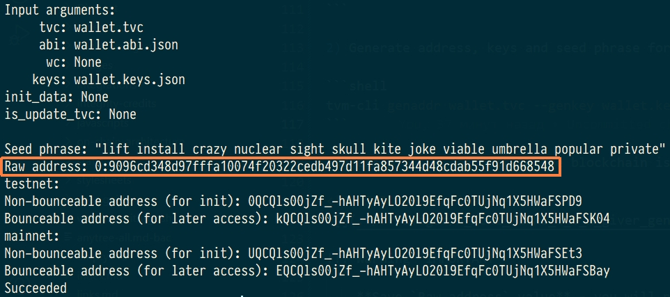
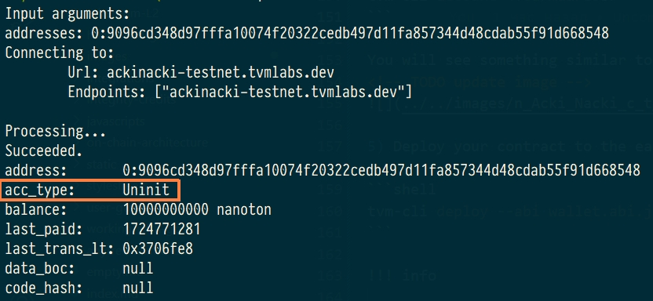
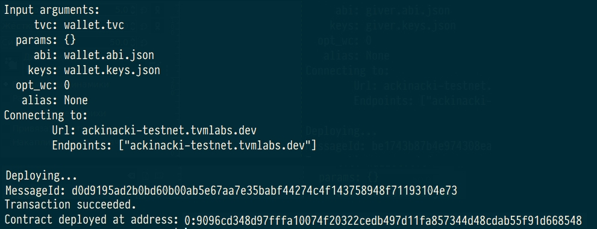
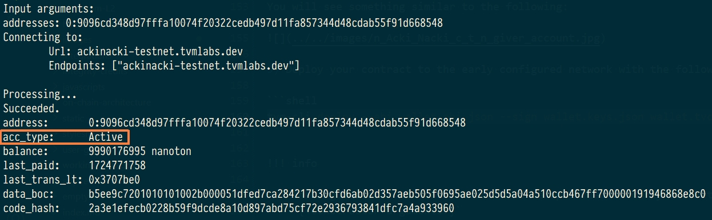

## **Prerequisites**

* Rust v1.76+  
* Node.js v18.19.1
* Python 3  
* Python 3 setuptools  


**This demo app implements the following scenario:**

1. Creates and initializes an instance of the SDK client;

2. Deploys the `helloWorld` contract:

    2.1 Generates key pair for the contract;

    2.2 Calculates future address of the contract;

    2.3 Sends to the future address of the contract some tokens required for deploy;

    2.4 Deploys the `helloWorld` contract;

3. Gets account info and print balance of the `helloWorld` contract

4. Runs account's get method `getTimestamp`

5. Executes `touch` method for newly deployed `helloWorld` contract

6. Runs contract's get method locally after account is updated

7. Sends some tokens from `helloWorld` contract to a random account


<!-- !!! warning "Important"

    **For the application to work, you should to place `ABI files` of the `wallet` and `helloWorld` contracts into the `contracts` folder.** -->

!!! info

    For testing your developed applications, you can use Acki Nacki development blockchain  
    at **ackinacki-testnet.tvmlabs.dev**  

    To replenish the balance of wallet-contract, please contact us in [Channel on Telegram](https://t.me/+1tWNH2okaPthMWU0).


We will do all the work in this quick start in a separate `~/test-sdk` folder.
Let's create it:

```
cd ~
mkdir test-sdk
```

## **Build core TVM library for Node.js**


1.Clone the repository to a separate directory:  

```
cd ~/test-sdk
git clone https://github.com/tvmlabs/tvm-sdk-js.git
```

2.Run build:

```
cd tvm-sdk-js/packages/lib-node/build
cargo run
```

As a result, the builded binding `tvmsdk.node` will be placed into the folder `~/test-sdk/tvm-sdk-js/packages/lib-node`.


## **Create a wallet**

By this point, you should have deployed a wallet from which the balances of your demo contracts will be replenished.  

Create a separate folder for it:

```
cd ~
mkdir wallet
cd wallet
```

And download the [wallet code file](https://raw.githubusercontent.com/tvmlabs/sdk-examples/main/contracts/simpleWallet/wallet.tvc){:target="_blank"} and the [abi file](https://github.com/tvmlabs/sdk-examples/blob/main/contracts/simpleWallet/wallet.abi.json){:target="_blank"} and put it in the wallet folder.

Then deploy the contract to Acki Nacki development blockchain  
at **`ackinacki-testnet.tvmlabs.dev`**:


1) Make sure TVM-CLI is in $PATH:

```shell
export PATH=$PATH:<PATH_TO>/tvm-cli
```

2) Configure network:

```
tvm-cli config --url ackinacki-testnet.tvmlabs.dev
```

3) Generate address, keys and seed phrase for your wallet:

```shell
tvm-cli genaddr wallet.tvc --genkey wallet.keys.json
```

Address of your contract in the blockchain is located after `Raw address:`



!!! Warning "IMPORTANT" 

    **Save `Raw address` value** - you will need it to deploy your contract and to work with it.  
    We will refer to it as **`<YourAddress>`** below.  
    
    **Seed phrase** is also printed to stdout.  
    **Key pair** will be generated and saved to the file **`wallet.keys.json`**.


!!! danger
    **Write your seed phrase down and store it somewhere safe, and never share it with anyone. Avoid storing it in plain text or screenshots, or any other non-secure way. If you lose it, you lose access to your assets. Anyone who gets it, gets full access to your assets.  
    Also, save the file with a pair of keys in a safe place.**

4) Request test tokens

!!! note 

    Acki Nacki deploy is fee-based, so your new contract will be charged for this.  
    You will need to request some tokens to the address before the actual deployment.  
    Contracts take value in nanotokens.  
    ***(You will need approximately 10 tokens to deploy)***

Please contact us in [Channel on Telegram](https://t.me/+1tWNH2okaPthMWU0) and specify the **`<YourAddress>`**.

5) Check the state of the pre-deployed contract. It should be **`Uninit`**:

```shell
tvm-cli account <YourAddress>
```

You will see something similar to the following:



5) Deploy your contract to the early configured network with the following command:

```shell
tvm-cli deploy --abi wallet.abi.json --sign wallet.keys.json wallet.tvc {}
```

!!! info

    The arguments of the constructor must be specified in curly brackets:  
    `{<constructor arguments>}`



6) Check the contract state again. This time, it is should be `Active`.




### **Request test tokens for future use**

To replenish your wallet, please contact us in [Channel on Telegram](https://t.me/+1tWNH2okaPthMWU0).


You can find full source code of this contract and its artifacts [here](https://github.com/tvmlabs/sdk-examples/tree/main/contracts/simpleWallet)  


## **Prepare demo application**


1.Clone repository contains the demo application:

```
cd ~/test-sdk
git clone https://github.com/tvmlabs/sdk-examples.git
cd sdk-examples/js/nodejs/helloWorld
```

2.Configure wallet for using in the demo app:

<!-- For demo app working, you should configure the wallet. -->
To do this, in the demo folder, edit `.env` file with following content:


```
WALLET_ADDRESS=YOUR_WALLET_ADDRESS
WALLET_KEYS=FULL_PATH_TO_YOUR_WALLET_KEYS_FILE # should be absolute path
```

3.Install the packages `@tvmsdk/core` and `@tvmsdk/lib-node` for the demo application:

```
npm install
```

4.Replace the binary file in `@tvmsdk/lib-node` with an Acki Nacki-compatible one, which was builded early:  

```
cp ~/test-sdk/tvm-sdk-js/packages/lib-node/tvmsdk.node ~/test-sdk/sdk-examples/js/nodejs/helloWorld/node_modules/@tvmsdk/lib-node/
```


## **Run it**

Go to the folder with the demo application and run it:

```
cd ~/test-sdk/sdk-examples/js/nodejs/helloWorld
node index.js
```

You will see a result similar to the following:


```
wallet keys fname: /home/username/wallet/wallet.keys.json
Future address of helloWorld contract is: 0:90e7941f8eb4806097598e1653a97fc6f8951423e4f12b417d67b4b186633771
Transferring 1000000000 tokens from wallet to 0:90e7941f8eb4806097598e1653a97fc6f8951423e4f12b417d67b4b186633771
Success. Tokens were transferred

Deploying helloWorld contract
Success. Contract was deployed

helloWorld balance is 986483999
Run `getTimestamp` get method
`timestamp` value is {
  value0: '0x0000000000000000000000000000000000000000000000000000000066cdf75f'
}
Calling touch function
Success. TransactionId is: c7b7cb19d4b7f4d56c854c593dfe68c4f2cfc508af6a766a5c841d2fbfde417a

Waiting for account update
Success. Account was updated, it took 0 sec.

Run `getTimestamp` get method
Updated `timestamp` value is {
  value0: '0x0000000000000000000000000000000000000000000000000000000066cdf763'
}
Sending 100000000 tokens to 0:2b8436113a37866f5f8258f0e1645872a2a7168ef8b8115405de804a368477f8
Success. Target account will receive: 99000000 tokens

Normal exit
```

## **Source code**

The source code of all the components used can be found [here](https://github.com/tvmlabs/sdk-examples)


