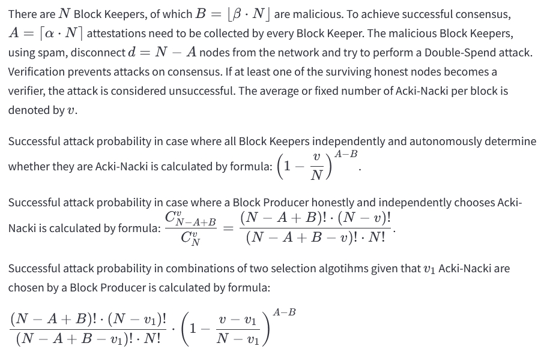

<!-- By delivering 3 blocks per second on one thread, with an unlimited number of possible threads, **Acki Nacki** can sustain, at under 1 second finality, an infinite number of transactions per second — directly proportional to the amount of computing power that exists in the world — making it the only true solution for scalability on the blockchain. 

GOSH is building a decentralized world computer which needs a decentralized backend that can power any cloud service, providing access to databases, and empowering high usage applications, stored entirely on the blockchain. Now this is possible on GOSH. 

**Acki Nacki** also offers higher security guarantees than Bitcoin — Not just that, but the probability of a comet hitting the planet Earth and destroying life as we know it, is higher than the probability that **Acki Nacki** will be broken. -->

***watch the event*** [**here**](https://www.ackinacki.com/){:target="_blank"}

The use cases enabled by GOSH demand so great an amount of data to be processed, that no blockchain technology today can actually cope with handling it entirely on-chain. Consequently, there is a need for a new blockchain architecture that will allow GOSH to do what cloud computing can do.

We present to your attention the **Acki Nacki** consensus algorithm, the innovative blockchain design and
technology for data exchange and replication.

It will allow faster finality, more throughput, and higher security than any other blockchain consensus algorithm.

By delivering 3 blocks per second on one thread, with an unlimited number of possible thread, **Acki Nacki** will be able to support an infinite number of transactions per second with completion in less than 1 second — directly proportional to the amount of computing power available in the world — making it the only true solution for scalability on the blockchain.

<!-- Acki Nacki is a multi-core, multi-threaded execution environment where anyone can deploy a contract and execute many operations in parallel with under 1 second finality. -->

The **Acki Nack is a multi-core** processor that is also **self-tuning**.

Participants periodically agree on the level of network security they want to achieve by changing its parameters, for example, the number of participants.

And it reacts to these changes and adjusts its properties in accordance with the security guarantees of the entire network.

<!-- We trade off deterministic consensus with theoretical constraints on message complexity and number of byzantine agreements with probabilistic algorithms overtaking these boundaries. We further claim that because of the use of randomness and social-economics in blockchain designs, no real trade off is actually present. -->

### **Roles of participants in the network:**

In Acki Nacki, participants can perform three roles: Block Producer, Block
Keeper, and Verifier (which we call an Acki-Nacki entity). All these roles could be performed by any network participant in parallel.

**Block Producer** -  is somebody who takes the transactions received from users, executes them inside the virtual machine, and sends it out to the network.  
This operation is quite fast. Now, if the block becomes too big and there are too many people who want to execute, then the block Producer splits the block into another block and another block and delegates the work to another block Producer.  

As a result, with a heavy load, there will be a network full of block developers. Each of them will offer smaller fragments of this block.

A **Producer of malicious blocks** may also appear

**Block Keeper** - receives blocks and sends confirmation to the network 

<!-- Sometimes he turns into an Acki Nacki creature that has to check the block. -->

Sometimes he turns into **Verifier of blocks** (?) = "Acki Nacki"  
Any node can become a Verifier, this is a random value. And for all nodes events I am Verifier are independent.
Verifier (selected based on the formula) are obliged to validate block.

* if the block is correct, it sends a confirmation (ACK)

* if the lock is malicious, send a message that the lock has not been confirmed (NACK)

Hence why the protocol is called Acki Nacki

(In the decentralized system, there may be some nodes, which are malicious. 
The malicious nodes, using spam, disconnect some nodes from the network and perform a Double-Spend attack. 
To achieve successful consensus some unique BLS signatures of nodes need to be collected.
Verification prevents attacks on consensus.
If at least one of the surviving honest nodes becomes a verifier, the attack is considered unsuccessful.
)

If Verifier do not send ACKI/NACKI, then they will be slashed in the future. 

### **Validator flow**

### **Security**. DDOS Attack.
Our protocol reaches consensus in two communication steps with probabilistic dynamically adjusted safety guarantees.  
One of the key ingredients of our approach is separating the verification of execution by a consensus committee from the attestation of the block propagation by network participants.

Acki Nacki consensus committee is randomly selected for each block and is not predetermined while the Leader is deterministic.

The probability of the successful attack in Ack-Nack consensus approaches zero as the number of confirming blocks tends to infinity.

You can visually view dependency graphs [here:](https://ackinacki-plots.gosh.sh/)

### **Definitions**

**Account** (contract) is a record in a distributed database.

**Thread** is a subset of nodes that serves a particular subset of Accounts.

**Block Producer (BP)** is a leader of a particular Thread responsible for block production.

**Block Keeper (BK)** is an entity having two functions: 
Receives blocks from BP and sends out an Attestation with block hash and other metadata back to BP. BK does not check block transactions validity, it does not try to execute the block, only apply it to its local state with a mark 'Not Final'.
Performs a self check if it needs to become a Verifier for this block as described below. If it does, BK will verify the Block and broadcast the result: Ack, if the Block is ok and Nack, if the block is invalid.

**Verifier (Acki-Nacki)** — is a BK being responsible for block validation and notifying all network participants about his verdict: is block valid or not.

**Attestation** — message that is sent to BP by any BK after receiving the block. Attestation is BLS signature done on BK’s private key. BP of the next block must aggregate all received Attestations for the previous block into one BLS signature and include it into the Common section of the new block.

**Ack** — Verifier’s message that is broadcasted to all network participants by Acki-Nacki if the block is verified and it’s valid. 

**Nack** — Verifier’s message that is broadcasted to all network participants by Acki-Nacki if the block is verified and it’s NOT valid.

<!-- Attestations and Verifier’s messages must contain block hash, its BLS signature on BK’s private key. Some extra data may be added. For example Nack contains the reason for block rejection. -->

