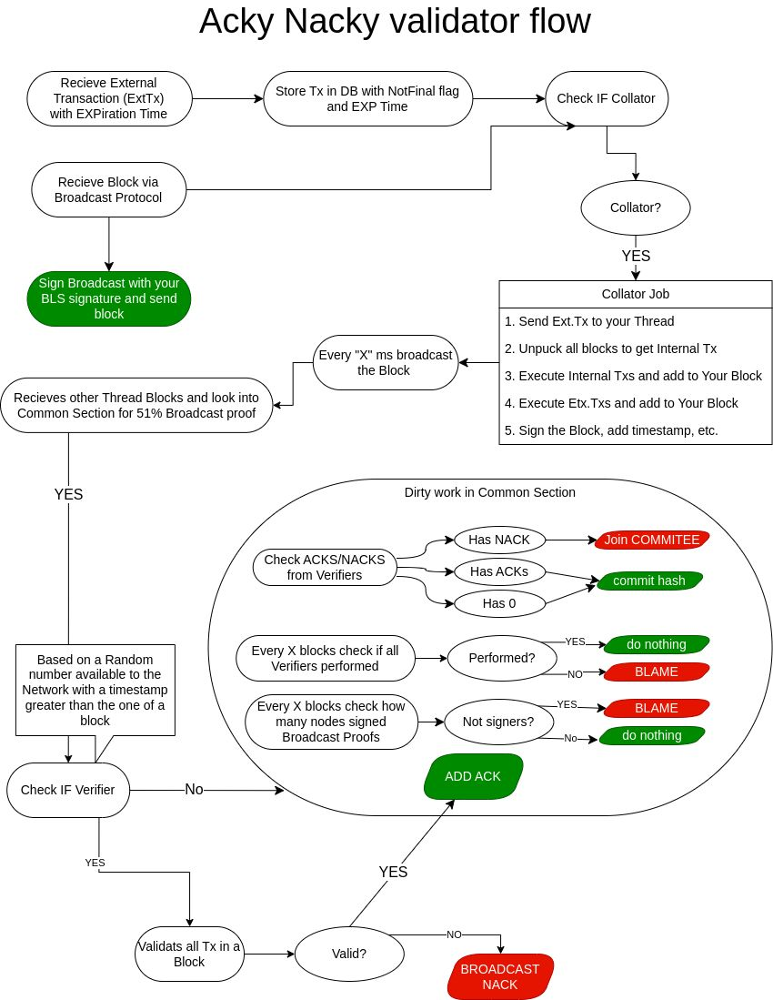

<!-- By delivering 3 blocks per second on one thread, with an unlimited number of possible threads, **Acki Nacki** can sustain, at under 1 second finality, an infinite number of transactions per second — directly proportional to the amount of computing power that exists in the world — making it the only true solution for scalability on the blockchain. 

GOSH is building a decentralized world computer which needs a decentralized backend that can power any cloud service, providing access to databases, and empowering high usage applications, stored entirely on the blockchain. Now this is possible on GOSH. 

**Acki Nacki** also offers higher security guarantees than Bitcoin — Not just that, but the probability of a comet hitting the planet Earth and destroying life as we know it, is higher than the probability that **Acki Nacki** will be broken. -->

*watch the event* [here](https://www.ackinacki.com/)

The use cases enabled by GOSH demand so great an amount of data to be processed, that no blockchain technology today can actually cope with handling it entirely on-chain. Consequently, there is a need for a new blockchain architecture that will allow GOSH to do what cloud computing can do.

We present to your attention the **Acki Nacki** consensus algorithm, the innovative blockchain design and
technology for data exchange and replication. .

It will allow faster finality, more throughput, and higher security than any other blockchain consensus algorithm.

By delivering 3 blocks per second on one thread, with an unlimited number of possible thread, **Acki Nacki** will be able to support an infinite number of transactions per second with completion in less than 1 second — directly proportional to the amount of computing power available in the world — making it the only true solution for scalability on the blockchain.

<!-- Acki Nacki is a multi-core, multi-threaded execution environment where anyone can deploy a contract and execute many operations in parallel with under 1 second finality. -->

The **Acki Nack is a multi-core** processor that is also **self-tuning**.

Participants periodically agree on the level of network security they want to achieve by changing its parameters, for example, the number of participants.

And it reacts to these changes and adjusts its properties in accordance with the security guarantees of the entire network.

<!-- *since the probability of attack can be ex-pressed in terms of the Ack-Nack consensus parameters, these parameters can be dynamically adjusted depending on the required security guarantees, the number of validators in the system, and other parameters.* -->

**Roles of participants in the network:**

**Block Producer** -  is somebody who takes the transactions received from users, executes them inside the virtual machine, and sends it out to the network.  
This operation is quite fast. Now, if the block becomes too big and there are too many people who want to execute, then the block Producer splits the block into another block and another block and delegates the work to another block Producer.  

As a result, with a heavy load, there will be a network full of block developers. Each of them will offer smaller fragments of this block.
<!-- 
The Acki Nacki block producer takes the transactions, applies them to the block, and sends this block to everyone, every 330 milliseconds. And in roughly another 200 milliseconds on top of that, all other existing network participants will get the block, then unpack the block, and apply it to the state, which takes another 100, 120 milliseconds. -->

A **Producer of malicious blocks** may also appear

**Block Keeper** - receives blocks and sends confirmation to the network 

<!-- Sometimes he turns into an Acki Nacki creature that has to check the block. -->

Sometimes he turns into **Verifier of blocks** (?) = "Acki Nacki"  
Any node can become a Verifier, this is a random value. And for all nodes events I am Verifier are independent.
Verifier (selected based on the formula) are obliged to validate block.

* if the block is correct, it sends a confirmation (ACK)

* if the lock is malicious, send a message that the lock has not been confirmed (NACK)

Hence why the protocol is called Acki Nacki

(In the decentralized system, there may be some nodes, which are malicious. 
The malicious nodes, using spam, disconnect some nodes from the network and perform a Double-Spend attack. 
To achieve successful consensus some unique BLS signatures of nodes need to be collected.
Verification prevents attacks on consensus.
If at least one of the surviving honest nodes becomes a verifier, the attack is considered unsuccessful.
)

If Verifier do not send ACKI/NACKI, then they will be slashed in the future. 

"The network is optimized for optimism"(с)(Mitja) 

If a malicious block appears, the network slows down to mitigate the attack and sort itself out, and then continue working.

_______________________________________________________
(????)
IGF
GBA
Triscale   Wallacea Trust
DeVOTE
(?????)

<!-- TODO ?
GBA- ассоциация управления блокчейнов, которая управляет Форумом Интернет Правительст
под названием "Динамическая коалиция" в ООН решили создать  ДАО на GOSH, чтобы работать над своей политикой, проектами, файлами  задачами на блокчейне и осууществлять управление над этими процессами.

Triscale сотрудничает c Wallacea Trust - для них мы сделаем процесс экспертной отценки для ревью децентрализованным

DeVOTE - массовое криптографическое голосованиес использованием докозательств с  ZK Proofs 
-->

security?

2  algorithms that guarantee network security:

<!-- 1) узнать кто будет следующим "Acki Nacki" , которым дудет проверять блок

2) каждый Block Keeper может стать "Acki Nacki" в каком то раунде

Каждый блок должен быть подписан специальным "???" если нет,  то не сможет создавть блоки или его блоки никогда не будт приняты -->

1. 
2. 

________________________________

As a result, GOSH will now become the first **decentralized operating system for non-financial applications**

GOSH is already the 2 Level for Ethereum, but in the future GOSH may become the 2 Level for many blockchains and provide endless scalability to run applications (fast and free).

## Acki-Nack Consensus

<!-- *****************************
 Let's imagine that we have a random number that is known to the network after the block was created by a proposer, that all agree upon, but that is not related to block validity — just a random number — and each validator will have their private key only known to them. Now let’s divide this random number by this private key and with Modulo division. If the Modulo ends with, for example, zero (0), then they know for themselves that they need to validate the book. A process entirely random and unpredictable

Now we don't know how many Validators there will be, we don't know who they are, and the block proposer doesn't know who they are, meaning no collusion is possible. These random nodes will just validate this block. If they see that the block is not correct, they will send a negative acknowledgement/not acknowledged message (NACK) — the definition: “a signal used by computers or other devices to indicate that data transmitted over a network was received with errors or was otherwise unreadable … sent by a recipient to report that a specific, expected signal must be re-sent for some reason … NACK messages often include the ability to report on the reason the message is being NACKed” — And if they see the block is correct, they will send an acknowledged message, or ACK. Hence why the protocol is called Acki Nacki

When a verifier finds that a block is not correct, they will send the NACK message to the network and the block proposer will be stripped of all of his money and be kicked out of the network immediately.

*********************************** -->

Each Node obtains block  propagates  message.

And also Node computes if it is Verified for block

Any node can become a Verifier, this is a random value. 

And for all nodes events I am Verifier are independent.

Verifier (selected based on the formula) are obliged
to validate block.

If they will not (do not send ACKI/NACKI),
then they will be slashed in the future. 

Also if they produced incorrect verdict for block, they will be punished too. 
For good job they will rewarded.

    Any node can verify block block (if she wants) too, even if it is not selected.

    And she can send ACKI/NACKI.

    For incorrect verdict it will be punished. 

    *But will it get reward per good job as other Verifiers?*

When any node receives a confirmation/NACK for a block, it adds that block to the chain locally.

### Validator flou

Mathematical formulas:

#### The new block producing
#### The verifiers assigning
#### The block verification
#### The block finalization
#### The block producer election
#### Slashing

PERFORMANCE ANALYZIS

<!-- Why it is incredible fast? -->
The crucial feature is that the block producer does not change if everything goes well. Thus, it does not change too often and therefore the protocol does not spend a lot of time re-electing a new block producer and reconfiguring the network

to it

### Security. DDOS Attack.

follows that the probability of the successful
attack in Ack-Nack consensus approaches zero as the number
of confirming blocks tends to infinity.

*graphics*

### proofs L2 for Ethereum

## Defenitions

blockchain, 
consensus, 
BFT, BLS signature,
DDOS attack

Producer of malicious blocks

**Block Keepers** - all nodes in network who
participate in consensus: hold the replicated state, build new
blocks, receive messages, check and sign blocks.

**Thread** is a subset of block keepers that is ..
together with data .. thread does not change from one block
to another  
Threads can’t intersect. Threads are like shards in TON
blockchain. The set of keepers servicing the thread can change
(by voting).

**Block Producer** - one of block keepers who assemble the Bi from
received unhandled messages and broadcast the Bi
to other block keepers.  
There is only one block producer in each thread for each
block number.  
Verifier of blocks (Acki-Nacki)

**Verifiers** are those block keepers who are assigned to verify (this is their responsibility and they
will be punished if they fail to do so, while the other keepers can check or not check the block as they wish) and broadcast
the checking results to all other keepers of current thread.  

Block keepers can exchange data of several types:  
1) the messages notifying about events (“Event messages”), which in turn are divided into messages about external events “External messages”) and internal events (“In-ternal messages”) regarding the current thread.

2) broadcast protection (BP) messages

3) the blocks