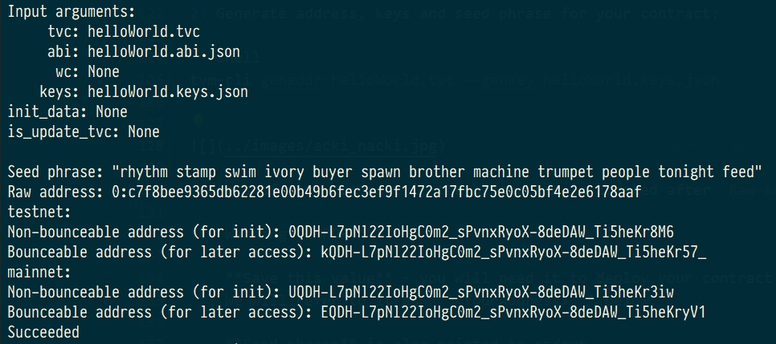
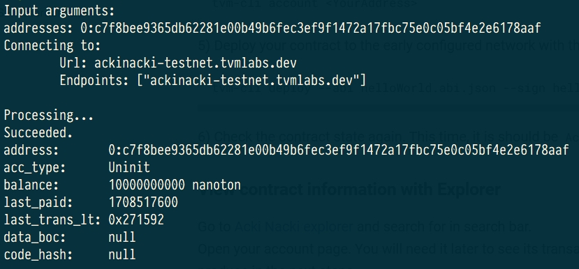
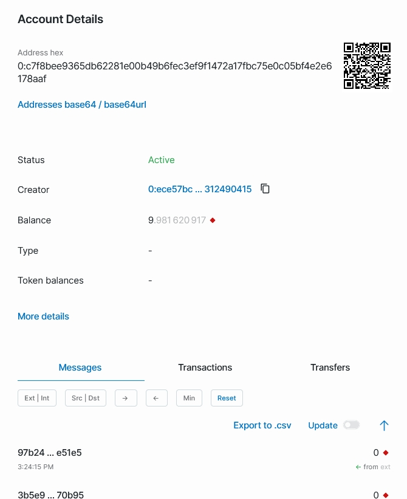
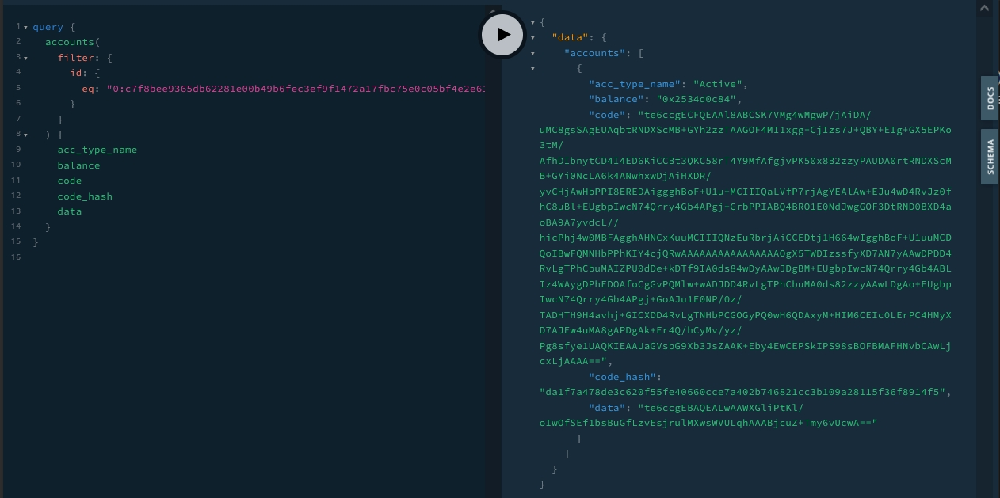
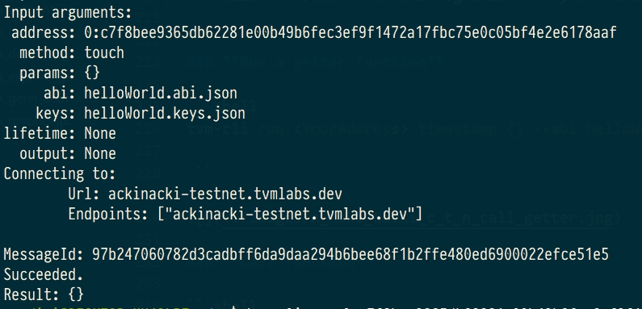

## **Quick Start**

### **Guide overview**

This guide will help you get started with such essential Acki Nacki tools as:

* [TVM-CLI](https://github.com/tvmlabs/tvm-cli)  
* [Solidity Compiler](https://github.com/gosh-sh/TON-Solidity-Compiler)  
* [Acki Nacki Blockchain Explorer](https://ackinacki-testnet.tvmlabs.dev/landing)  
* GraphQL API
<!-- TODO added link  -->

You will learn how to:

* Create and compile your first Solidity contract
* Deploy your first contract
* Run it on-chain
* Run a getter-function
* Make a transfer
* Explore contract data in Explorer and GraphQL playground
* Configure your own giver


### **Install TVM-CLI**

Download  and install the TVM-CLI for the platform you need from [here](https://github.com/tvmlabs/tvm-cli/releases/tag/0.38.0)


### **Create contract**

Create file `helloWorld.sol` with following content:

```solidity
pragma ton-solidity >= 0.35.0;
pragma AbiHeader expire;

// This is class that describes you smart contract.
contract helloWorld {
    // Contract can have an instance variables.
    // In this example instance variable `timestamp` is used to store the time of `constructor` or `touch`
    // function call
    uint32 public timestamp;

    // Contract can have a `constructor` – function that will be called when contract will be deployed to the blockchain.
    // In this example constructor adds current time to the instance variable.
    // All contracts need call tvm.accept(); for succeeded deploy
    constructor() public {
        // Check that contract's public key is set
        require(tvm.pubkey() != 0, 101);
        // Check that message has signature (msg.pubkey() is not zero) and
        // message is signed with the owner's private key
        require(msg.pubkey() == tvm.pubkey(), 102);
        // The current smart contract agrees to buy some gas to finish the
        // current transaction. This actions required to process external
        // messages, which bring no value (hence no gas) with themselves.
        tvm.accept();

        timestamp = block.timestamp;
    }

    function renderHelloWorld () public pure returns (string) {
        return 'helloWorld';
    }

    // Updates variable `timestamp` with current blockchain time.
    function touch() external {
        // Each function that accepts external message must check that
        // message is correctly signed.
        require(msg.pubkey() == tvm.pubkey(), 102);
        // Tells to the TVM that we accept this message.
        tvm.accept();
        // Update timestamp
        timestamp = block.timestamp;
    }

    function sendValue(address dest, uint128 amount, bool bounce) public view {
        require(msg.pubkey() == tvm.pubkey(), 102);
        tvm.accept();
        // It allows to make a transfer with arbitrary settings
        dest.transfer(amount, bounce, 0);
    }
}
```

### **Install Solidity compiler**

<!-- TODO change link

Download and install the Solidity compiler for required platform from [here](https://github.com/gosh-sh/TON-Solidity-Compiler/releases)-->

Download and install the Solidity compiler for Linux from [here](https://github.com/gosh-sh/gosh/tree/dev/v6_x/v6.2.0/contracts/compiler)

*(For other platforms is coming soon)*

### **Compiling**

Compile the contract using Solidity compiler:

```shell
sold helloWorld.sol
```

The compiler produces `helloWorld.code`, `helloWorld.tvc` and `helloWorld.abi.json` to be used in the following steps.

Binary code of your contract is recorded into `helloWorld.tvc` file.

### **Deploy**

Let's deploy the contract to Acki Nacki development blockchain  
at **ackinacki-testnet.tvmlabs.dev**


1) Make sure TVM-CLI is in $PATH:

```shell
export PATH=$PATH:<PATH_TO>/tvm-cli

tvm-cli config --url ackinacki-testnet.tvmlabs.dev
```

2) Generate address, keys and seed phrase for your contract:

```shell
tvm-cli genaddr helloWorld.tvc --genkey helloWorld.keys.json
```

Address of your contract in the blockchain is located after `Raw address:`




!!! Warning "IMPORTANT" 

    **Save this value** - you will need it to deploy your contract and to work with it.  
    We will refer to it as **`<YourAddress>`** below.  
    
    **Seed phrase** is also printed to stdout.  
    **Key pair** will be generated and saved to the file **`helloWorld.keys.json`**.


3) Get some test-tokens to your account.


!!! note 

    You will need to send some tokens to the address before the actual deployment. Acki Nacki deploy is fee-based, so your new contract will be charged for this.  
    ***(You will need about 10 tokens to deploy)***

We recommend creating a [Wallet contract](./#creating-your-own-giver) that will serve as your giver.

To replenish it, please contact us in [Channel on Telegram](https://t.me/+1tWNH2okaPthMWU0).


4) Check the state of the pre-deployed contract. It should be `Uninit`:

```shell
tvm-cli account <YourAddress>
```

You will see something similar to the following:



5) Deploy your contract to the early configured network with the following command:

```shell
tvm-cli deploy --abi helloWorld.abi.json --sign helloWorld.keys.json helloWorld.tvc {}
```

!!! info

    If there are arguments in the contract constructor, then they must be specified in curly brackets  
    {<constructor_arguments>}


6) Check the contract state again. This time, it is should be `Active`.


### **View contract information with Explorer**

Go to [Aсki Naсki explorer](https://ackinacki-testnet.tvmlabs.dev/landing) and search for <YourAddress> in search bar.  
Open your account page. You will need it later to see its transactions and messages, that we will produce in the next steps.



### **Explore contract information with GraphQL**

Go to [GraphQL playground](https://ackinacki-testnet.tvmlabs.dev/graphql).  
Enter in the left pane and click Run button (replace the contract's address with the one you got in the previous steps).

```graphql
query {
  accounts(
    filter: {
      id: {
        eq: "<YourAddress>"
      }
    }
  ) {
    acc_type_name
    balance
    code
    code_hash
    data
  }
}
```

You will see something that looks similar following:



!!! info

    **You can specify any other fields in the result section that are available in GraphQL Schema.**  
    Click **`Docs`** on the right side of your screen to explore it.


### **Run a getter function**

```shell
tvm-cli run <YourAddress> timestamp {} --abi helloWorld.abi.json

```
for example, the `timestamp` method:


### **Call function**

```shell
tvm-cli call <YourAddress> touch {} --abi helloWorld.abi.json --sign helloWorld.keys.json
```

for example, the `touch` method:



### **Creating your own giver**
To create your own giver, deploy (according to the instructions [above](./#create-helloworld-contract)) any contract of wallet,  
for example this one:


```solidity
pragma solidity >= 0.6.0;

/// @title Simple wallet
/// @author Tonlabs
contract Wallet {
    // Modifier that allows function to accept external call only if it was signed
    // with contract owner's public key.
    modifier checkOwnerAndAccept {
        // Check that inbound message was signed with owner's public key.
        // Runtime function that obtains sender's public key.
        require(msg.pubkey() == tvm.pubkey(), 100);

        // Runtime function that allows contract to process inbound messages spending
        // its own resources (it's necessary if contract should process all inbound messages,
        // not only those that carry value with them).
        tvm.accept();
        _;
    }

    /*
     * Public functions
     */

    /// @dev Contract constructor.
    constructor() public checkOwnerAndAccept { }

    /// @dev Allows to transfer grams to the destination account.
    /// @param dest Transfer target address.
    /// @param value Nanograms value to transfer.
    /// @param bounce Flag that enables bounce message in case of target contract error.
    function sendTransaction(address payable dest, uint128 value, bool bounce) public view checkOwnerAndAccept {
        // Runtime function that allows to make a transfer with arbitrary settings.
        dest.transfer(value, bounce, 3);
    }
	
    // Function to receive plain transfers.
    receive() external payable {
    }
}
```

Request test tokens [from us](https://t.me/+1tWNH2okaPthMWU0) for this wallet and pay for the deployment of contracts from this wallet in the future

### **Transfer of tokens from own giver**

```shell
tonos-cli call <walletAddress> sendTransaction '{"dest":"DestAddress", "value":10000000000, "bounce":false}' --abi wallet.abi.json --sign wallet.keys.json
```

!!! info

    * Contracts take value in nanotokens
    * You will need approximately 10 tokens to deploy the contract
    * **Bounce = true** means that if the recipient does not exist, money will be returned back.  
    If you plan to transfer money for deploy, specify **Bounce = false**!


### **What's next?**

Congratulations, тow your contract is up and running!  
Now, you can get acquainted with:

* [Solidity API for TVM](https://github.com/gosh-sh/TON-Solidity-Compiler/blob/master/API.md)
* [more contract samples](https://github.com/tonlabs/samples/tree/master/solidity)
