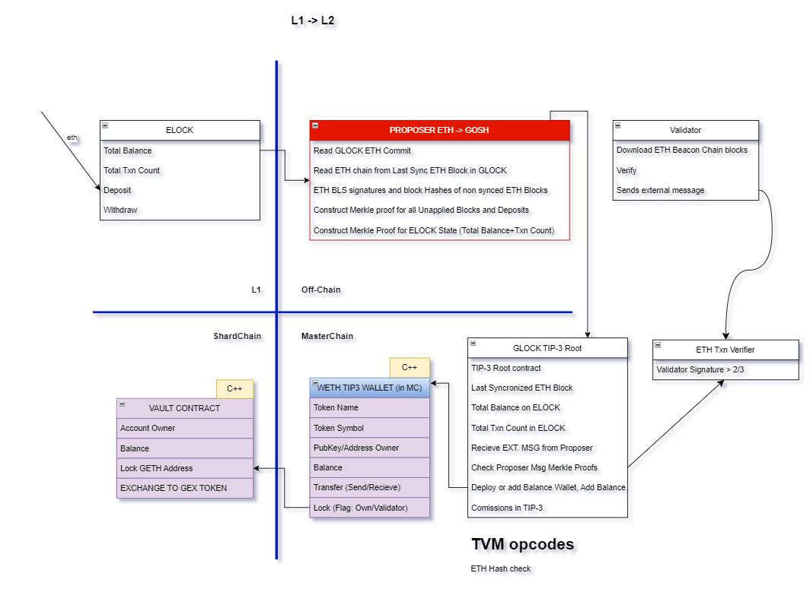
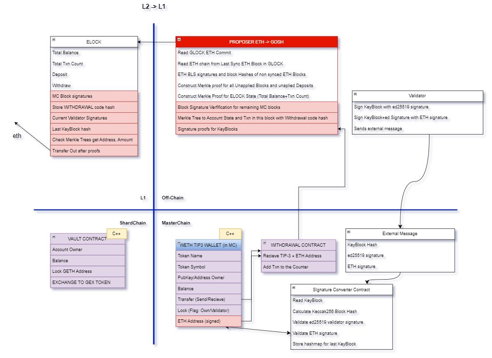

# **GOSH Ethereum L2**

## **Overview**

GOSH is an asynchronous, highly scalable validity rollup which enables any asset on Ethereum blockchain to be transferred into GOSH and vice versa. All ZK Proofs (Zero-knowledge proofs) are prepared on the user side by a [**Proposer**](ethereum-L2.md#definitions " is an off-chain program which packages all necessary data to prove to GOSH chain that a particular transaction (let’s call them “L2 transactions”) on Ethereum Network took place and vise versa — to prove to Ethereum ELOCK smart contract (i.e. Ethereum validators) that an L2 transaction took place on the GOSH Blockchain").
It then submitted to Independent Collator which receives user input and executes them on GOSH.

Anyone can submit a resulting **L2 (GOSH Blokchain)** state root to **L1 (Etherium Blokchain)**. Randomly selected Verifiers run the state transition periodically and slash Collators in case of a fraud via decision by L1. Verifiers are slashed for false fraud alerts. If Collator is censoring users' transactions, it is possible to force the transaction via L1. Anyone can publish L2 state root but only Collator can propose L2 state change.

**Constraints:**

* L1 can’t have the L2 entire state (L2 state is too large)
* There must be a mechanism to move funds from L2 even if: L2 is not moving; L2 has banned specific accounts
* EVM and TVM are different. TVM is a reference VM for the L2 chain. This means that even if L1 has a state it can’t execute transactions to verify correctness. But it can execute ZKP which will prove the correctness of operations in the particular circuit

## **Development process**

### **Stage 1: Trustless Bridge, kinda**

!!! info
    At this stage we assume:  
    L2 fully trusts L1, it knows Validators (Committee) PubKeys and can always validate the chain of L1 blocks.  
    We do not validate the smart contract execution on L2. We protect against any malicious 3rd party except for L1 and L2 Validators.

As an example we will talk about ETH moving from Ethereum mainnet into WETH Asset on GOSH L2 Blockchain and back. In general any asset  on Ethereum can be supported with necessary adjustments made to [ELOCK](ethereum-L2.md#definitions "is a GOSH L2 smart contract on Ethereum Blockchain") smart contract Deposit/Withdrawal functions.

Since GOSH uses ed25519 we use a double signature envelope scheme to prove signatures on GOSH to ELOCK Smart Contract on Ethereum (*we could use ZKP to prove the ed25519 or a precompile proposed EIP665 whenever either of those solutions will be production ready*).

The scheme for transferring assets from the Etherium to GOSH

The scheme for transferring assets from the GOSH to Etherium

!!! info 
    *What we don’t cover at this Stage?*  

    * L2 contract execution is not validated (no validity or fraud proofs)  
    * Funds retrieval function in case of L2 censored / stopped  
    * L1 Funds retrieval is complicated and expansive  

### **Stage 2: Optimistic roll-up, kinda**

!!! info
    At this stage we add fraud and execution proofs for [TIP-3](ethereum-L2.md#definitions "is a distributed token smart contract standard on GOSH blockchain") сontracts.

The Proposer constructs the TIP-3 execution proof and sends it together with block proofs. If the execution is correctly proved the funds can be withdrawn immediately. If the Proposer does not wish to pay the gas fees for ZKP execution it can supply the withdrawal request without any proof but with a bond. In which case the withholding period will be activated (hence optimistic rollup). Another Proposer can verify the correctness of execution of the TIP-3 in the proposed batch and if found incorrect execution can supply the fraud proof (consisting of proof of the correct execution of the corrupted TIP-3 transaction and proof of block tree hashes which will be incompatible with hashes provided by the first Proposer) and collect the Proposer Bond.
 
At this stage we have added a mechanism of Fraud proof of L2 validators making the network effectively on par with security assumptions of other оptimistic rollups, but also providing a mechanism for immediate Validation of token contract execution on L2 network. We do not prove the whole network, but do we really need to? What difference does it make if the rest of state transition is corrupted if the contracts holding L1 balances are correct?

!!! info
    *What we don’t cover at this Stage?*  

    * Funds retrieval function in case of L2 censored / stopped  
    * L1 funds retrieval is complicated and expansive in case of immediate withdrawal  

### **Stage 3: Validium ZKP roll-up**

At this stage we are adding external Verifiers and putting a bond of L2 Collators on Ethereum mainnet. Verifiers will be able to supply fraud proofs as well as data availability proofs.

The Verifiers have the ability to slash the L2 Collators in case of misbehavior by supplying ZKPs proving the wrong block production, or by successfully challenging data availability proofs  making it effectively an Ethereum Sharding design, since GOSH is multithreaded, multisharded blockchain.

Let’s remember that Zero Knowledge Proofs are probabilistic. The Verifier check protocol is probabilistic as well. The ZKP does not prove that every operation on the L2 blockchain is correct because that would not only be costly but not necessarily increase the probability of the correctness in respect to Verifiers check.

Let's say we have `S` threads and `N` validators, out of which M are malicious. For each thread, we choose `L` validators that will sign the block. If a group of validators gathers at least `C` malicious ones, the attack is considered successful.  
Let's calculate the probability of an attack on a single thread.

The total number of ways to choose validators for a thread is $C _{N} ^{L}$

Let `i` be the number of malicious validators gathered in a thread. To find the number of ways to choose at least `C` malicious validators, we need to multiply the number of ways to choose malicious validators by the number of ways to choose regular validators.

That is $C _{M} ^{i} * C _{N-M} ^{L-i}$

Since we need to gather at least `C` malicious validators, the total number of ways will be the sum 

of `i` from `C` to `L` :

$$\displaystyle\sum_{i=C}^{L} C _M^i * C _{N-M}^{L-i}$$

The final probability of an attack on a single thread, without considering verifiers, is

$$P = \frac{\displaystyle\sum_{i=C}^{L} C _M^i * C _{N-M}^{L-i}}{C _{N} ^{L}}$$

Let $T = \frac{N}{R}$ where `R` is some number. A validator becomes a verifier if the remainder of some hash when divided by ${T}$ equals zero.

In each round, the probability for a particular validator to become a verifier is $\frac{1}{T}$. For the attack to be successful, none of the honest validators should become a verifier.

The probability of this is $(1 - \frac{1}{T}) ^{N-M}$

Thus, the final probability of the attack is

$$P = \frac{\displaystyle\sum_{i=C}^{L} C _M^i * C _{N-M}^{L-i}}{C _{N} ^{L}} * (1 - \frac{1}{T}) ^{N-M}$$

Which is less of an a probability of successful attack on Bitcoin blockchain:

!!! note annotate "Important"
    At this stage there is no need to trust L2 Collators with anything. L1 is able to verify all L2 state transitions and L2 can verify L1 contract state transitions. Funds are easily withdrawn from either blockchain. To break the system both L1 and L2 need to be corrupted or stopped simultaneously.

### **Proof Summary**

| **What do we Prove**     | **How do we Prove it** |
| ------------------------ | ------------------------------------ |
| **`L1 Blocks are correct`**    | BLS Signatures check  |
| **`L2 Blocks are correct`**    | Validator signatures + Verifiers Fraud Proofs |
| **`L1 transaction are within the correct blocks`** | Merkle tree proof from Transaction hash to L1 block hash |
| **`L2 transaction are within the correct blocks`** | Merkle tree proof from Transaction hash to L2 block hash |
| **`All L1 transactions are provided to L2 from block A to block B`** | Txn count in block a and Txn count in block B are known we can verify that total transaction count transferred to [GLOCK](ethereum-L2.md#definitions "is a special TIP-3 Token Root Contract on GOSH Blockchain") is correct and since we have hashes it's impossible to cheat
| **`Transaction counts and Balances are correct for L1 Block transmitted to L2`** | Merkle tree of account states for a particular L1 block |
| **`All L2 Withdrawal Transactions are transferred to L1   from Block A to Block B`** | Txn count in block a and Txn count in block B are known we can verify that total transaction count transferred to ELOCK is correct and since we have hashes it's impossible to cheat
| **`TIP-3 Deposit/Transfer/Withdrawal Transaction  Execution is correct`** | ZKP for TIP-3 Circuit |
| **`Validator set change from last KeyBlock is correct`** | ZKP for Elector contract Circuit |
| **`Validators Fraud Proofs`** | Fraud detection mechanism by Verifiers |

## **Contracts**

* ELOCK 
* GLOCK
* tip3root
* tip3wallet

## **Usage**
Any DAO on GOSH can become Ethereum Layer 2 with a click of a button.

!!! info
    This is only possible in the GOSH version at least 6.1.0

To do this, go to the Etherium tab:

or select the appropriate section by clicking on your profile in the right corner:

Now we can test the ETH transfer in the alpha version.

Сlick on:

<!-- DAO members can choose to have their token available in Ethereum, effectively making any project its own L2. And because GOSH L2 supports ERC-20 Tokenization, we offer easy ecosystem integration for any project............... -->

## **Definitions**

**Proposer** is an off-chain program that any user can run on their own machine. It packages all necessary data to prove to GOSH chain that a particular transaction (let’s call them “L2 transactions”) on Ethereum Network took place and vise versa — to prove to Ethereum ELOCK smart contract (i.e. Ethereum validators) that an L2 transaction took place on the GOSH Blockchain.

Proposer will always accumulate all transactions that are currently not applied to generate the proof, thus ensuring that all transactions of the opposite network are applied. If that is not the case the State Validation function will fail.

**ELOCK** — is a GOSH L2 smart contract on Ethereum Blockchain. It receives deposits from users, manage withdrawals and locks user funds. ELOCK is also counting its total balance, total transaction count and stores root Merkle proofs, withdrawal smart contract code hash, etc. for L2 synchronization.

**TIP-3** — is a distributed token smart contract standard on GOSH blockchain. It is formally verified scalable token design for sharded architecture optimized for parallelization.

**GLOCK** — is a special TIP-3 Token Root Contract on GOSH Blockchain. Aside from managing TIP-3 distributed token it also manages the deposits and withdrawals of ELOCK assets. It receives external message from Proposers, with Ethereum blockchain proofs signed by Ethereum committee,  checks total transaction count consistency, checks Proposer message Merkle proofs, deploy or add to TIP-3 balances to corresponding User addresses.

**WITHDRAWAL** — is a smart contract on GOSH that manages user withdrawals. It receives TIP-3 transactions, verifies them and adds transactions to the counter index.

**WETH TIP-3 Wallet** — is a custom TIP-3 contract that runs in GOSH Masterchain and in addition to standard functions has Lock/Unlock method. Lock is called when WETH needs to be transferred to Ethereum Blockchain. Lock is proved to ELOCK contract in order to allow for ETH native token withdrawals. 

**VAULT** — is GOSH Shardchain smart contract that Wraps WETH TIP-3 tokens into tradable assets on GOSH Network

**TVM** — is a Custom Virtual Machine GOSH Blockchain uses. For the GOSH L2 release we have added special TVM Opcodes for Ethereum signatures and Hash function, thus TVM smart contract can run Signature Verifications and Calculate Hash functions from Ethereum Data. 
