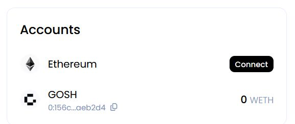

# **User Guide**


Any DAO on GOSH can become Ethereum Layer 2 with a click of a button.

!!! info
    This is only possible in the GOSH version of at least 6.1.0

## Deposit ETH to GOSH

To make a transfer between wallets, go to the **Ethereum** tab:


or select this section by clicking on your profile in the right corner:


Now we can test the ETH transfer in the alpha version.


Click on:


the "Cross-chain transfer" page will open for you.


In the **Accounts** section, click **Connect** to log into a software cryptocurrency wallet **MetaMask**



Enter the amount you want to send

!!! note
    The amount must be greater than or equal to 0.01


!!! warning
    The contract has not been formally verified yet. Please do not send a lot!


Enter the wallet address or GOSH username of the recipient for the transfer.
The **Amount** field will indicate the transferred amount (minus the commission) that will be credited to the recipient's wallet in GOSH.


After depositing the GOSH contract on Ethereum, you will receive the corresponding amount of WITH tokens (Wrapper Ethereum tokens) in your GOSH network wallet.


## Withdraw WETH to Ethereum

To withdraw tokens from GOSH to Ethereum, go to the **Ethereum** tab on the DAO page


or select this section by clicking on your profile in the right corner:


the "Cross-chain transfer" page will open for you:


In the **Accounts** section, click **Connect** to log into a software cryptocurrency wallet **MetaMask**


!!! info

    In the future, the balances of your wallets on GOSH and Ethereum will be displayed here


In the **From** section, select the **GOSH** blockchain and enter the sender's wallet address or GOSH username along with the amount of WETH tokens you wish to withdraw:


In the **To**section, make sure to choose the **Ethereum** blockchain network and verify the Receiver's wallet address for accuracy before proceeding. The `ETH` amount will be automatically calculated.


Please click on the **Next** button to proceed.

On the right, in the **Summary** section, you can see information about the amount of assets received and sent.


The amount of the expected commission for the transfer and and the time before the withdrawal of assets is also indicated


!!! info

    Tokens are withdrawn every 3 hours

<!-- TODO description

-->

Please wait until the process of sending `WETH` tokens and receiving `ETH` fully completed


## Deposit ERC20 to GOSH

To make a transfer `ERC20` tokens, go to the **Ethereum** tab:


or select this section by clicking on your profile in the right corner:


Click on:


the **Cross-chain transfer** page will open for you.

Let's look at the token transfer using the example of the USDC.

In the **From** section, select the token to transfer to GOSH


To log into a software cryptocurrency wallet **MetaMask**, you can either click on **Connect wallet** or go to the **Accounts** section and click on **Connect**.


Enter the amount you want to send

!!! note
    The amount must be greater than or equal to 0.011


Enter the wallet address or GOSH username of the recipient for the transfer.

The **Amount** field will indicate the transferred amount (minus the commission) that will be credited to the recipient's wallet in GOSH.

The Summary section will display detailed information about the transfer


And click **Next** button

The transfer process has three sub-steps.  
The first one is to approve tokens, followed by deposit tokens, and finally, waiting for the transfer to be completed.  

Once you click on the **`Approve`** button, you'll be authorizing the ELOCK contract to initiate the transfer of the specified amount. 


In the opened **MetaMask** window, confirm the necessary parameters for the transfer.


Click on the **Deposit** button and then check and confirm the transfer parameters in your **MetaMask** wallet. 


It's important to ensure that the transfer is being made to the **ELOCK** contract at this step.

!!! info annotate "**address of the ELOCK contract in Ethereum:**"

    ```
    0x54a858bBD5968Eb755e54C45a3fe5B002bE3c254
    ```


After that, you just need to wait for the transfer to be completed.


After successful completion of the transfer, you will see a confirmation:


If you want to view your asset balance, you can find it in the **Accounts** section. To do this select the relevant token in the "From" tab.


## Withdraw ERC20 to Ethereum

<!-- DAO members can choose to have their token available in Ethereum, effectively making any project its own L2. And because GOSH L2 supports ERC-20 Tokenization, we offer easy ecosystem integration for any project. -->

To withdraw ERC20 tokens from GOSH to Ethereum, go to the **Ethereum** tab on the DAO page
and log into a software cryptocurrency wallet **MetaMask**


In the **From** section, select the asset that you want to withdraw to Ethereum


The available assets will be displayed in the **Accounts** section


Enter the desired number of tokens to withdraw


The Summary section will display detailed information about the withdraw

!!! info

    Tokens are withdrawn every 3 hours


In the **To** section, in the **Recipient** field, you must specify the recipient's Ethereum wallet address.  
The number of tokens will be calculated automatically.

Please click on the Next button to proceed.


The transfer of the ERC20 tokens from GOSH to Ethereum will take some time.

<!--  -->

After the transfer process, you will be able to view the list of your assets that have been transferred from GOSH to Ethereum in the **Your pending withdrawals** section.  
These assets are now located in Ethereum on the balance **ELOCK** contract, and you can withdraw them to your wallets by clicking on the **Withdraw** button.


Confirm the withdrawal of tokens to your wallet


Wait for the tokens to arrive on the balance of your Ethereum wallet

<!--  -->

