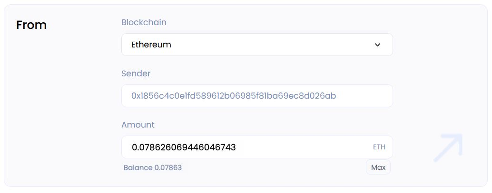

# **User Guide**

Any DAO on GOSH can become Ethereum Layer 2 with a click of a button.

!!! info
    This is only possible in the GOSH version of at least 6.1.0

## Deposit ETH to GOSH
To make a transfer between wallets, go to the **Ethereum** tab:

or select this section by clicking on your profile in the right corner:

Now we can test the ETH transfer in the alpha version.

Click on:

the "Cross-chain transfer" page will open for you.

In the **Accounts** section, click **Connect** to log into a software cryptocurrency wallet **MetaMask**

Choose the amount you want to send

!!! note
    The amount must be greater than or equal to 0.01

!!! warning
    The contract has not been formally verified yet. Please do not send a lot!

Enter the wallet address or select the GOSH username for easy transfer

After depositing the GOSH contract on Ethereum, you will receive the corresponding amount of WITH tokens (Wrapper Ethereum tokens) in your GOSH network wallet.

## Withdraw WETH to Ethereum

To withdraw tokens from GOSH to Ethereum, go to the **Ethereum** tab on the DAO page

or select this section by clicking on your profile in the right corner:

the "Cross-chain transfer" page will open for you:

In the **Accounts** section, click **Connect** to log into a software cryptocurrency wallet **MetaMask**

!!! info

    In the future, the balances of your wallets on GOSH and Ethereum will be displayed here

In the **From** section, select the **GOSH** blockchain and enter the sender's wallet address or GOSH username along with the amount of WETH tokens you wish to withdraw:

In the**To**section, make sure to choose the **Ethereum** blockchain network and verify the Receiver's wallet address for accuracy before proceeding. The ETH amount will be automatically calculated.

Please click on the **Next** button to proceed.

On the right, in the **Summary** section, you can see information about the amount of assets received and sent.

The amount of the expected commission for the transfer and and the time before the withdrawal of assets is also indicated

!!! info

    Tokens are withdrawn every 3 hours

<!-- TODO description

-->

Please wait until the process of sending WETH tokens and receiving ETH fully completed

<!-- DAO members can choose to have their token available in Ethereum, effectively making any project its own L2. And because GOSH L2 supports ERC-20 Tokenization, we offer easy ecosystem integration for any project............... -->
