# **User Guide**

## Hackathon

### **for the organizers**

!!! warning "important"
    * To create a Hackathon, you must be a member of the DAO.

    * The DAO must have enough tokens in its reserve to allocate towards Hackathon rewards.

    * The experts who will be part of the jury for the Hackathon must be registered participants of the DAO before the event commences.

To create a **Hackathon**, you need to navigate to the **"Hacks & Grants"** tab in the DAO where you are a member.

Make sure to check the guidelines and requirements of the DAO to ensure that you have the necessary permissions and resources to host the Hackathon.

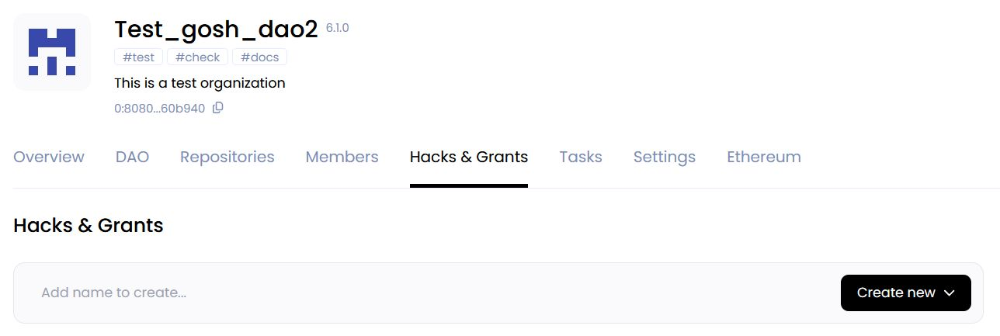

and click **Create new** or start typing the name of the your Hackathon

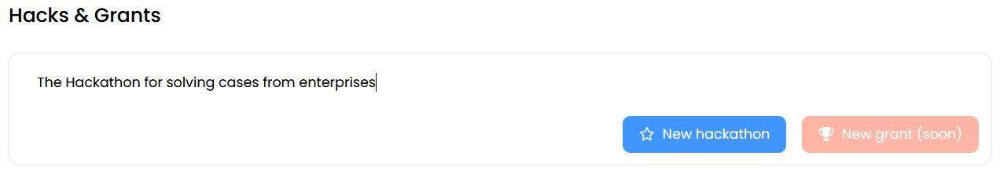

then click **New hackaton**

**On the page that opens, enter all the necessary  information about the event:**

* In the **README** section tell the about your program. What are its aims? Who should participate? How will it work?

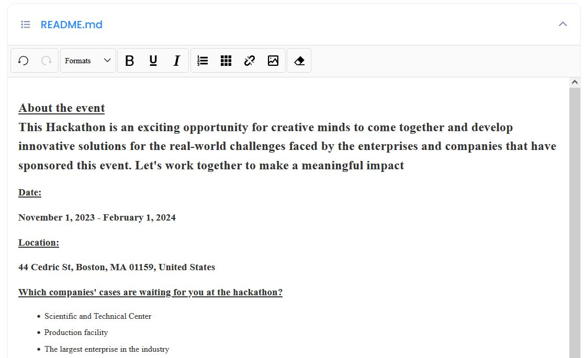

* In the **RULES** section, describe the rules that the participants should follow. What is expected, allowed and strictly prohibited?

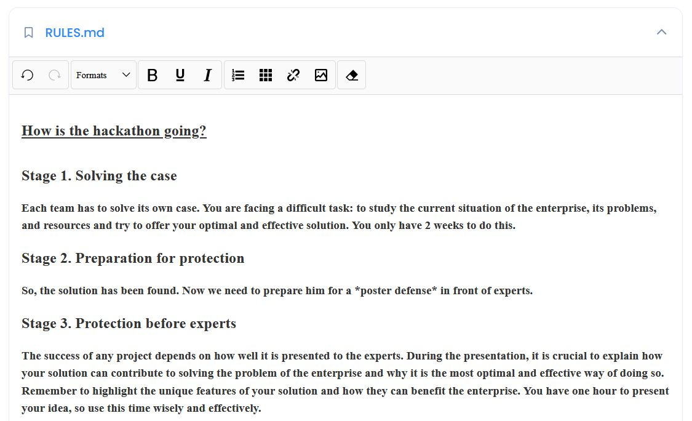

* In the **PRIZES** section, it is important to outline of the awards will be distributed among the participants. Additionally, it is crucial to explain the evaluation criteria used to determine the winners.

Also here you have the opportunity to provide detailed information about any additional prizes that will be available to participants. This can be a great way to encourage engagement and encourage people to participate in your event or program.

<!-- TODO when will the opportunity be supported in dollars -->
<!-- 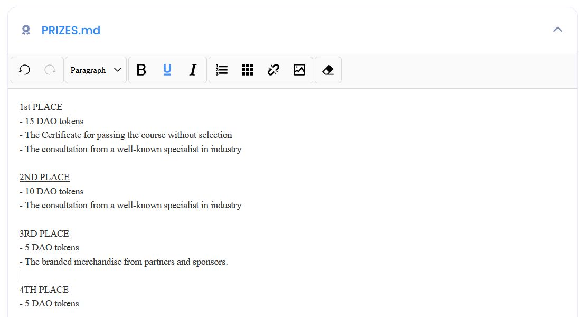 -->

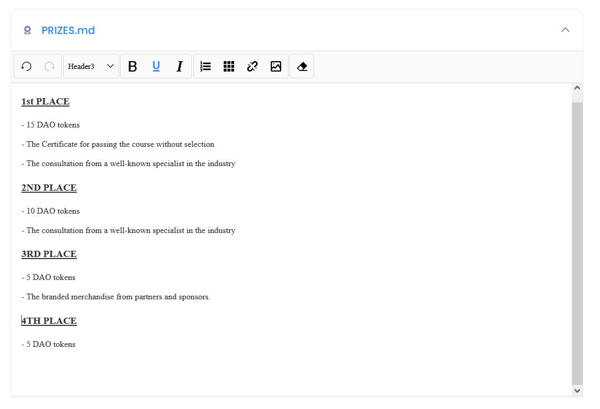

!!! info
    It is not mandatory to provide information in the README, RULES, and PRICES sections, but including them can greatly improve the clarity and informativeness of your content. Therefore, we recommend filling them out whenever possible.

* Also, the information about the awards must be configured in the **Prize pool** section by clicking on the **"Add prize pool"** button.

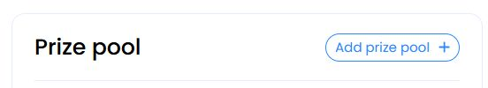

Enter the total amount of the prize pool and distribute it among the prize places.

Then click **Save distribution**

!!! warning
    The total amount of the prize fund cannot exceed the amount of the DAO reserve balance.

<!-- TODO when will the opportunity be supported in dollars... -->

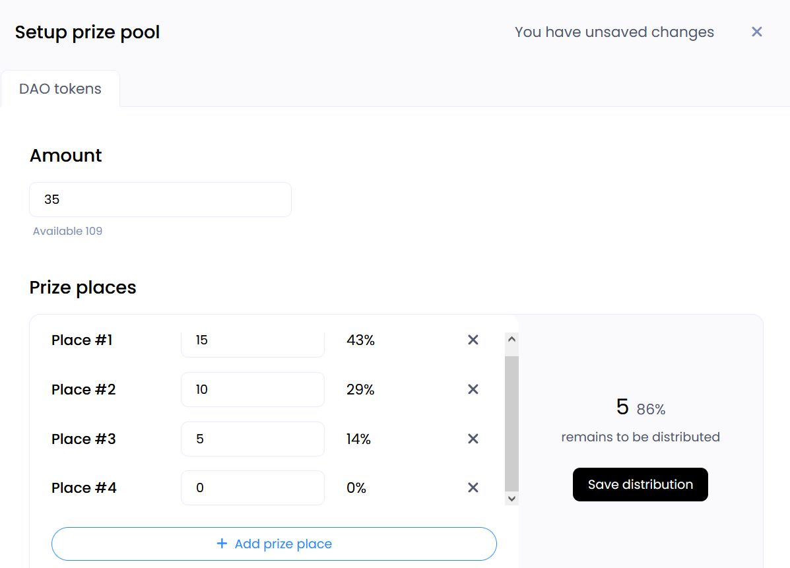

<!-- !!! info
    Until the prize fund is put up, the Hackathon will be in the Draft status -->

To make any changes, simply click on the "Update prize pool" button.

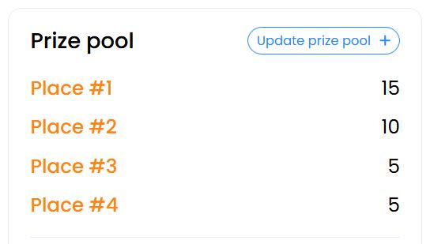

* Don't forget to fill in the **Short Description** section. This information will be visible in the proposal for voting on the creation of the Hackathon after all the necessary data has been filled about the event.

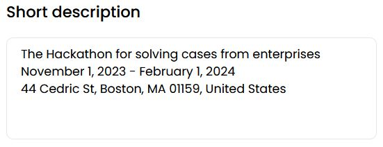

* You will need to set the date and time for three important stages.  
Do this by clicking on the **Add date** button

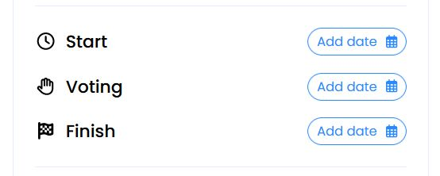

and in the window that opens, configure on 3 tabs:

**Start** tab - here you need to set the start date and time of the Hackathon.

**Voting** tab - here you need to set the date and time when the acceptance of applications ends, and when they will be presented to the jury members for voting.

!!! warning
    After the start of the voting stage, it will be impossible to add new participants.

**Finish** tab - you need to set the date and time when the voting stage ends and the winners will be determined.  
Then click **Apply dates**

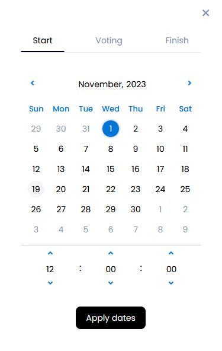

In the [**Export tags**](user-guide.md#expert-tags) section, select all the necessary scope for which expert assessments are required.

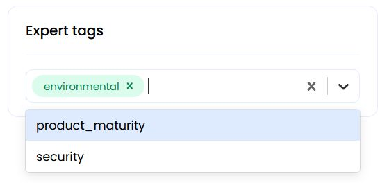

Once you've set the dates and times, you can click on **Create proposal to publish**

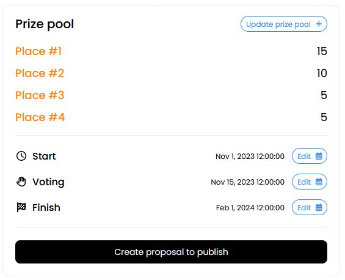

<!-- TODO change when change data
 -->

The preparation of the Hackathon repository and the creation of a proposal for its creation will begin.

And once it's done, you will be redirected to the DAO events page. 

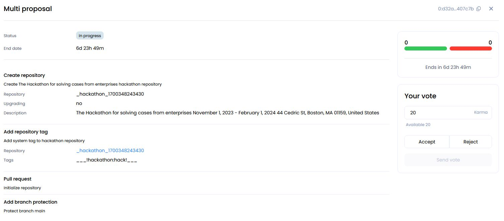

Once the voting process is completed with a positive outcome, a Hackathon will be created.

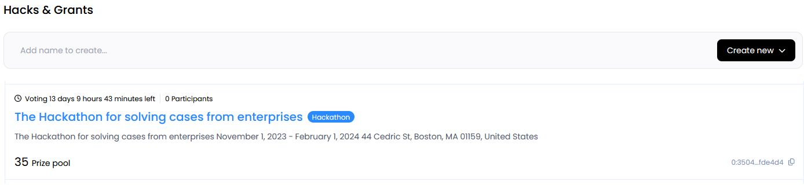

!!! warning "important"
    **After the Hackathon is created, its data can be changed and any alterations are subject to voting for approval.**

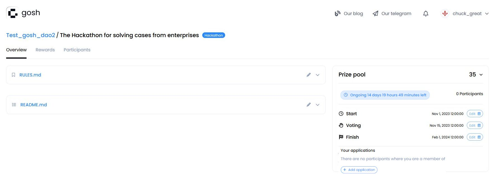
<!-- 
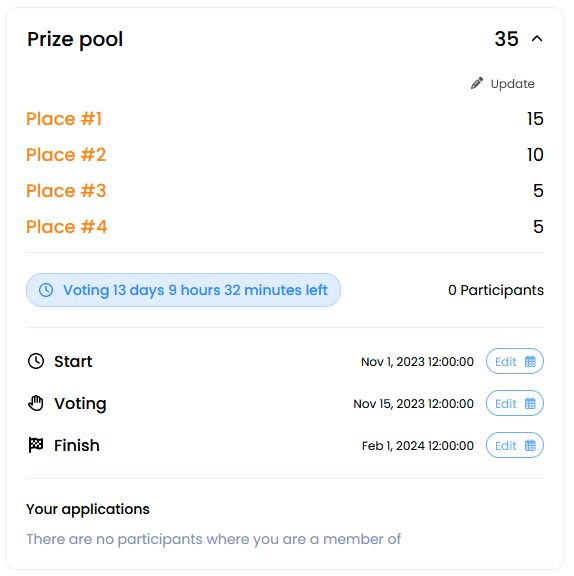
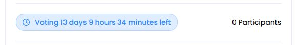
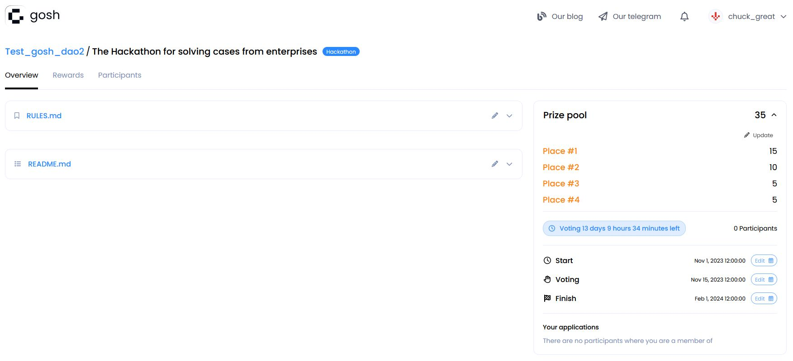
 -->

To be aware of the status of the Hackathon, the time remaining until the next stage will be displayed on its page.

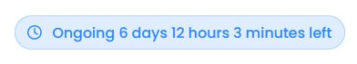

When the application acceptance stage comes to an end, the **`Voting`** stage will begin.

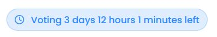

At the end of the **`Voting`** stage, the summing up will start, and the Hackathon will be marked as **`Finished`**

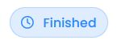

### **for participants**

**If you're a GOSH user** who is interested in participating in a Hackathon, you'll need to visit the Hackathon organizer's DAO. Once there, you can navigate to the **"Hacks and Grants"** tab to learn more about the available Hackathons and select the one that interests you.

On the Hackathon page you will find all the necessary information, including a detailed description of the Hackathon, its rules and prizes that can be obtained.

**If you're not a GOSH user** but want to participate in the Hackathon, you'll need to [**create an GOSH account**](../working-with-gosh/gosh-web/account.md) first.  
Then you can visit the Hackathon page to get started.

During the Hackathon, all participants must complete certain tasks and then upload them to their [repositories](../working-with-gosh/gosh-web/repository.md) into their [DAO](../working-with-gosh/gosh-web/create-dao.md).

To participate in the Hackathon, you'll need to click on the **Add application** button.

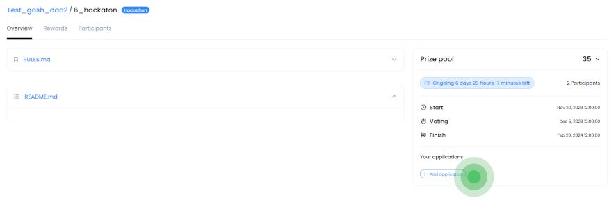

!!! info "If you followed the direct link to the Hackathon"  
      
    then be sure to log into your account by clicking on the **Sign in** button.  

    <!-- 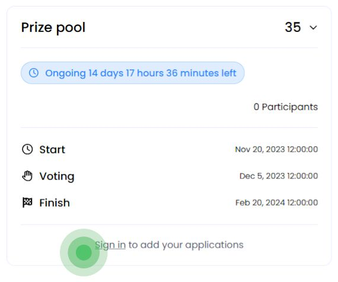{ align=right } -->
    

    After you entered your passphrase and PIN code on the Hackathon page, the next step is to click on the **Add application** button.
    { .ml-params }

<!-- 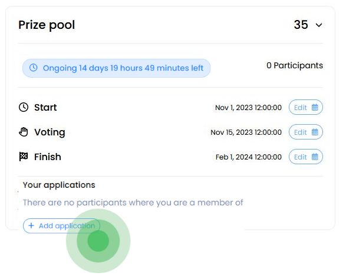 -->

Then, in the form that opens, click **Add application form DAO**

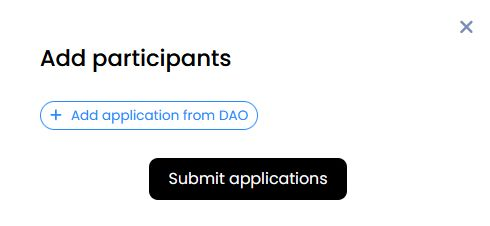

and enter the name of your DAO and the name of the repository that you require.

!!! warning "Important"

    * You can **add an application** **only** from the **DAO** of which you are a **member**.

    * Also, keep in mind that **each repository** is a **separate participant** of the Hackathon.

!!! info
    You can add multiple repositories from one DAO at once by separating the input with a space.

<!-- Do this for all the DAOs you need to participate in the Hackathon, and then click ** Submit applications** -->

Once you have added all the necessary applications, click on "Submit applications".

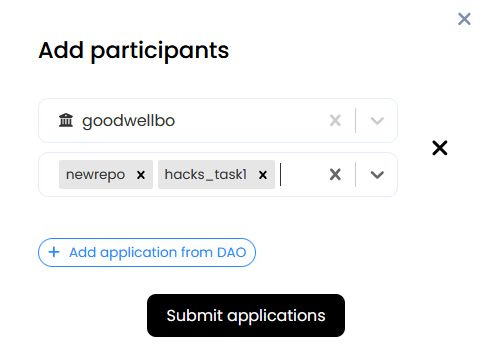

At the end of the process, all the repositories you have uploaded will be displayed in the "Your applications" section.  

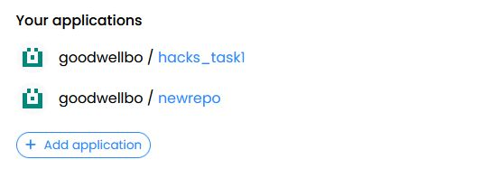

Additionally, you can view information about the other participants of the Hackathon in the "Participants" section.

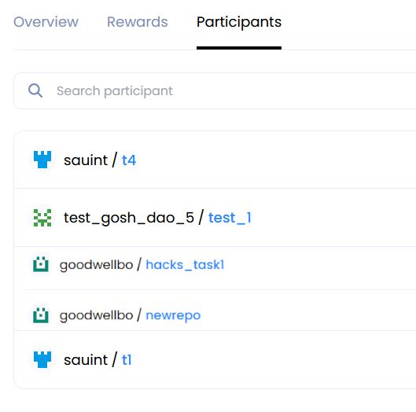

<!-- The remaining time until the next stage will be displayed on the Hackathon page, allowing participants to stay updated on the status of the competition. -->

To keep participants updated on the status of the competition, the remaining time until the next stage will be displayed on the Hackathon page.

When the application acceptance stage comes to an end, the **`Voting`** stage will begin.

At the end of the **`Voting`** stage, the summing up will start, and the Hackathon will be marked as **`Finished`**

### **Expert Tags**

<!-- TODO
remove into settings & remame KARMA tags-->

Expert Tags are created as evidence of the member's expertise and experience within this DAO.  

By creating and attaching Tags to DAO members, you can count on their skills and experience to help other members of the DAO.

Tags affect the number of votes that the expert will be able to use when voting.

!!! info

    If a DAO member has an attached Expert Tag, then when voting, he will be able to use tokens within his Karma, increased by the coefficient specified when creating this Tag.

Tags will make it easier to find a performer to complete a Task or review it.

Using expert tags when judging at Hackathons will allow you to take into account the weight of each expert's vote when voting for projects, which reduces the likelihood of a subjective impact of each expert's assessment on the final result and reduces the possibility of manipulation by the jury, i.e. judging will be more objective and independent of each other.

If you want to add expert Tags to your DAO simply go to the **Settings** tab in the **karma Tags** section and enter the name of the Tag in the appropriate field. 

You can also specify the percentage by which the karma of the relevant expert will be increased when voting. It's important to note that the experts of the jury must be participants of the DAO before the Hackathon begins.

To delete a Tag, click on the cross in the corresponding line.

The addition of expert Tags can only be made possible through the voting of the DAO members. Therefore, you must leave a comment for the proposal and then click on the **Save changes and create proposal** button to initiate the process.

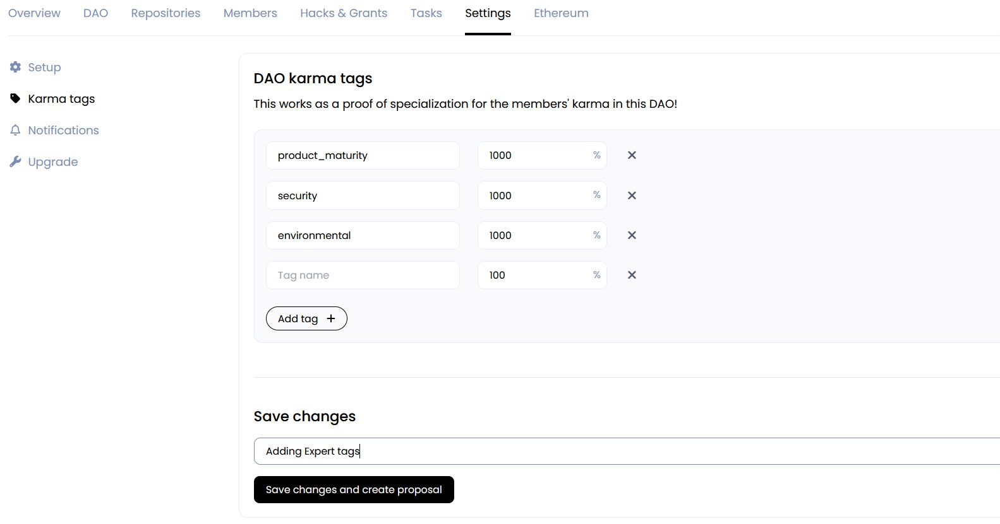

You will redirected to the event page in the DAO tab. Now you can proceed with voting.

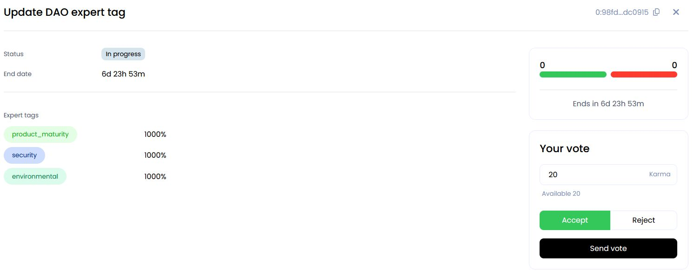

Any changes to the karma Tags of the DAO will be accepted through the vote.

After the proposal is accepted, on the "Members" tab, you have the ability to assign Expert Tags to DAO members based on their experience.

To assign Expert Tags to DAO members based on their experience, you'll need to navigate to the **Members** tab. 

Once there, you can select the appropriate Tag from the drop-down list and assign it to the respective member.  
This is a great way to highlight the skills and expertise of your DAO members and make it easier for others to identify who to turn to for specific tasks or advice.

Please make sure to include a detailed description of the proposal regarding changes in allowances for members.  
It is important to provide all the necessary information for members of DAO to make informed decisions making the voting process.

Then click on the **Save changes and create proposal** button:

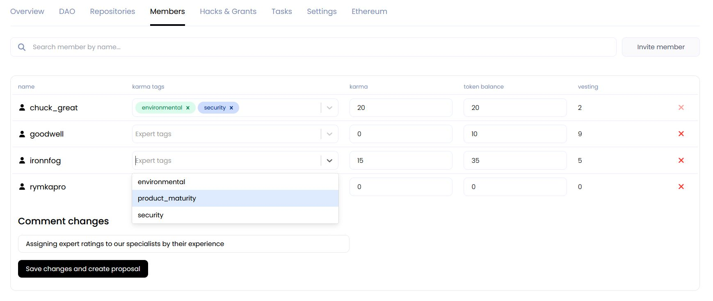

You will redirected to the event page in the DAO tab. Now you can proceed with voting.

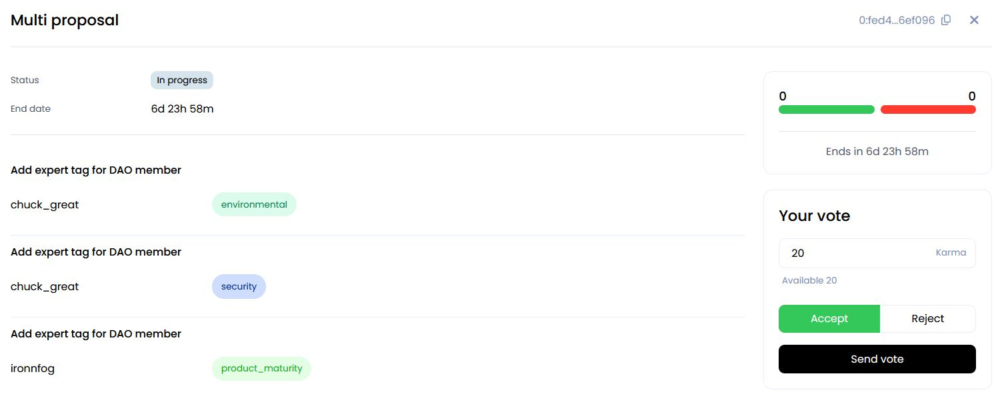

Expert Tags will be assigned to DAO members after the proposal is accepted and they will be able to use them for work.

## Grant Program

*coming soon*