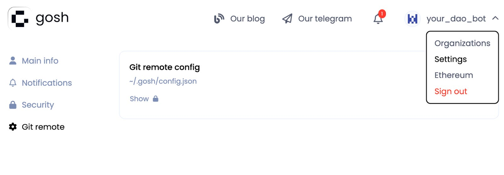
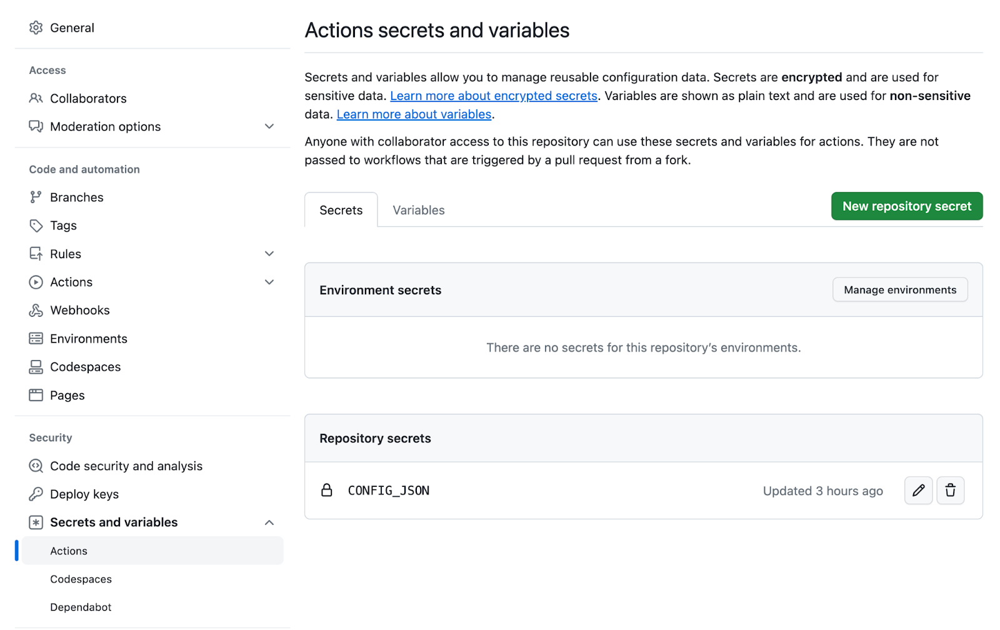
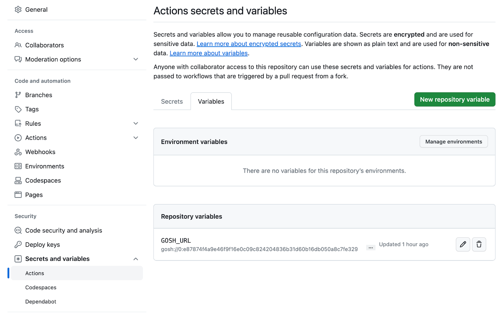
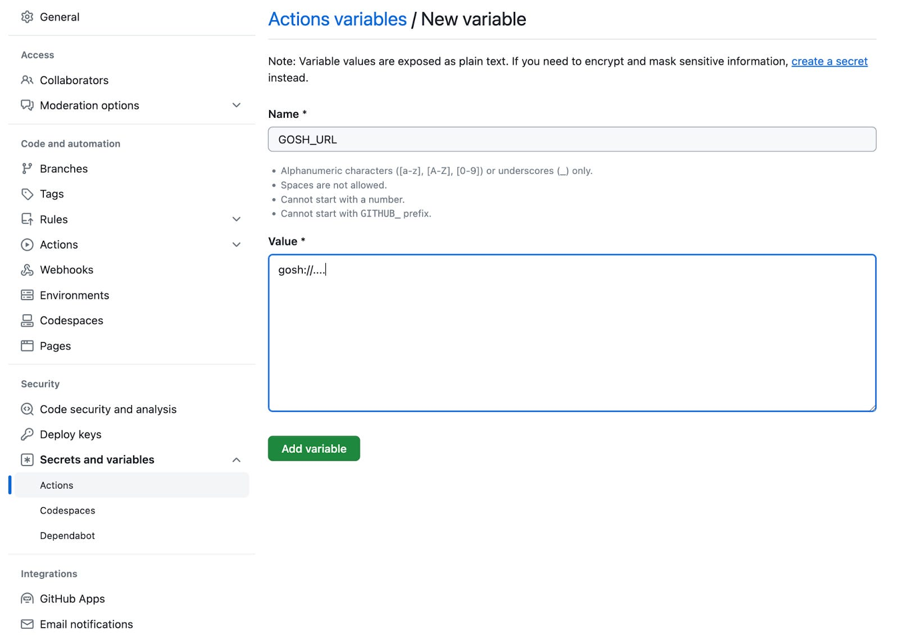

<!-- ## **GOSH GitHub Sync** -->

**GOSH GitHub Sync** is an easy way to enable GOSH DAOs to work side by side with GitHub Repositories.

You can build Consensus around your code and organization through DAOs on GOSH while continuing to use GitHub’s familiar development tools.


## **Introduction**


A year ago we introduced the Login with GitHub option to easily migrate your repositories to GOSH when you sign up. Now we are enhancing this capability enabling continuous synchronization of your GitHub and GOSH repositories.

Synchronize your GitHub repositories with GOSH, and work with both platforms side by side. Changes in a GitHub repository appear in GOSH, offering both the benefits from GitHub features, convenience, and efficiency; while not compromising the decentralization of code and governance, as assured by GOSH.

## **How it works**

Github-actions are triggered by changes in the github repository and execute their script. User’s changes will be pushed automatically to GOSH. The script will clone the repository, and its history, and push these branch changes to the matching branch in GOSH.


## **How To Set It Up**


### **Prerequisites**

* Create a separate bot account in GitHub, and register this bot on GOSH

* Add this bot to the DAO with the repository you want to synchronize

* GitHub Sync requires CONFIG_JSON and GOSH_URL set up


!!! info
    You need only a single bot for the whole DAO


### **Set up CONFIG_JSON**

* You need to copy `config.json` content under **Show**



* Go to repository settings in the **Secrets and variables in GitHub**, and press **New repository secret**, and add credentials




!!! info
    You can use `CONFIG_JSON` once for your whole organization


### **Set up GOSH_URL**

**GOSH_URL** is a variable in github-actions. It must point to the GOSH repository (the one we sync changes to)


Click on **New repository variable**:



Set value of the `GOSH_URL`:



### **Set up github-actions**

Enable github-actions by creating a `/.github/workflows` folder in your GitHub repository. You can also create it in your user interface and copy the content below, and GitHub will create the folder for you automatically. Create a `gosh-sync.yaml` file inside, in this aforementioned folder and add this content:


```
name: Sync with Gosh

on:
  workflow_dispatch:
  push:
    branches:
      - main

jobs:
  sync:
    runs-on: ubuntu-latest

    steps:
      -
        name: Checkout
        uses: actions/checkout@v4
        with:
          # Only a single commit is fetched by default, for the ref/SHA that
          # triggered the workflow. Set fetch-depth: 0 to fetch all history for
          # all branches and tags.
          fetch-depth: 0

      - name: Sync
        env:
          CONFIG_JSON: ${{ secrets.CONFIG_JSON }}
          GOSH_URL: ${{ vars.GOSH_URL }}
          GOSH_TMP_BRANCH: github_${{ github.ref_name }}
        run: |
          # install GOSH Git Remote plugin
          wget -O - https://raw.githubusercontent.com/gosh-sh/gosh/dev/install.sh | bash -s
          export PATH="$HOME"/.gosh:"$PATH"

          # set user secrets
          echo "$CONFIG_JSON" >~/.gosh/config.json

          # sync github -> gosh
          git remote add gosh $GOSH_URL
          git switch -C $GOSH_TMP_BRANCH
          git push -vv gosh
```

After this is done, all of the changes pushed to GitHub will be seen on Gosh (except the branches’ names). Starting from this first commit onwards, every change to your GitHub repository will be mirrored to GOSH. 

!!! example annotate "For example"
    If there were changes in a main branch in GitHub, these changes will appear in the github_main branch in GOSH and once DAO decides to accept those changes they can create a proposal to merge changes from the github_main branch into the main, inside GOSH.