## **Creating DAO**

First, create a decentralized autonomous organization ([**DAO**](https://docs.gosh.sh/on-chain-architecture/organizations-gosh-dao-and-smv/#dao)) on [**GOSH**](https://app.gosh.sh).

You can [invite](https://docs.gosh.sh/working-with-gosh/gosh-web/members/#adding-members-to-dao) participants to the DAO while working on a project and assign them [karma and tokens](https://docs.gosh.sh/on-chain-architecture/organizations-gosh-dao-and-smv/#smv-in-gosh) from the [DAO reserve](https://docs.gosh.sh/working-with-gosh/gosh-web/dao-overview/#dao-reserve) so that they can [vote](https://docs.gosh.sh/on-chain-architecture/organizations-gosh-dao-and-smv/#voting) for events in the DAO.

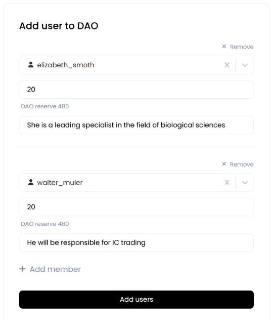

## **Project contributors**

Each DAO member will have their role in this project.

The following persons can contribute to the project:

- **Scientists/Validator (BFI)** - this person will be responsible for reviewing the project documentation;
- **Project developer** - uploads project documentation, and prepares proposals for voting on it;
- **Buyer(Trader)** - will be responsible for the buying and selling of IC tokens;
- **CI Issuance manager** - will prepare the token issuance process;
- **CI marketplace manager** - will collaborate with community developers and brand teams to create, challenge, and deploy community marketing strategies;
- **Community lead**;
- **Account holder** (Fund/Investor/Corporate);

## **Creating a biodiversity project**

The biodiversity project is created by the **Project developer**. To create it on GOSH, go to the tab **Integrity Credits**.

### **Assigning roles**

Here it will be necessary to distribute which of the DAO participants will act as validators (Scientists), who will be involved in the design of the project (Developer), and who will manage the token issuance process (Issuer).

!!! info

    Each role can have multiple representatives.

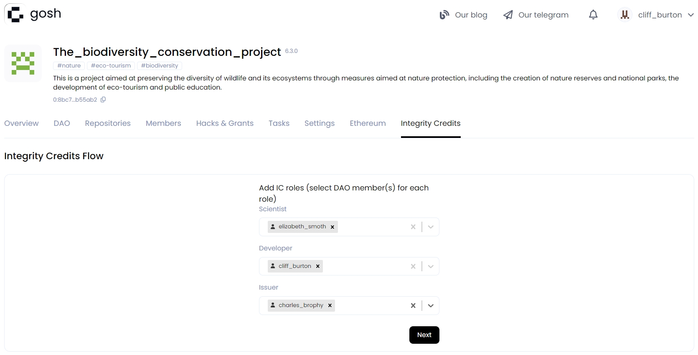

And then click the **Next** button.

### **Creating Task**

The [**Task**](https://docs.gosh.sh/working-with-gosh/gosh-web/task/) will be assigned to work on the project. At this stage, you need to determine the rewards and the rules for distributing tokens of this DAO for completing the Task.

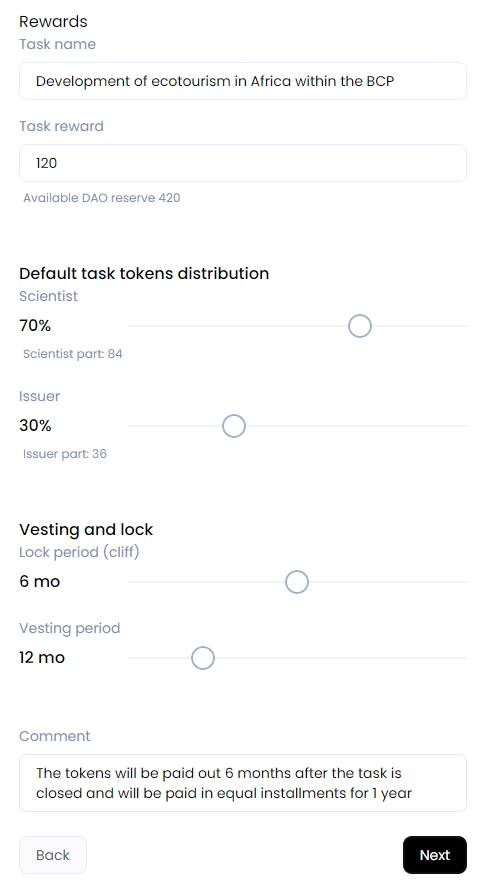

And then click **Next**.

### **Creating Repository**

All project documentation in this DAO will be stored in repositories.
In the next step, select the repository name and add a description for it.

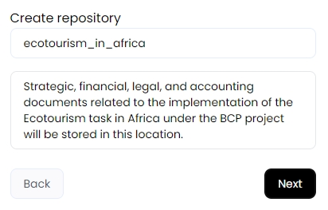

And then click the **Next** button.

### **Uploading project documentation**

Select to upload all the necessary files and documents that you will need to complete the task for your project.

Click on an empty area to open a browser or drag and drop documents here.

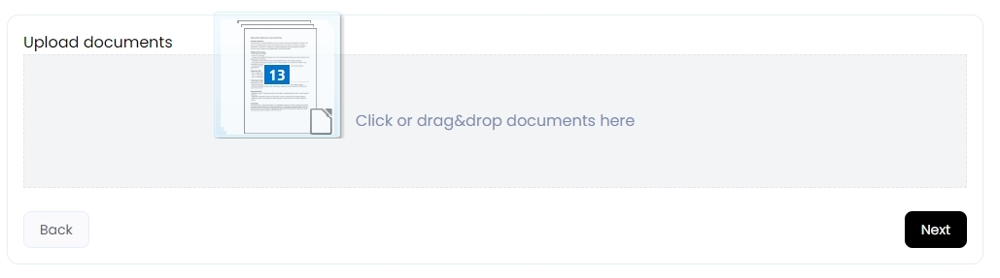

After the download is complete, you will see a list of files:

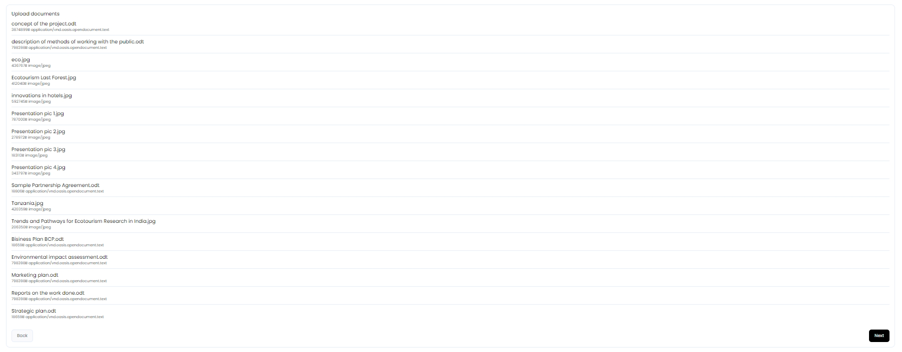

And then click the **Next** button.

### **Forms**

At this step, you need to create the credit and project structures and, according to your needs, then fill out the resulting form.

!!! info

    The templates with different characteristics of the project and the future token will be stored in specific forms in a GOSH repository. 

#### **- characteristics of the project**

Once you have chosen a template for the project, you can personalize it to suit the unique needs of your project. 

To do this, click on **Edit form** at the top of the form:

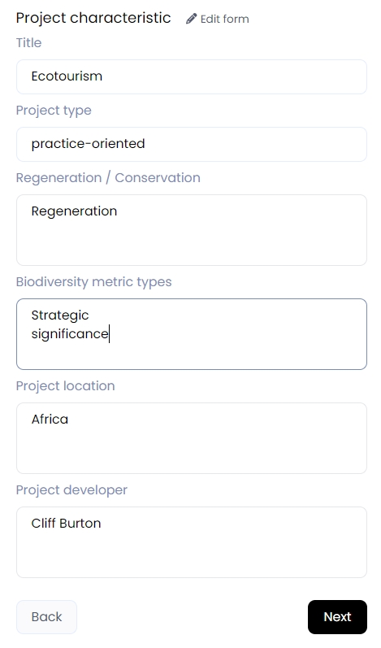

You can change the name of a form field or add additional fields to a form. You can also choose the input type for each field (single-line or multi-line) and decide whether to make each field required.

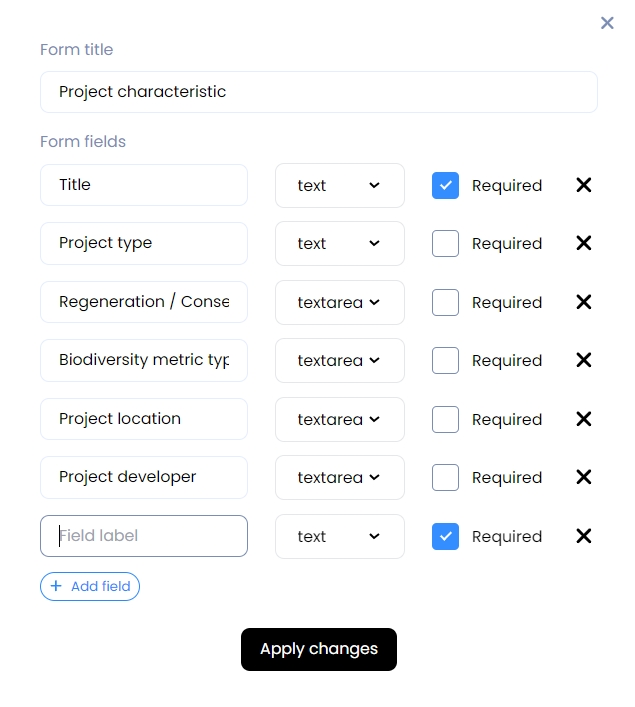

After you are finished, please click **Apply changes**.

Fill out the resulting form and click **Next**.

#### **- credit characteristic**

After you have selected a credit template, you can customize it to suit the unique needs of your project by entering the details of the token that will be issued.

To do this, click on **Edit form** at the top of the form:

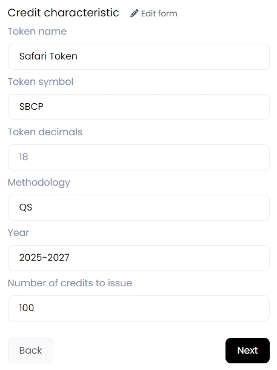

You can change the name of a form field or add additional fields to a form. You can also choose the input type for each field (single-line or multi-line) and decide whether to make each field required.

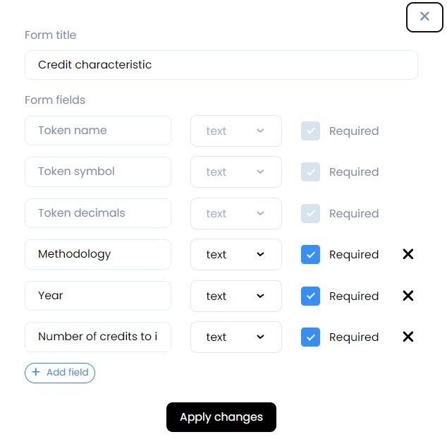

After you are finished, please click Apply changes.

!!! Warning "Attention"

    Some fields cannot be renamed because, based on these fields, information about the token will be saved in the blockchain registry.

Fill out the resulting form and click the Next button.

### **Voting**

Any action in a DAO requires a [vote](https://docs.gosh.sh/on-chain-architecture/organizations-gosh-dao-and-smv/#smv-in-gosh) and is created through Proposals. 

As a result of your previous actions, a multi-proposal  will be created:

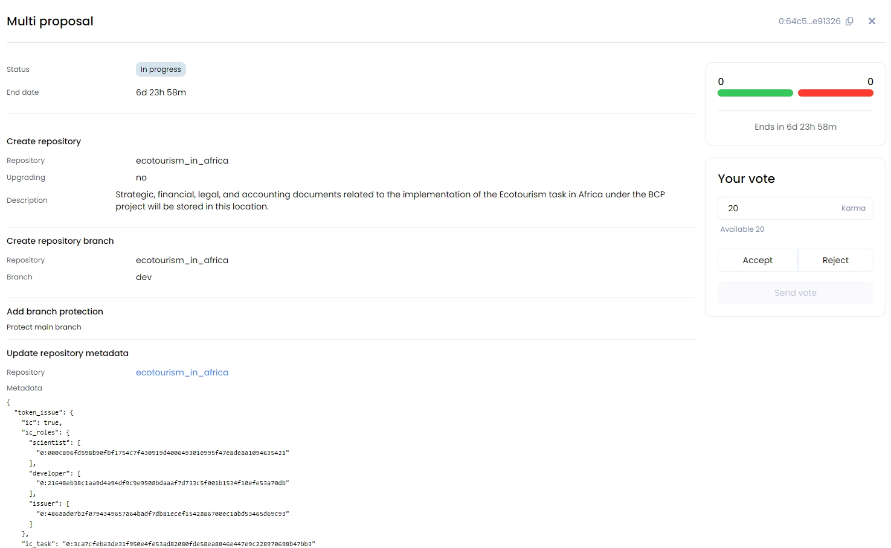
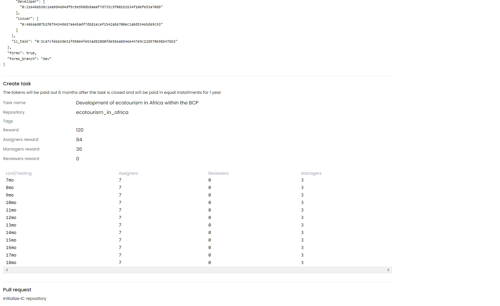

You can vote for or against this multi-proposal on the **DAO** tab.

Members of the DAO who have subscribed to the events of this DAO will receive a notification via the e-mail address they provided.

After the vote, if the proposal is accepted, a **Repository** for this project will be created. The `main` branch will be protected, and development ( `dev` ) branch will also be created. 

All project documentation and information about the project, as well as future token data, will be uploaded to this branch to facilitate further discussions about the project.

Additionally, a Task will be created.

### Working on the project

With everything now prepared, the participants in the task can proceed with their work on the project. 

Navigate to your project using the Repositories tab.

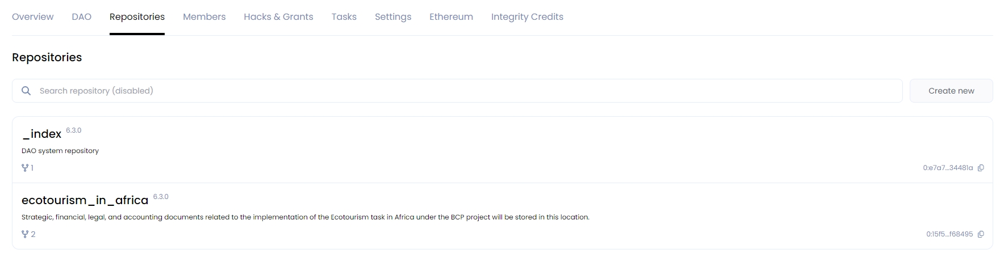

Now, there are two branches in the repository: 

`Main` branch is protected. To work on documents and forms, please switch to the `dev` branch.

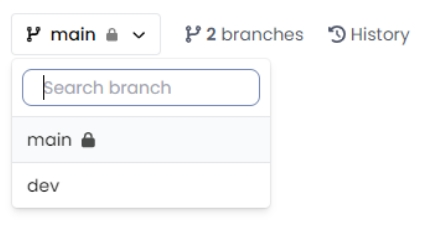

#### **Reviewing documents**

To view the uploaded documents, navigate to the **Documents** folder.

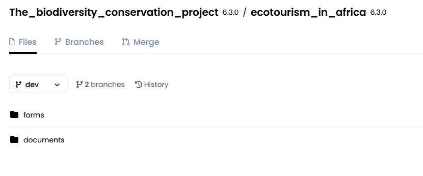

In the list of files, select the necessary one:

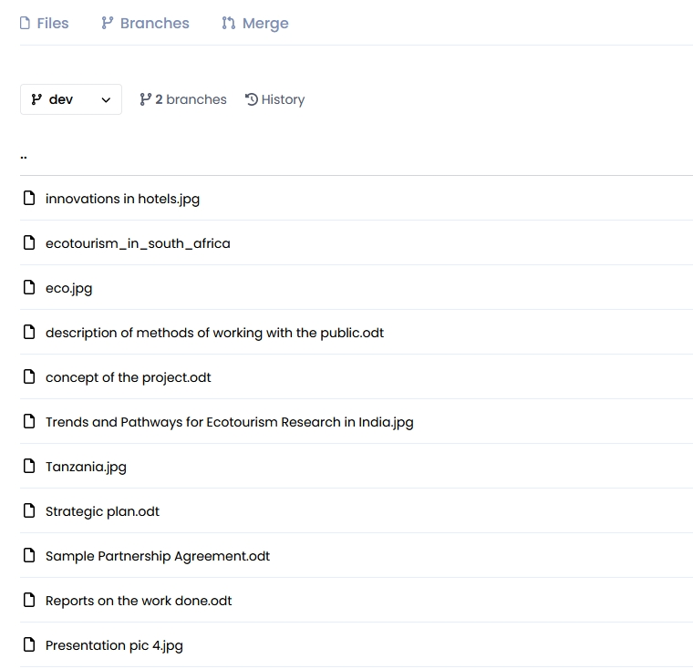

You can [add comments](https://docs.gosh.sh/working-with-gosh/gosh-web/repository/#adding-comments-to-file) to uploaded documents in order to discuss them and share your thoughts:

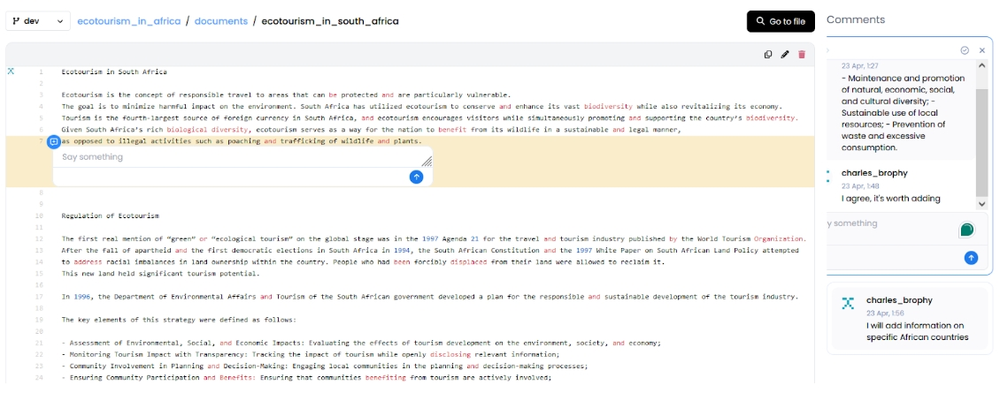

#### **Editing forms**

The **Forms** folder contains the templates you selected (in `JSON` format), with filled-in information about your project and the future token.

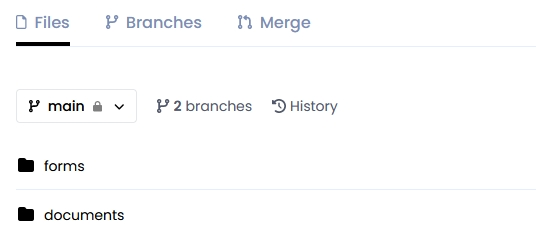

While working with the forms, participants can open and edit them in the **IC Application Forms** section on the right:

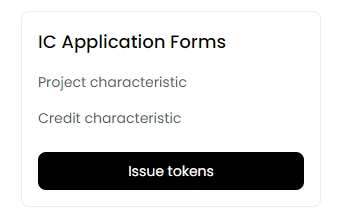

<!-- 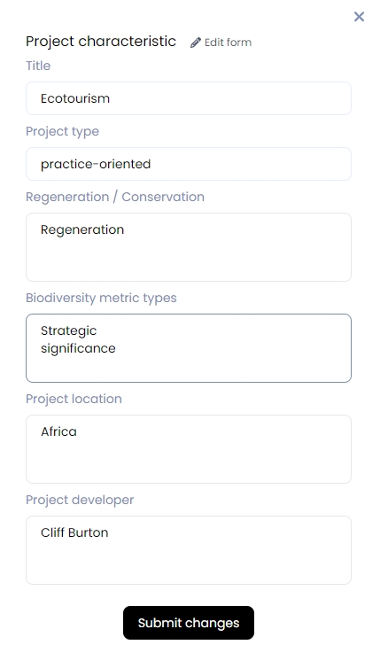 -->

!!! info 

    All of this will be pushed without creating proposals because the work is in a separate development branch.

#### **Merge into main**

If needed, and assuming you've already reached consensus on certain aspects, you can merge all the changes into the main branch.

To accomplish this, the **Project developer** should navigate to the **Merge** tab in the project repository select merge `dev` branch into `main`, and click **Compare**:

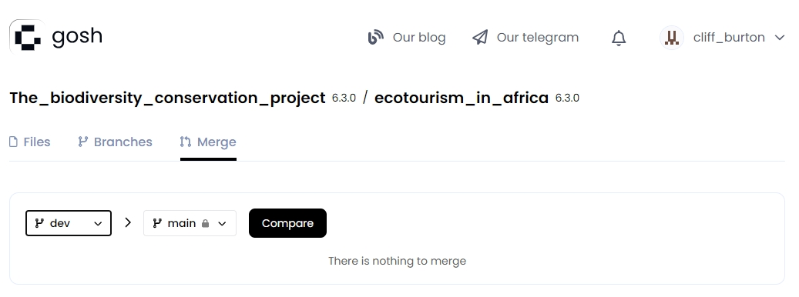

<!-- The process of working on a project can be broken down into stages, with specific tasks assigned to each stage. -->

At the bottom of the window, which opens, enter the commit description and select the task that was created to work with this project (The Task executors will be displayed automatically):

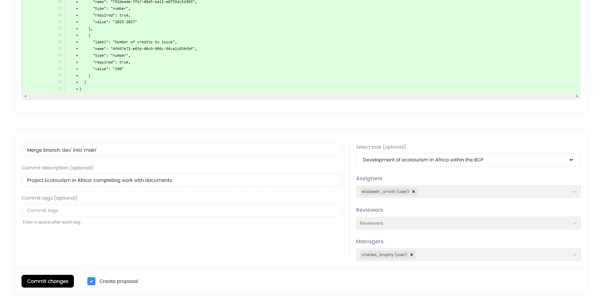

Check the box to **Create a proposal** for voting and click **Commit changes**.

As a result, a proposal will be created, which can be seen on the DAO tab:

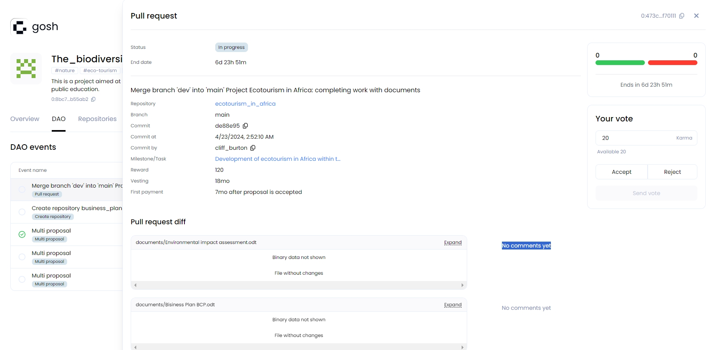

When the pull request is accepted, the Task status will change to **Confirmed**.

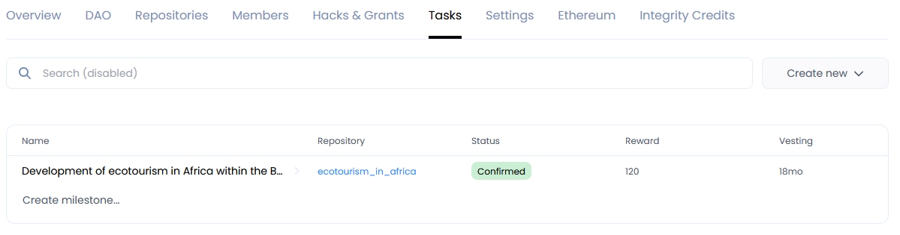

The distribution of remuneration for this task will be carried out by the vesting scheme specified when the task was created.

### **Issue tokens**

After all the documents have been merged into the main branch, you can start issuing tokens.

To do this, the **CI Issuance manager** must go to the project repository and click in **IC Application Forms** on the **Issue tokens** button:

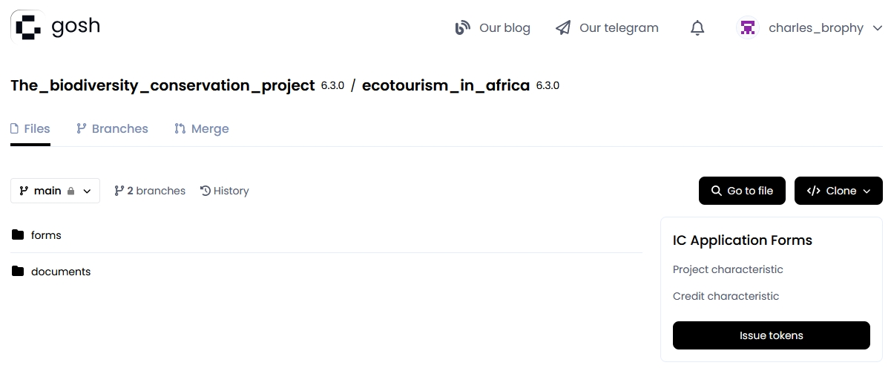

In the window that opens, you can specify who and how many issued tokens will be transferred. To do this, 
click **Add recipient**:

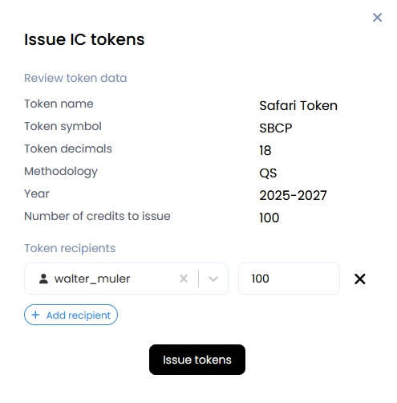

Check the token data and click the **Issue tokens** button.

The multi-proposal will be created for:  
- the PR from the dev branch to the main;  
- permission to issue a token.  

If the multi-proposal is accepted, changes to the docks and forms are poured into the main branch, the TIP3-token contract is deployed and information about the issued tokens appears in the repository and they can be transferred.

### **Transfer tokens**

The DAO member who was designated as the recipient of the issued tokens will be able to see these tokens in their balance in the project's repository.

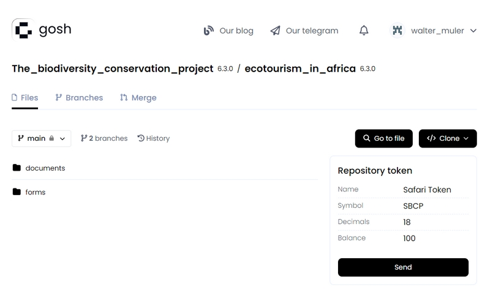

To send IC tokens, please click the **Send** button in the **Repository tokens** section, enter the recipient's name, and click **Send**.

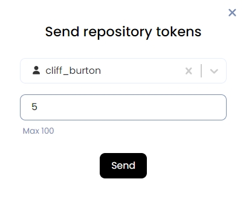

The recipient will also be able to see the IC tokens in the project repository in the **Repository tokens** section:

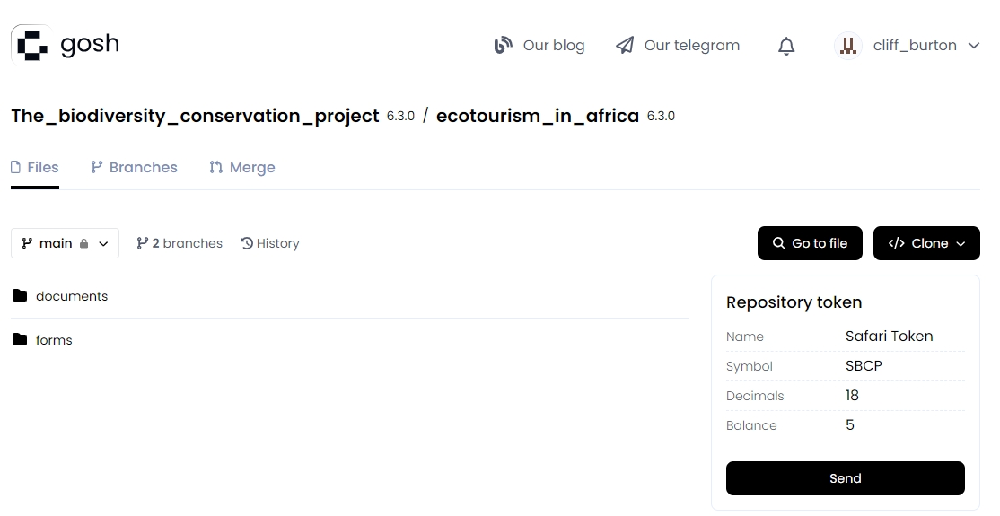

### **Registry**

Based on the information entered in the fields of the form, a blockchain register will be created, which can be accessed on the special website.

And then it will be read from there:

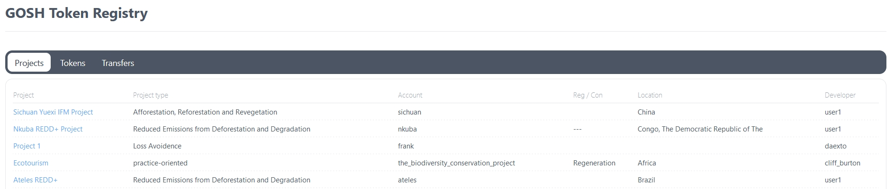

If you click on a project in the **Projects** section, you will be taken to its repository on GOSH, where you can familiarize yourself with uploaded documents and files:

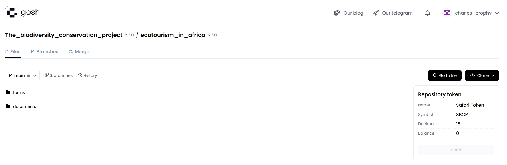

On the **Tokens** tab, you can see the token issued for this project:

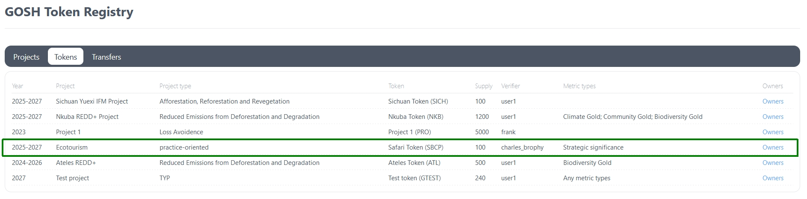

Information about the token holders can be found by clicking on Owners:

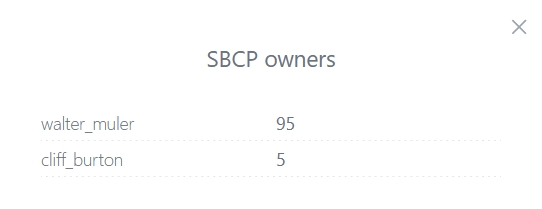

On the **Transfers** tab, you can view all transactions related to this token:

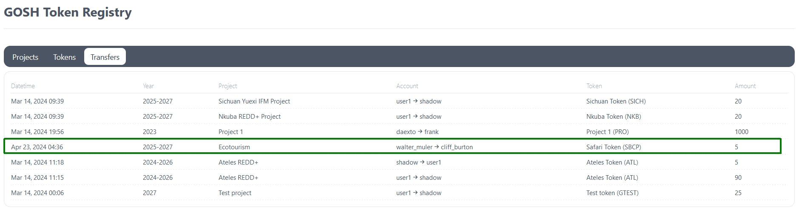

<!-- 

### **Reviewing documents**

With everything now prepared, the participants in the task can proceed with their work on the project. 

Navigate to your project using the Repositories tab.

Now, there are two branches in the repository: 

`Main` branch is protected. To work on documents and forms, please switch to the `dev` branch.

To view the uploaded documents, please navigate to the **Documents** folder.

The **Forms** folder contains the templates you selected (in `JSON` format), with filled-in information about your project and the future token.

To edit them, go to the **IC Application Forms** section on the right.

You can [add comments](https://docs.gosh.sh/working-with-gosh/gosh-web/repository/#adding-comments-to-file) to uploaded documents in order to discuss them and share your thoughts:

 -->

