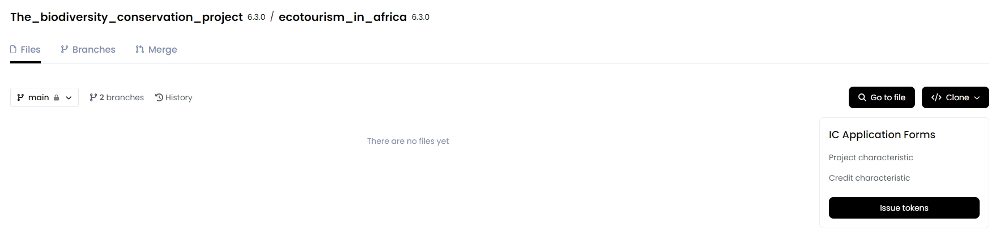

## **Creating DAO**

First, create a decentralized autonomous organization ([**DAO**](https://docs.gosh.sh/on-chain-architecture/organizations-gosh-dao-and-smv/#dao)) on [**GOSH**](https://app.gosh.sh).

You can [invite](https://docs.gosh.sh/working-with-gosh/gosh-web/members/#adding-members-to-dao) participants to the DAO while working on a project and assign them [karma and tokens](https://docs.gosh.sh/on-chain-architecture/organizations-gosh-dao-and-smv/#smv-in-gosh) from the [DAO reserve](https://docs.gosh.sh/working-with-gosh/gosh-web/dao-overview/#dao-reserve) so that they can [vote](https://docs.gosh.sh/on-chain-architecture/organizations-gosh-dao-and-smv/#voting) for events in the DAO.

## **Project contributors**

Each DAO member will have their role in this project.

The following persons can contribute to the project:

- **Scientists/Validator (BFI)** - this person will be responsible for reviewing the project documentation;
- **Project developer** - uploads project documentation, and prepares proposals for voting on it;
- **Buyer(Trader)** - will be responsible for the buying and selling of IC tokens;
- **CI Issuance manager** - will prepare the token issuance process;
- **CI marketplace manager** - will collaborate with community developers and brand teams to create, challenge, and deploy community marketing strategies;
- **Community lead**;
- **Account holder** (Fund/Investor/Corporate);

## **Creating a biodiversity project**

The biodiversity project is created by the **Project developer**. To create it on GOSH, go to the tab **Integrity Credits**.

### **Assigning roles**

Here it will be necessary to distribute which of the DAO participants will act as validators (Scientists), who will be involved in the design of the project (Developer), and who will manage the token issuance process (Issuer).

!!! info

    Each role can have multiple representatives.

And then click the **Next** button.

### **Creating Task**

The [**Task**](https://docs.gosh.sh/working-with-gosh/gosh-web/task/) will be assigned to work on the project. At this stage, you need to determine the rewards and the rules for distributing tokens of this DAO for completing the Task.

And then click **Next**.

### **Creating Repository**

All project documentation in this DAO will be stored in repositories.
In the next step, select the repository name and add a description for it.

And then click the **Next** button.

### **Uploading project documentation**

Select to upload all the necessary files and documents that you will need to complete the task for your project.

Click on an empty area to open a browser or drag and drop documents here.

After the download is complete, you will see a list of files:

And then click the **Next** button.

### **Forms**

At this step, you need to create the credit and project structures and, according to your needs, then fill out the resulting form.

!!! info

    The templates with different characteristics of the project and the future token will be stored in specific forms in a GOSH repository. 

#### **- characteristics of the project**

Once you have chosen a template for the project, you can personalize it to suit the unique needs of your project. 

To do this, click on **Edit form** at the top of the form:

You can change the name of a form field or add additional fields to a form. You can also choose the input type for each field (single-line or multi-line) and decide whether to make each field required.

After you are finished, please click **Apply changes**.

Fill out the resulting form and click **Next**.

#### **- credit characteristic**

After you have selected a credit template, you can customize it to suit the unique needs of your project by entering the details of the token that will be issued.

To do this, click on **Edit form** at the top of the form:

You can change the name of a form field or add additional fields to a form. You can also choose the input type for each field (single-line or multi-line) and decide whether to make each field required.

After you are finished, please click Apply changes.

!!! Warning "Attention"

    Some fields cannot be renamed because, based on these fields, information about the token will be saved in the blockchain registry.

Fill out the resulting form and click the Next button.

### **Voting**

Any action in a DAO requires a [vote](https://docs.gosh.sh/on-chain-architecture/organizations-gosh-dao-and-smv/#smv-in-gosh) and is created through Proposals. 

As a result of your previous actions, a multi-proposal  will be created:

You can vote for or against this multi-proposal on the **DAO** tab.

Members of the DAO who have subscribed to the events of this DAO will receive a notification via the email address they provided.

After the vote, if the proposal is accepted, a **Repository** for this project will be created. The `main` branch will be protected, and development ( `dev` ) branch will also be created. 

All project documentation and information about the project, as well as future token data, will be uploaded to this branch to facilitate further discussions about the project.

Additionally, a Task will be created.

### **Reviewing documents**

With everything now prepared, the participants in the task can proceed with their work on the project. 

Navigate to your project using the Repositories tab.

Now, there are two branches in the repository: 
<!--  -->

`Main` - this branch is protected.  
To work on documents and forms, please go to the `dev` branch.

To view the uploaded documents, please navigate to the **Documents** folder.

The **Forms** folder contains the templates you have selected (in `JSON` format) with filled-in information about the project and the future token.

You can [leave comments](https://docs.gosh.sh/working-with-gosh/gosh-web/repository/#adding-comments-to-file) on the uploaded documents to discuss them:

