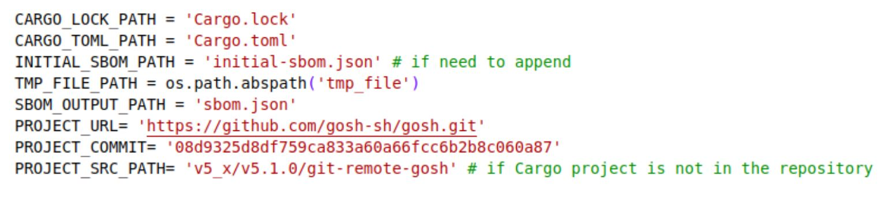
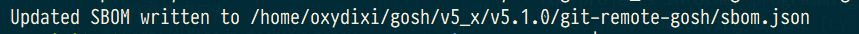
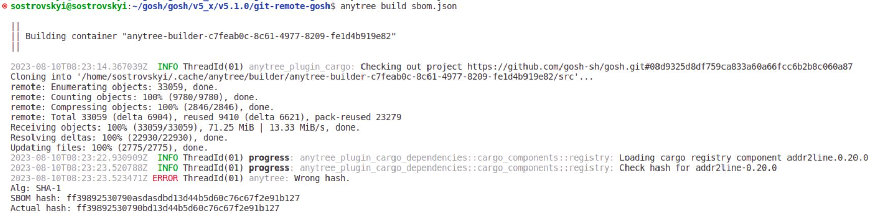

# **AnyTree**


## **Overview**


GOSH introduces **AnyTree** — a software deployment system built to guarantee the security of your software supply chain

With AnyTree, any mutations of your code, down to every dependency, as well as operations, including builds and every artifact, are logged, timestamped, signed, and verified when used on GOSH

Deep SBOM extends the SBOM surface to include all build environments. It is impossible to inject malicious commits backwards on GOSH and miss dependency tampering during the CI/CD process when using Deep SBOM. Integrating GOSH Builder with AnyTree proves builds on a developer machine and a server (or a cloud) are identical

<!-- creates reproducible containers in an isolated environment.  -->

AnyTree utilizes standard Docker Containers secured by [**GOSH AnyTree Builder**](anytree.md#build-image) and is currently available as Beta on Linux and is coming soon to Windows and macOS.

As the result of his work will be the creation of a binary file of project. It is describing not only what, but also how something was built.

!!! info
    The current version of AnyTree only supports Linux.


## __Installation AnyTree__


Before installing AnyTree, you must already have the [**Git Remote Helper**](git-remote-helper.md) installed.

If you have Linux you can use these installation methods:


### **Install AnyTree using the installation script**


``` sh
wget -O - https://raw.githubusercontent.com/gosh-sh/anytree/dev/install.sh | bash -s
```


<!-- 
### __Install AnyTree from binary releases__

1. Follow the [link](https://github.com/gosh-sh/gosh-build-tools/releases/tag/0.1.1) and download GOSH AnyTree for the required operating system.

2. Extract files from tar-file

    for example, for Linux x64, run:

    ``` sh
    tar xzvf gosh-linux-amd64.tar.gz
    ```

3. Move binary files to any searchable path  
    for example:

    ``` sh
    sudo mv gosh /usr/local/bin
    ```
 -->

### __Install AnyTree from source__


1. Prerequisites:

      - Rust v1.66+
      - Protobuf Compiler
      - `git`
      - `make`

2. Clone [AnyTree](https://github.com/gosh-sh/anytree) repository

3. Run make install to build GOSH `anytree tool`

<!-- Go to the `gosh-build-tools` directory

    ``` sh
    cd gosh-build-tools && make install
    ``` -->


## **Setup a GOSH project**


You need a GOSH repository.  
If you haven't used a GOSH-repository you can upload your github-repository to GOSH through [onboarding](https://app.gosh.sh/onboarding) or create a [GOSH-account](https://app.gosh.sh/) and [create a new one](gosh-web.md#create-repository).

Go to your GOSH-repository you project

and run:

``` sh
gosh init
```

## **Generation `SBOM file`**

AnyTree builds the artifacts uses `SBOM file` that allows developers to see what they built and why and reproduce the same result.

To create artifacts, you will need an `SBOM file` created  according to the [Cyclone DX specification](https://cyclonedx.org/docs/1.5/json/)

!!! info
    The example file can be viewed here:
    https://github.com/gosh-sh/anytree/blob/dev/tools/python/sbom.json

If you have a Rust project, you can generate an `SBOM file` using the script [generate-sbom.py](https://github.com/gosh-sh/anytree/blob/dev/tools/python/generate-sbom.py)  
(*scripts for other programming languages will coming soon*)


!!! Note
    either copy script to your cargo project and run `python3 generate-sbom.py` or check and configure variables in script

    


Prerequisites:

* Docker
* Python3 with pip (required to generate a `SBOM-file`)


To generate a `SBOM file` for a Rust project, you can use the script [generate-sbom.py](https://github.com/gosh-sh/anytree/blob/dev/tools/python/generate-sbom.py)

!!! info
    If necessary, install the dependencies for the script to work.  
    Run in the folder where the script is located:

    ```
    pip3 install -r requirements.txt
    ```

**Possible options are described in the *help*:**

```
python3 generate-sbom.py --help
```

```
usage: generate-sbom.py [-h] [--cargo-lock CARGO_LOCK_PATH] [--cargo-toml CARGO_TOML_PATH] [--initial-sbom INITIAL_SBOM_PATH]
                        [--sbom-output SBOM_OUTPUT_PATH] [--project-src PROJECT_SRC_PATH] [--project-commit PROJECT_COMMIT]
                        [--project-url PROJECT_URL]

Generate software bill of materials (SBOM) for Rust project

options:
-h, --help            show this help message and exit
--cargo-lock CARGO_LOCK_PATH
                        Path to Cargo.lock file. Default - ./Cargo.lock
--cargo-toml CARGO_TOML_PATH
                        Path to Cargo.toml file. Default - ./Cargo.toml
--initial-sbom INITIAL_SBOM_PATH
                        Optional. Path to initial SBOM JSON file if need to append existing SBOM. Default - initial-sbom.json. Will ignore
                        if file doesn't exist.
--sbom-output SBOM_OUTPUT_PATH
                        Path to output SBOM JSON file. Default - sbom.json
--project-src PROJECT_SRC_PATH
                        Path to the Rust project source if not in root git directory. Not relates to local file system path. Relates to
                        path inside repo structure. For example we can use v5_x/v5.1.0/git-remote-gosh which means https://github.com/gosh-
                        sh/gosh/v5_x/v5.1.0/git-remote-gosh
--project-commit PROJECT_COMMIT
                        Commit of the project. Default - commit parsed with 'git rev-parse HEAD' command in dir where Cargo.lock is
                        located.
--project-url PROJECT_URL
                        URL of the project's repository. Default - project URL parsed with 'git config --get remote.origin.url' command in
                        dir where Cargo.lock is located.
```

!!! For_example
    Run the generation of the `SBOM-file` for the rust project `Git Remote Helper` latest version:

    ```
    python3 ~/gs/generate-sbom.py --cargo-lock ~/gosh/v5_x/v5.1.0/git-remote-gosh/Cargo.lock --cargo-toml ~/gosh/v5_x/v5.1.0/git-remote-gosh/Cargo.toml --sbom-output ~/gosh/v5_x/v5.1.0/git-remote-gosh/sbom.json --project-src v5_x/v5.1.0/git-remote-gosh
    ```

    The script downloads all dependencies specified in `cargo.lock`, counts all hashes and the generated sbom.json will be placed in the root folder of the project.

    After running the script you should get the following output at the end:

    ```
    Updated SBOM written to /home/user/gosh/v5_x/v5.1.0/git-remote-gosh/sbom.json
    ```

    And generated `sbom.json` file in the following format  
    https://github.com/gosh-sh/anytree/blob/dev/tools/python/sbom.json


    <!--  -->


## **Working with AnyTree**


run:

```
anytree build sbom.json
```

As a result, a binary file of project will be created
and you should get similar output at the end:

```
Successfully copied 15.8MB to /home/user/.cache/anytree/builder/anytree-builder-5aba4439-2642-4b7f-bc3c-affd8c9839fd/target
```

And your artifacts will be accessible in this folder

**If the hash that was calculated when creating the SBOM file differs from the hash that AnyTree checks, an error like this will be output:**




!!! info
    For more information about the [options](anytree.md#build), see the Help section:

    ``` sh
    anytree --help
    ```

!!! info
    The developer can put the generated specification in his repository for further verification.


### __Options__


#### __build__

Print help

``` sh
-h, --help
```

Print version

``` sh
-V, --version
```

 
### __Known issues__

We would like to bring to your attention a memory limitation concern that has been identified when working with large repositories. Under certain circumstances, you might encounter memory depletion issues which could potentially affect your work efficiency and system performance. We deeply apologize for any inconvenience this may cause.

Rest assured, we are committed to promptly resolving this issue. Our dedicated team of developers has already initiated efforts to address this, with an anticipated resolution targeted within the next two weeks. We appreciate your patience and understanding as we continue to enhance and streamline our services.


### __Contact us__

If you have any questions or issues using GOSH AnyTree, please email us at [help@gosh.sh](mailto:help@gosh.sh)

