<!-- [GOSH Web](https://app.gosh.sh/){:target="_blank"} implements GOSH repository management as a simple web interface.

You will be able to create your **GOSH Account** and [**Decentralized Autonomous Organization (DAO)**](../../on-chain-architecture/organizations-gosh-dao-and-smv.md), set up and manage repositories. Repositories stored in GOSH can then be interacted with like any regular remote repository, with a few small configurations to git, making decentralized code management easily available to anyone. -->

<!-- Using the [GOSH Web interface](https://app.gosh.sh/){:target="_blank"}, you can easily organize all the necessary components for your project in a [**Repository**](gosh-web/repository.md) inside your [**Decentralized Autonomous Organization (DAO)**](../../on-chain-architecture/organizations-gosh-dao-and-smv.md).

First, you need to create your *GOSH Account** and DAO. -->

To manage your projects in a decentralized way using the [**DAO**](../../on-chain-architecture/organizations-gosh-dao-and-smv.md), you will need to organize all the necessary components in a [**Repository**](./repository.md) on GOSH.

**But to get started, you need to create your GOSH Account.**

## __Create Account__

To start registering on GOSH, simply visit the [**GOSH website**](https://app.gosh.sh){:target="_blank"} and click **Create account**:

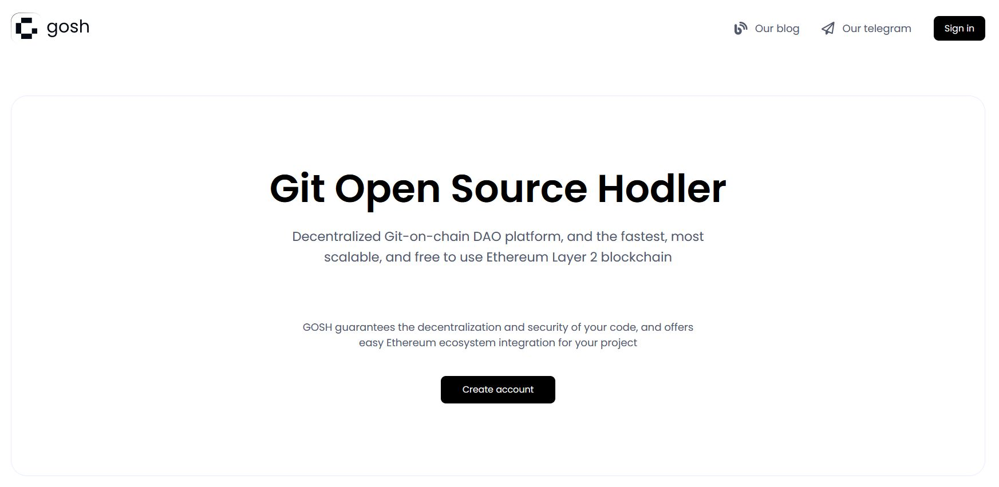

Use one of the suggested methods:

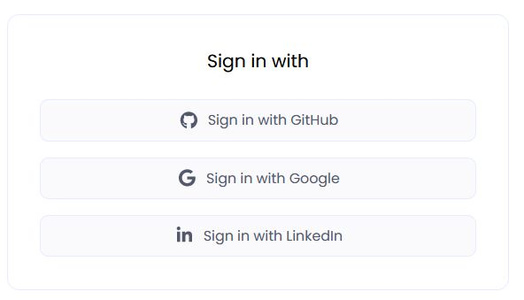

### __with GitHub__

Use your Github account to sign up for GOSH.

To do this,enter your username or email address and password and click **Sign in** button:

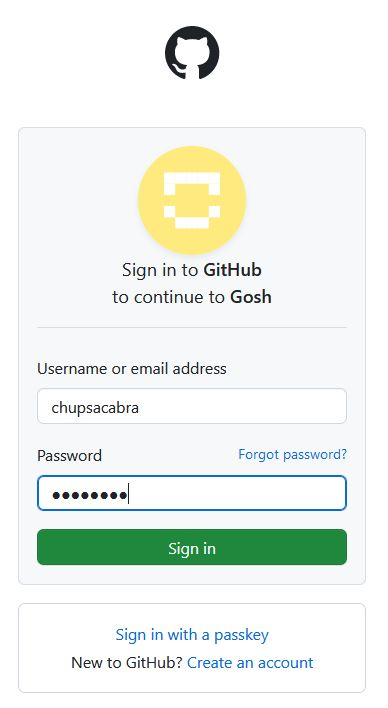

and complete the authentication.

!!! info
    The special GOSH DAO Bot will help with registration in GOSH.
    It will deploy your DAO and upload your selected repositories to GOSH.

In the list of organizations received from Github, select the organization from which you want to make a DAO on GOSH

and then select repositories for upload into GOSH.

Do this **for each** organization for which you want to upload repositories to GOSH.

!!! danger
    After registering on GOSH you will not be able to return to this step in this release.

    This will be available later

!!! info
    If you want other GOSH users to be able to find you by your email, give permission.

Then click **Upload**

​If you are familiar with blockchain, you know what to do with a seed phrase.

If you're new to blockchain, all you need to know is that this is the key to your Account and all your assets on GOSH. Your public key, which can identify you on the blockchain and the secret key you'll use to sign your actions can always be calculated from your seed phrase.

To create the GOSH Account, the seed phrase will be generated for you. If you already have the GOSH Account, click **Clear** and enter your own one seed phrase.

!!! info
    Your seed phrase will be used to log into GOSH.

!!! danger
    **Write your seed phrase down and store it somewhere safe, and never share it with anyone. Avoid storing it in plain text or screenshots, or any other non-secure way. If you lose it, you lose access to your assets. Anyone who gets it, gets full access to your assets.**

Once you have written down your seed phrase, click **Continue.**

Then choose your username in GOSH. **This is your unique cryptographic identifier in GOSH.
**

!!! Danger
    **Please note that after creating your username it will be impossible to change it in the future.**

if your username is already taken, please choose another one.

!!! warning
    The username must contain only Latin letters, numbers, hyphen, underscore character `( a...z, 0...9, -, _ )`

And click **Create account**.

When entering the GOSH will ask you to set up a PIN code:

!!! info
    Set a new PIN code for each new session.

And unlock with PIN code.

!!! warning
    If the name of the organization or repository already exists, you will receive the message.
    Change the name, click **save changes** and confirm the action with a pin code.

The Organizations page will open after your Account is created.

!!! info
    __When the repositories are uploaded, a notification will be sent to your email.__

Follow the link in the letter.

Enter the saved seed phrase and click **Sign in**.

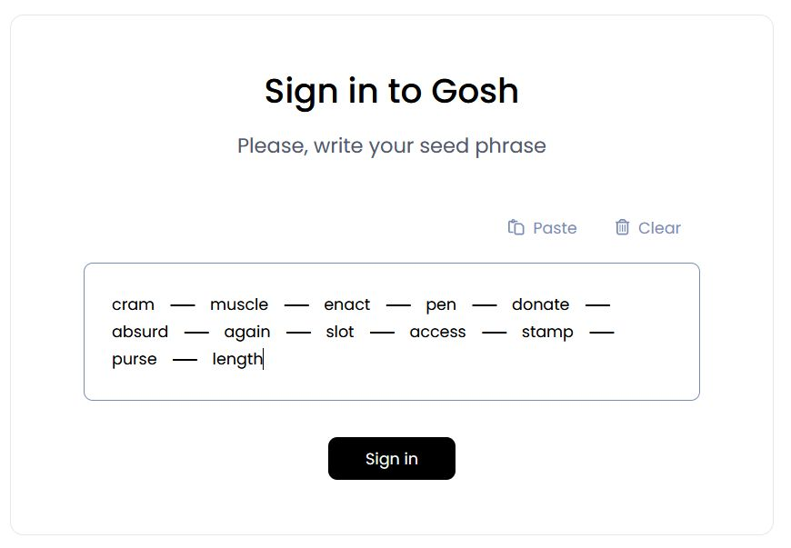

Also set up a PIN code and unlock with PIN code.

You can also ensure continuous **synchronization of your GitHub and GOSH repositories.**  
To do this you can use [GOSH GitHub Sync](../sync.md).

### __with Google__

You can use your Google account to sign up for GOSH click **Sign in with Google**

Then,enter your email address or phone number and click **Next** button:

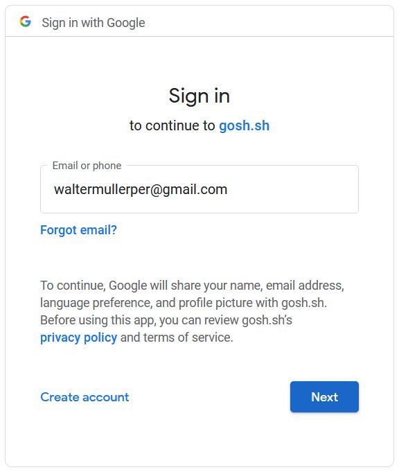

Confirm the selection with a password and proceed to the next step by clicking **Next**

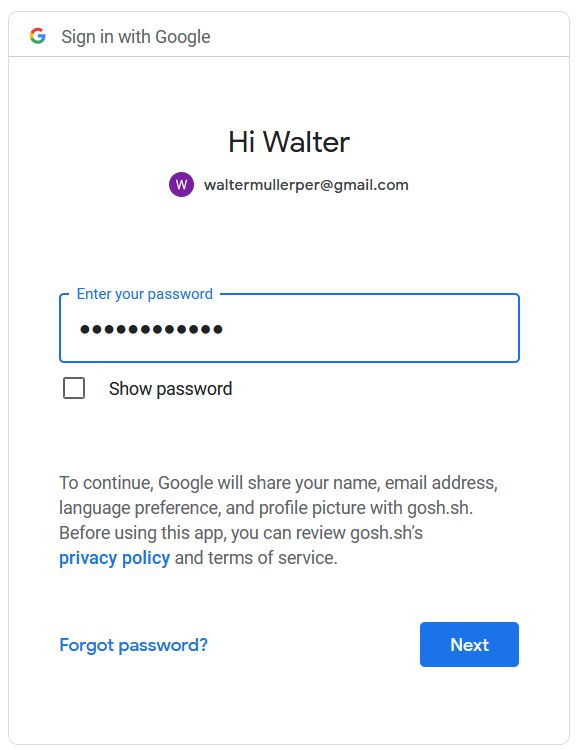

Specify the email address that is convenient for you to work with GOSH.

Then choose your username in GOSH. **This will be your unique cryptographic identifier in GOSH.**

!!! Danger
    **Please note that after creating your username it will be impossible to change it in the future.**

if your username is already taken, please choose another one.

!!! warning
    The username must contain only Latin letters, numbers, hyphen, underscore character `( a...z, 0...9, -, _ )`

then click **Continue**

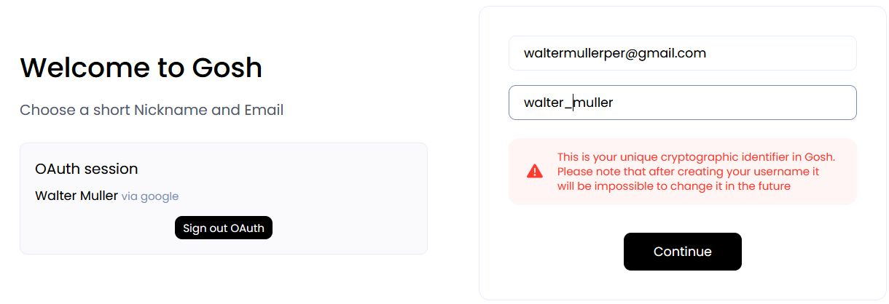

On the next step, you will be offered the generated seed phrase.

​If you are familiar with blockchain, you know what to do with a seed phrase.

If you're new to blockchain, all you need to know is that this is the key to your Account and all your assets on GOSH. Your public key, which can identify you on the blockchain and the secret key you'll use to sign your actions can always be calculated from your seed phrase.

To create the GOSH Account, the seed phrase will be generated for you. If you already have the GOSH Account, click **Clear** and enter your own one seed phrase.

!!! info
    Your seed phrase will be used to log into GOSH.

!!! danger
    **Write your seed phrase down and store it somewhere safe, and never share it with anyone. Avoid storing it in plain text or screenshots, or any other non-secure way. If you lose it, you lose access to your assets. Anyone who gets it, gets full access to your assets.**

Once you have written down your seed phrase, check the box and click **Continue**

Then, please enter the required words from your phrase, separated by a space, to make sure that it is spelled correctly, and click **Create Account**

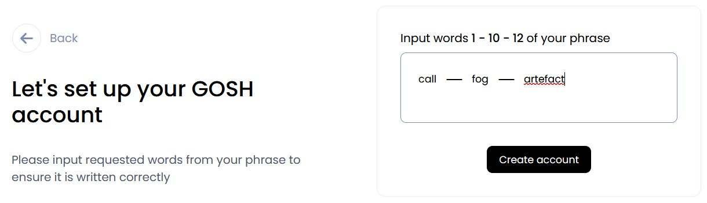

When entering the GOSH will ask you to set up a PIN code:

!!! info
    Set a new PIN code for each new session.

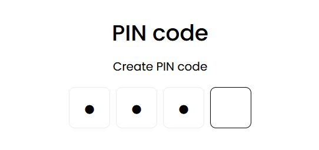

And unlock with this PIN code.

Congratulations, your GOSH account has been created.

It remains to create a your first DAO. To do this, click on **Create DAO and complete**

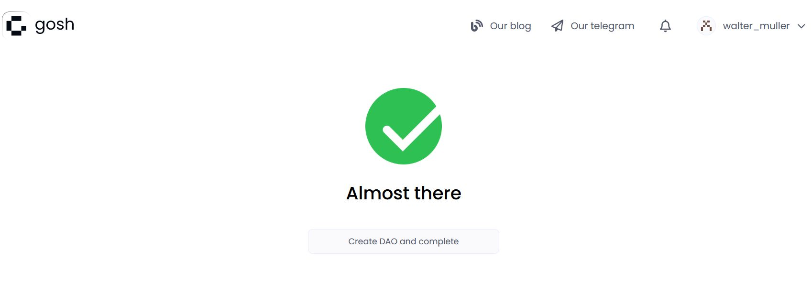

On the page that opens, click on your DAO to open. A description of further work with DAO can be seen [here](./dao-overview.md)

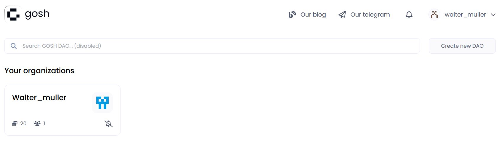

You can synchronize your GitHub repositories with GOSH, which allows you to work with both platforms side by side. To do this you can use [GOSH GitHub Sync](../sync.md).

### __with Linkedln__

Use your Linkedln account to sign up for GOSH.

To do this,enter your email address and password and click **Sign in** button:

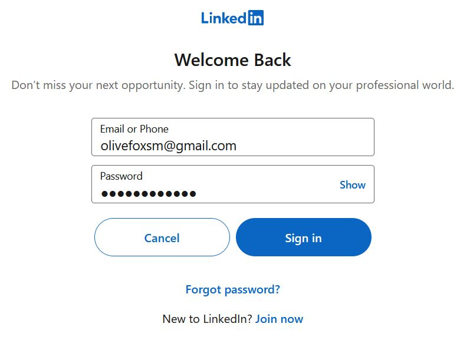

Click on the **Allow** button to grant permission for the use of your data

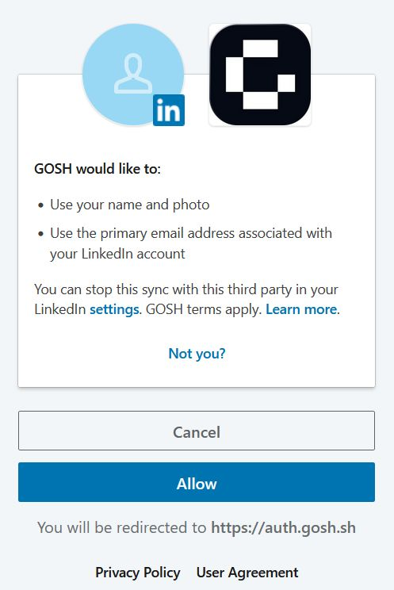

Specify the email address that is convenient for you to work with GOSH.

Then choose your username in GOSH. **This will be your unique cryptographic identifier in GOSH.**

!!! Danger
    **Please note that after creating your username it will be impossible to change it in the future.**

if your username is already taken, please choose another one.

!!! warning
    The username must contain only Latin letters, numbers, hyphen, underscore character `( a...z, 0...9, -, _ )`

then click **Continue**

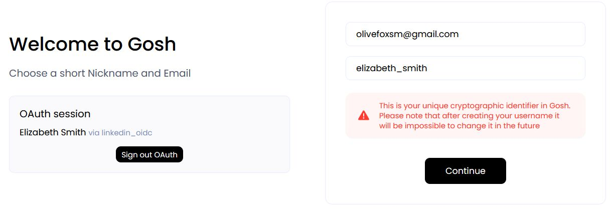

On the next step, you will be offered the generated seed phrase.

​If you are familiar with blockchain, you know what to do with a seed phrase.

If you're new to blockchain, all you need to know is that this is the key to your Account and all your assets on GOSH. Your public key, which can identify you on the blockchain and the secret key you'll use to sign your actions can always be calculated from your seed phrase.

To create the GOSH Account, the seed phrase will be generated for you. If you already have the GOSH Account, click **Clear** and enter your own one seed phrase.

!!! info
    Your seed phrase will be used to log into GOSH.

!!! danger
    **Write your seed phrase down and store it somewhere safe, and never share it with anyone. Avoid storing it in plain text or screenshots, or any other non-secure way. If you lose it, you lose access to your assets. Anyone who gets it, gets full access to your assets.**

Once you have written down your seed phrase, check the box and click **Continue**

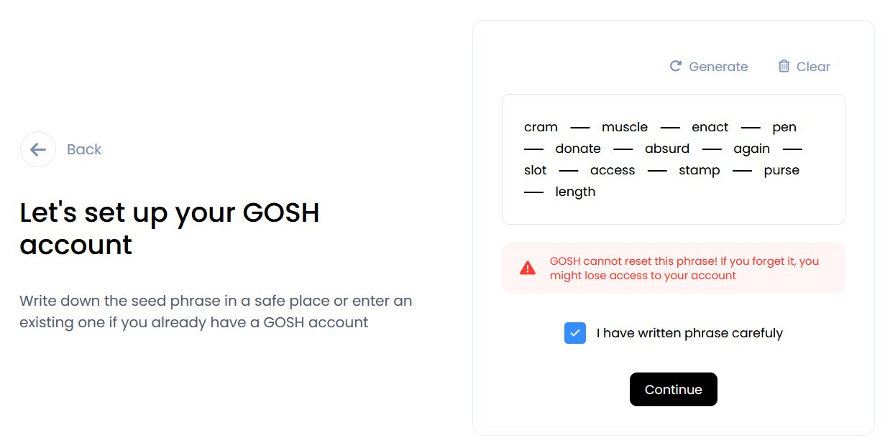

Then please input the requested words from your phrase to ensure it is written correctly and click **Create account**

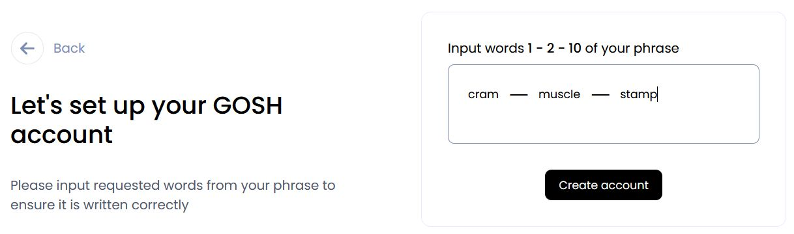

When entering the GOSH will ask you to set up a PIN code:

!!! info
    Set a new PIN code for each new session.

And unlock with this PIN code.

Congratulations, your GOSH account has been created.

It remains to create a DAO. To do this, click on **Create DAO and complete**

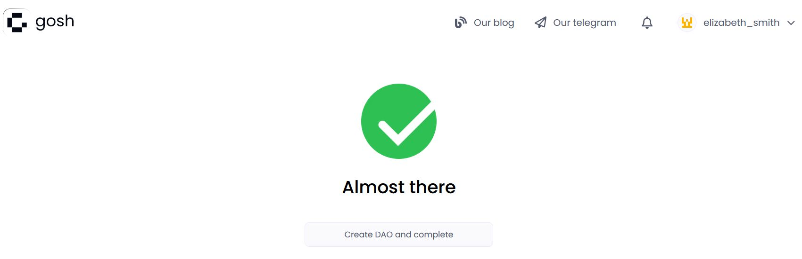

On the page that opens, click on your DAO to open. A description of further work with DAO can be seen [here](./dao-overview.md)

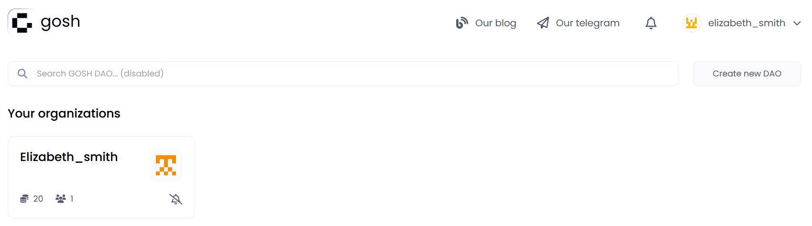

You can synchronize your GitHub repositories with GOSH, which allows you to work with both platforms side by side. To do this you can use [GOSH GitHub Sync](../sync.md).

## __View Public Key__

A user needs to know their public key, for example, when joining an organization.

To view your public key go to the main page of your Account and click [**Settings**](https://app.gosh.sh/a/settings){:target="_blank"}.

!!! danger
    Avoid storing your private key and seed phrase in plain text or screenshots, or any other non-secure way. If you lose it, you lose access to your assets. Anyone who gets it, gets full access to your assets.

