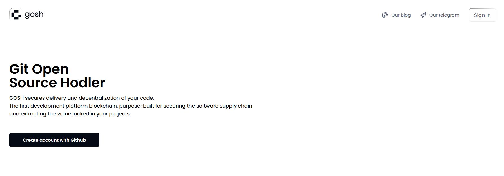

[GOSH Web](https://app.gosh.sh/) implements GOSH repository management as a simple web interface.

You will be able to create your **GOSH Account** and [**Decentralized Autonomous Organization (DAO)**](../../on-chain-architecture/organizations-gosh-dao-and-smv.md), set up and manage repositories. Repositories stored in GOSH can then be interacted with like any regular remote repository, with a few small configurations to git, making decentralized code management easily available to anyone.

## __Create Account__

### __with GitHub__

To get started with GOSH, you need an active Github-account.

Click **Create Account with Github** to start registering on GOSH

After click **Authorize gosh-sh** 

!!! info
    The special GOSH DAO Bot will help with registration in Gosh.
    It will deploy your DAO and upload your selected repositories to GOSH.

In the list of organizations received from Github, click on the organization

and select repositories for upload into Gosh.

Do this **for each** organization for which you want to upload repositories to Gosh.

!!! danger
    After registering on GOSH you will not be able to return to this step in this release.

    This will be available later

!!! info
    If you want other GOSH users to be able to find you by your email, give permission.

Then click **Upload**

​If you are familiar with blockchain, you know what to do with a seed phrase.

If you're new to blockchain, all you need to know, is that this is the key to your Account and all your assets on GOSH. Your public key, which can identify you on the blockchain and the secret key you'll use to sign your actions can always be calculated from your seed phrase.

To create the GOSH-Account, the seed phrase will be generated for you. If you already have the GOSH-Account, click **Clear** and enter your own one seed phrase.

!!! info
    Your seed phrase will be used to log into GOSH.

!!! danger
    **Write your seed phrase down and store it somewhere safe, and never share it with anyone. Avoid storing it in plain text or screenshots, or any other non-secure way. If you lose it, you lose access to your assets. Anyone who gets it, gets full access to your assets.**

Once you have written down your seed phrase, click **Continue.**

Then choose your username in GOSH. **This is your unique cryptographic identifier in Gosh.
**

!!! Danger
    **Please note that after creating your username it will be impossible to change it in the future.**

if your username is already taken, please choose another one.

!!! warning
    The username must contain only Latin letters, numbers, hyphen, underscore character `( a...z, 0...9, -, _ )`

And click **Create account**.

When entering the GOSH will ask you to set up a PIN code:

!!! info
    Set a new PIN code for each new session.

And unlock with PIN code.

!!! warning
    If the name of the organization or repository already exists, you will receive the message.
    Change the name, click **save changes** and confirm the action with a pin code.

The Organizations page will open after your Account is created.

!!! info
    __When the repositories are uploaded, a notification will be sent to your email.__

Follow the link in the letter.

Enter the saved seed phrase and click **Sign in**.

Also set up a PIN code and unlock with PIN code.

### __with Google__

### __with Linkedln__

## __View Public Key__

A user needs to know their public key, for example, when joining an organization.

To view your public key go to the main page of your Account and click [**Settings**](https://app.gosh.sh/a/settings).

!!! danger
    Avoid storing your private key and seed phrase in plain text or screenshots, or any other non-secure way. If you lose it, you lose access to your assets. Anyone who gets it, gets full access to your assets.

