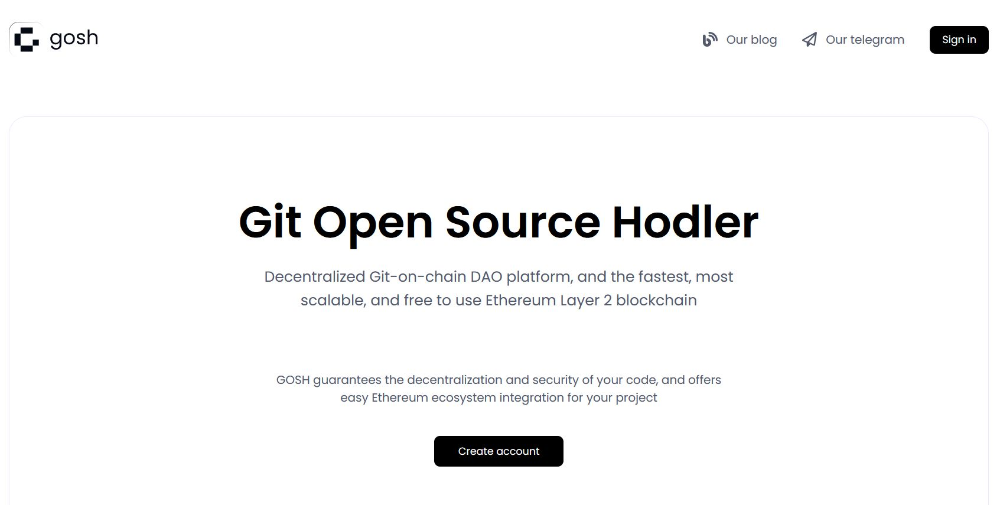
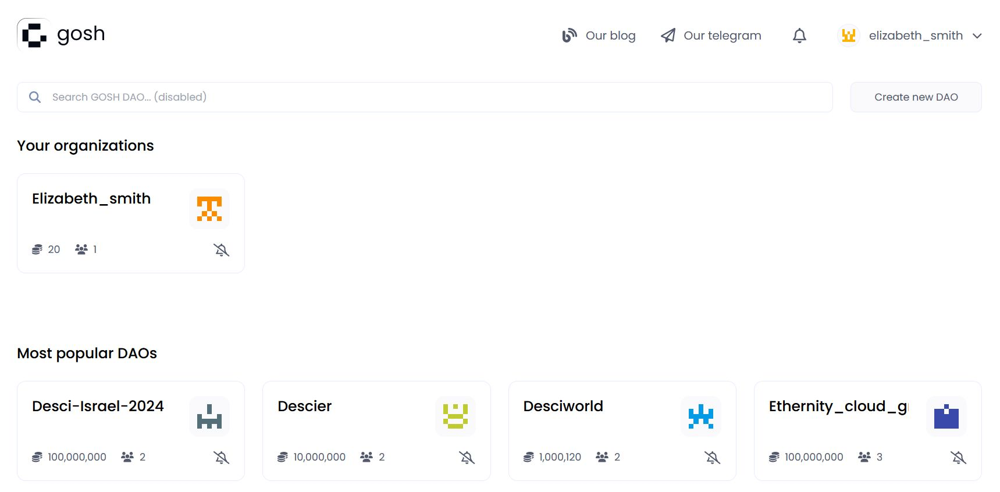

[**DAO - (Decentralized Autonomous Organization)**](../../on-chain-architecture/organizations-gosh-dao-and-smv.md#dao) is a tool that enables developers to build on GOSH in a way that is decentralized, secure, and scalable. 

!!! warning

    **To create a DAO, you must have an active GOSH [account](./account.md).**

!!! info

    Your first DAO is created during sign up on GOSH.

To create a new DAO go to the [GOSH web](https://app.gosh.sh){:target="_blank"} and click **Sign In**

Enter the saved seed phrase and click **Sign in**.

Also set up a **PIN code** and unlock with it.

To сlick **Сreate new DAO** button on the page that opens

To fill out all the required fields on the page that opens:

* __New organization name__

    !!! warning
        The Organizations name must contain only Latin letters, numbers, hyphen, underscore character `( a...z, 0...9, -, _ )`

* __Organization picture__

    The icon will be generated automatically.

* __Theme tags__

    You can add up to 3 tags separated by spaces. 
    According to them, GOSH users will be able to find your DAO.

* __Short description__

    A short description that can be seen on the DAO tab under the heading.

    The extended description can be added to the Readme file into _index system repository from the [Overview page](../gosh-web/dao-overview.md) after creating the DAO.

* __Total supply__

    You also need to enter the number of tokens that will be issued for this DAO.

    The maximum value of the total supply can be the number 2^128.

* __Allow mint__

    This is a permission to emission DAO tokens.
    It is enabled by default.

    In the future, it will be possible to disable the emission of DAO tokens through proposal and voting in the [**Settings**](../gosh-web/dao-set-up.md) section.

    !!! warning
        If you uncheck this option, the number of tokens issued for this DAO will be capped to the number entered during the initial setup

Click **Create organization**.

The DAO tab will open after its creation.
