### __DAO Set up__

You can continue with the initial setup of the DAO in the **Settings** tab.

<!-- TODO it might be worth removing this screen -->

#### **Tags**

<!-- TODO -->

#### **Token Setup**

In the **Token Setup** section, you can create a proposal to ban the issue of tokens from this DAO by unchecking the box.

!!! warning
    After the ban on the issue of DAO tokens, it will be impossible to allow the issue.

#### **Event setup**

In the **Event setup** section, you can enable/disable the option to view the voting results before it ends.

And also allow or prohibit discussion when working with proposals.

#### **Members setup**

In the **Members setup** section, you can grant or deny external users the ability to request membership in this DAO.

Then add a comment on changing the settings for other members of the DAO and click **Save changes and start proposal**.

!!! info
    __All settings and actions in the DAO will be performed in the [voting procedure](../gosh-web/proposals-and-voting-in-smv.md#voting-procedure).__
<!-- 

### __Karma tags__ -->

<!-- TODO -->
<!-- 
### __Notifications__ -->

<!-- TODO -->

### __Upgrade__

#### __Basic information__
When a new version of contracts is released in GOSH, the user needs to upgrade their contracts.

The [proposal](../gosh-web/proposals-and-voting-in-smv.md) initiates the upgrade.

!!! warning
    Make sure that the proposal for such an update has not yet been created.

!!! info
    Complete all proposal before starting the upgrade. All uncompleted proposals will be rejected and will not be transferred to the upgraded version.

You can see a message about the availability of a new version 
and an invitation to update in the DAO.

Depending on which version you currently have, choose the appropriate update method.

!!! warning ""
    It is recommended to upgrade to the latest version.

!!! info
    All token holders after upgrading the DAO must transfer their tokens from previous versions.
<!-- TODO
transfer tokens from previous versions to a separate item and make a link -->

#### __- from v. 1 to v. 2__

You can switch to the **Upgrade** section from the new version message or go to the **Settings** tab.

Select the version you want to upgrade and click **Create proposal for DAO upgrade**:

You will be taken to the DAO tab with events.

After accepting the proposal, the procedure for updating your DAO will begin.

Then you need to update all the Repositories.

To do this, go to their tab and click **Get repositories**

and then click **Start repositories upgrade** to create a proposal.

On the DAO tab, vote for the proposal to create a repository.

After the proposal is accepted, the contract version will be upgraded.

#### __- from v. 2 to v. 3__

!!! info "**Release notes**"  

    **Contracts**

        * Added possibility of a DAO to be a member of another DAO

        * Added possibility of DAO to be a Task performer. A DAO itself can now be a signer, reviewer, and manager of a Task in another DAO — Tasks now have the same functionality for DAOs as for individuals

        * Improve native token management in contracts. This is mainly bug fixes for the back-end blockchain tokens that guarantee the operations of a smart contract

        * Added possibility of task upgrade. Upgrades from Smart Contract version 2.0 to 3.0 required a redeployment of all Tasks. From now on, all future upgrades will not affect previously created Tasks

        * Task rewards do not increase karma. From now on, Tasks will only serve to remunerate contributors with DAO Tokens but without increasing their Voting Karma

        * Added a possibility to create index contracts. Version 3.0 now includes indexes that improve the performance of GOSH when used in a web browser

    **Interface**

        * DAOs can become members of other DAOs. DAOs have equal interface user flows for this operation

        * A DAO can be set as a Task assignee, reviewer, and manager (DAO review, receive task bounty is not implemented yet). Web browsers now also fully support Task functionality

        * DAO can create proposals and vote for proposals in parent DAO (not implemented yet)

        * ask rewards do not increase karma

        * If a DAO owns tokens of another DAOs, “DAO supply” block will contain a button with details. The GOSH interface now has a block to allow DAO members to see which tokens the DAO holds

    **Git Remote Helper**

        * supports all functionality of Smart Contract Version 3.0

The Tasks were added in contracts version 2.

Uninitialized Tasks will not be migrated to the new version. You will need to create these tasks in the new version.

!!! warning
    Before starting the update, make sure that there are commits in the Tasks.

Go to the Settings tab or follow the link in the upgrade message.

Select the version you want to update and click **Create proposal for DAO upgrade**

You will be taken to the DAO tab with events.

Inside the event, you can get acquainted with the details of the proposal.

After accepting the proposals, the DAO update process will begin.  
Before continuing, you need to transfer your tokens.

To do this, go to the **Overview** tab in the **Your wallet balance** section and click **Transfer from previous version**.

You can also do this on the **Members** tab.

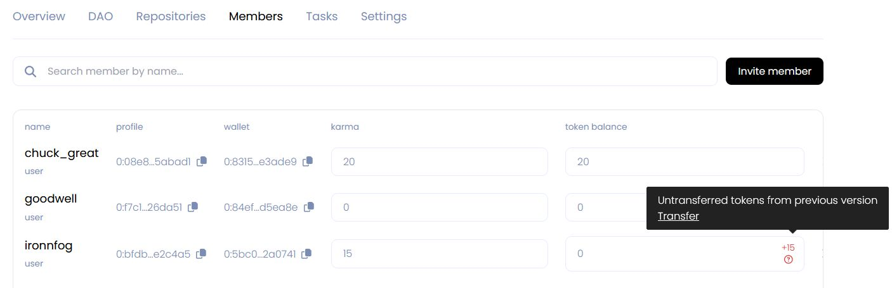

Then you need to update the DAO repositories and tags.  
To do this, click **upgrade** in the information message

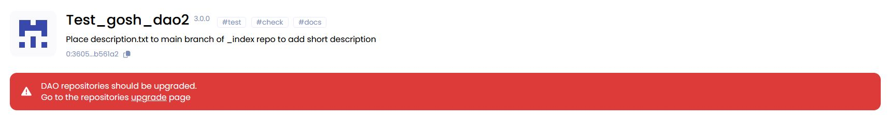

and go to the repository upgrade page.  
Click **Get repositories**.

Then click **Start repositories upgrade** to create a proposal.

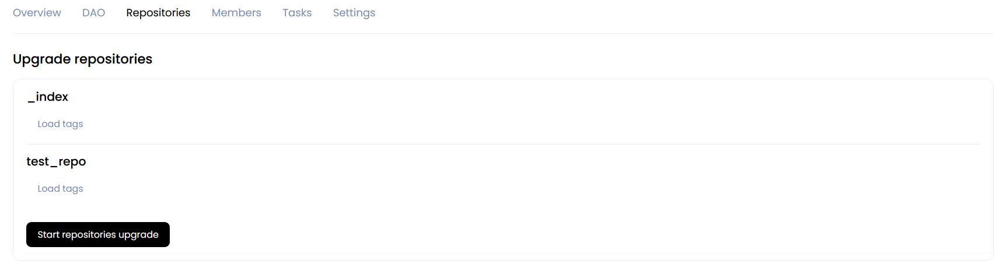

The process will be displayed below:

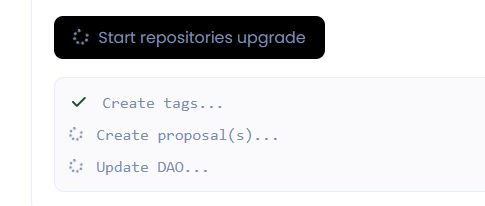

As a result, you will be redirected to the DAO events page.

The details of the Multi proposal can be found at the event.

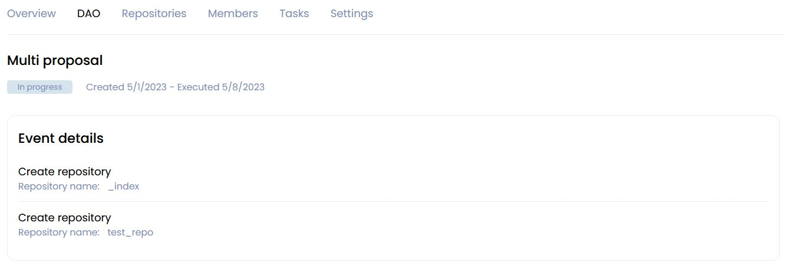

Then click **tasks upgrade page** in the information message

and click **Start tasks upgrade** on the page that opens.

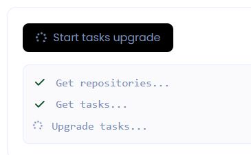

You will be taken to the DAO tab with events.

After accepting the proposal, the tasks will be transferred from the previous version and the contract upgrade to version 3 will be completed.

<!-- !!! info
    The history of events from the previous version will not be transferred. -->

#### __- from v. 3 to v. 4/5/6.0/6.1__

Uninitialized Tasks will not be migrated to the new version. You will need to create these tasks in the new version.

!!! warning
    Before starting the update make sure that there are commits in the Tasks.

Go to the Settings tab or follow the link in the upgrade message.

Select the version you want to update and click **Create proposal for DAO upgrade**

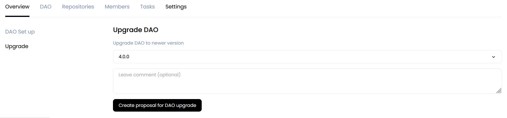

You will be taken to the DAO tab with events.

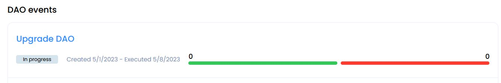

Inside the event, you can get acquainted with the details of the proposal.

After accepting the proposals, the DAO update process will begin.  
Before continuing, you need to transfer your tokens.

!!! info
    Starting from the 5th version, tokens are transferred automatically.

!!! warning
    **If you have tokens that were locked into voting in previous versions of the DAO at the time of the upgrade, please note that these tokens will be transferred only after the expiration of the proposal.**  

<!-- This is important to keep in mind to ensure that your tokens are properly accounted for in the DAO's upgraded system. -->

If you have a DAO version lower than the 4th inclusive, then to transfer tokens, go to the **Overview** tab in the **Your wallet balance** section and click **Transfer from previous version**.

You can also do this on the **Members** tab.

Then you need to update the DAO repositories and tags.  
To do this, click **upgrade** in the information message

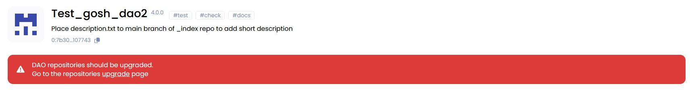

and go to the repository upgrade page.  
Click **Get repositories**.

Then click **Start repositories upgrade** to create a proposal.

The process will be displayed below:

As a result, you will be redirected to the DAO events page.

The details of the Multi proposal can be found at the event.

Then click **tasks upgrade page** in the information message

and click **Start tasks upgrade** on the page that opens.

You will be taken to the DAO tab with events.

After accepting the proposal, the tasks will be transferred from the previous version and the contract upgrade to version 4 will be completed.

<!-- #### __From version 1 to version 5 (recommended)__ -->

<!-- short description of DAO located in the _index repository

You can leave a comment on the proposal.

To transfer a brief description of the DAO from the _index repository

and

check mark on the permission for additional token issuance - individual proposal -->

#### __- from v. 6.1 to 6.2__

!!! info "**Release notes for 6.2.0**"  

    * [**Expert Tags**](../gosh-web/working-with-tokens-and-karma.md#expert-tags) have been introduced

    The list of decisions supported in this version includes:

    * [**Voting on Hackathon Results**](../../hacks-and-grants/user-guide.md#expert-tags)

    * [**Creating a Repository with Expert Tags**](../gosh-web/repository.md#create-repository-with-expert-tags)

    * **The Upgrade System** has been improved

    * some bugs have been fixed

!!! warning
    It's important to ensure that there are commits in the tasks and all proposals are completed before starting the update.

Go to the Settings tab or follow the link in the upgrade message.

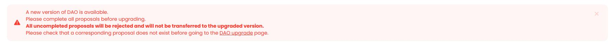

Select the version you want to update and click **Create proposal for DAO upgrade**

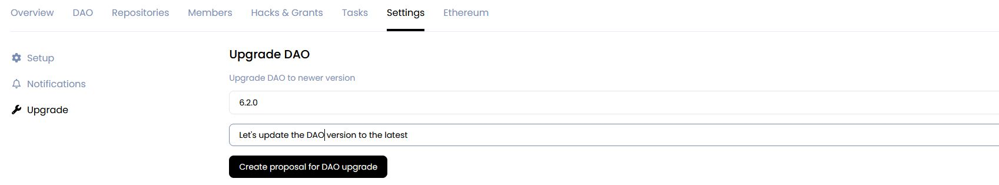

You will be redirected to the page with the DAO event and will be able to vote for this proposal.

After accepting the proposals, the DAO update process will begin.

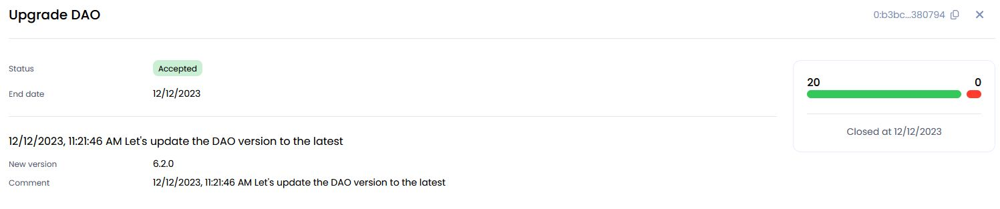

!!! warning
    **If you have tokens that were locked into voting in previous versions of the DAO at the time of the upgrade, please note that these tokens will be transferred only after the expiration of the proposal.**  
    
    
<!-- This is important to keep in mind to ensure that your tokens are properly accounted for in the DAO's upgraded system. -->

You should reload the page to continue updating your DAO.

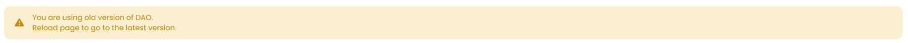

Once you've done that, click on the **Complete upgrade** button in the message that appears

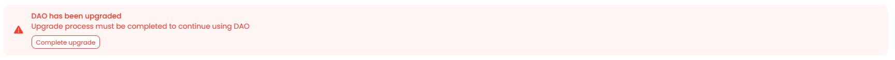

Then, a new window will open up, and you'll need to click on "Start upgrade complete process" to begin the data migration process between versions of DAOs. 

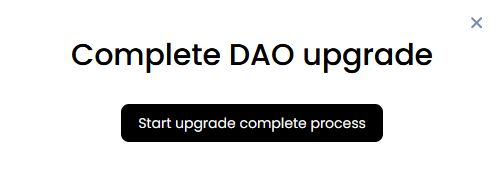

As a result, multiple proposals will be created to transfer all data from your DAO to the new version  
(*migrating the Index repository and all Hackathons, upgrading the DAO repositories*)

After all proposals are accepted, the DAO update process can be considered complete.

