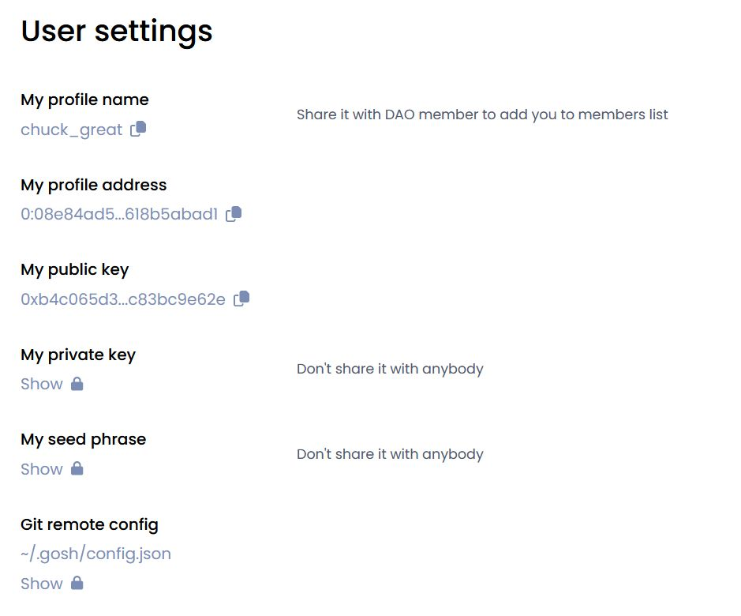
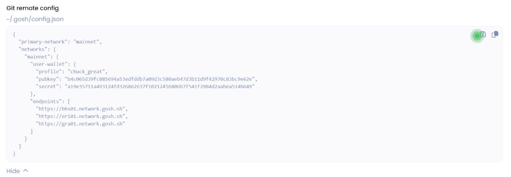

<!-- TODO
change -->

Set up [**Git Remote Helper**](../git-remote-helper.md) and continue working with your repository.

You'll need your wallet credentials. Go to the main page of your account and click [**User Settings**](https://app.gosh.sh/a/settings).

Scroll down to the **Git remote config** section, click **Show** and unlock with PIN code

Download the configuration file by clicking on the icon  
and save it to folder `~/.gosh`

To view the command to clone your repo, click the **Clone** button on your repo page.

