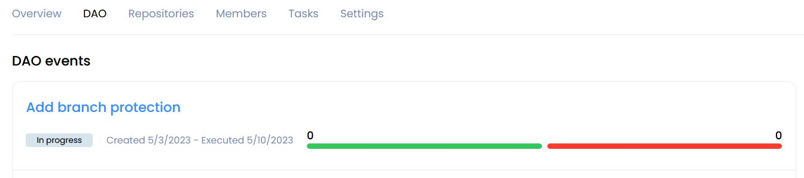
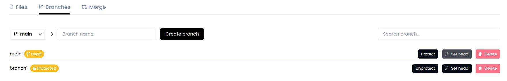
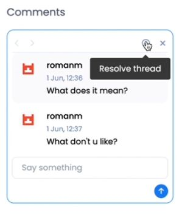
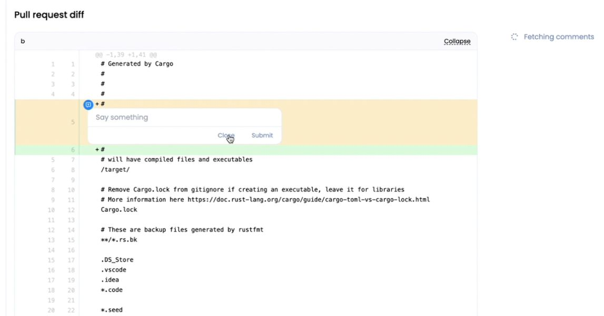

<!-- ## __Working with Repository__ -->

### __Create Repository__

To create a repository in your DAO click **Create new** in the Repositories section or Overview section.​

Enter repository name and its description and click **Create repository**.

!!! warning
    The repository name must contain only Latin letters, numbers,hyphen, underscore character`( a...z, 0...9, -, _ )`

A page with **DAO** events will open for you.

Open the event click on its name.

The page that opens displays the name of the proposal, its status, and the time of creation and as well as the end of voting.

The scale shows the number of votes for the proposal and against.

Specify the number of tokens less than or equal to your Karma for voting and accept or reject this proposal.

Add your opinion about the proposal to the discussion below and click **Send vote**

The created repository will appear in the list on the Repositories tab.

#### __create repository with Expert Tags__

This will provide every Tag holder with increased Karma Powers when voting on commits, and for branch protection and unprotection.

### __​Create Branch__

Repository is created with default main branch. To create another branch, click on the **branches** counter.​

Select the branch to be forked, enter new branch name, and click​ **Create branch**.

!!! warning
    The branch name must contain only Latin letters, numbers, hyphen, underscore character `( a...z, 0...9, -, _ )`

Once the branch is created, it will appear in the branches list.

Switch to it via drop down list.

### __Create File__

To create file, click **Add file** button.

Enter file contents and name.

You can use **Preview** if needed. MD syntax is supported for preview.

After scroll down and enter commit info:

* Commit description - you can add a description of your commit;

* Commit tags - this is a mutable pointer of the commit. You can add the tag to quickly go to this commit and see what has been done;

* Select task - if the branch is not protected and your file is a solution to a problem, you can choose a particular task;

* and add Assigners, Reviewers and Managers if necessary.

 and click **Commit changes**

If the branch you are working in requires no voting to confirm commits, the file will be added. Otherwise a DAO [vote](../gosh-web.md#proposals-and-voting-in-smv-soft-majority-vote) will be initiated.

<!-- TODO
If the branch is protect -->

Commit status will be displayed below.

### __Create Pull Request__

Click on the **Pull requests** tab and set up the pull request: what branch to merge from and to. Once selected, click **Compare**.

The branches will be compared. Review the changes, set up the pull request and click Commit changes.

!!! info
    **Note**: When merging into the main branch, and in some other cases (depending on DAO setup), a DAO proposal will be initiated by trying to commit.

    Organization Tokens have to be sent to the DAO Soft Majority Vote contract to start a proposal for DAO members to [vote](../gosh-web.md#proposals-and-voting-in-smv-soft-majority-vote) on.

### __Add protection for a branch__

If you want the changes to be added to the branch based on the voting results, then add protection to the branch.

This can be done by creating an appropriate proposal.

To do this, go from the **Repositories** tab to the repository you need.

Then, on the Branches tab, click the **Protect** button for the branch to which you want to add protection.

After creating the proposal, you will be redirected to the **DAO** page with events.

Inside the event, you can get details of proposal.

After the proposal is accepted the branch is marked as protected.  
A commit can be made to it only by voting.

### __Remove protection for a branch__

If the branch no longer needs protection, you can remove it by initiating appropriate proposals.

To do this, go from the **Repositories** tab to the repository you need.

Then, on the Branches tab, click the **Unprotect** button for the branch to which you want to add protection.

A vote will be created and you will be redirected to the **DAO** page with events.

Inside the event, you can get details of proposal.

After accepting the proposal, the protection mark will be removed from the branch.  
Now everyone can upload changes to the branch without voting.

### __Adding comments to file__

You can add a comment to any line in the file.

!!! info
    Comments are linked to a specific comment.

To do this, open the file and hover over a line or block of lines and click on the blue icon that appears on the left.

In the window that opens, enter your comment and click on the blue circle with an arrow to send it.

The comment line will be marked with a red icon on the left.

A thread of comments and replies to them will open on the right.

The discussion can be resolved. To do this, click the appropriate button:

!!! info
    The discussion can be resumed if a new comment has been added to it.

Up to 3 discussions can be expanded in one line.
You can switch between them.

### __Adding comments to Pull Request__

You can also add comments to Pull Request.
To do this, go from the **DAO** events page to the **Pull Request** vote in the **Pull request diff** section.
you can leave comments on any line or block of lines in the same way as in [commenting on a file](../gosh-web.md#adding-comments-to-file).

