<!-- 
## __Working with Task__ -->

**Milestone** is an important tool for project management and achieving set goals. A Milestone is a set of Tasks that must be completed to reach a key stage in the project.

The participants include:

**Assigners** who are responsible for task completion;
**Reviewers** who check for accuracy;
**Managers** who create and manage the Milestone and break it down into Tasks.

Milestone is used to track progress, identify potential issues, and adjust plans as needed. It also helps maintain team motivation and ensures timely and budgeted project implementation.

Once all Tasks in the Milestone are completed and Reviewers verify their accuracy, the Milestone will be completed. Each team member who completes Tasks within the Milestone will receive a reward according to predefined distribution rules.

### __Create Milestone__

<!-- we have not created tasks to replace Project Management tools, but because we want to offer members the ability to have voting power adequately reflecting their contribution to a DAO, be it ‘product people’ who create tasks, developers who write code, and reviewers. -->

To create a Milestone, go to the Tasks tab and click **Create milestone**

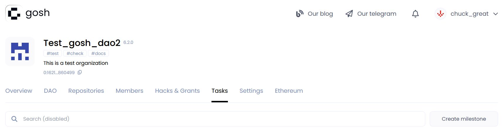

Then you need to fill in the Milestone conditions:

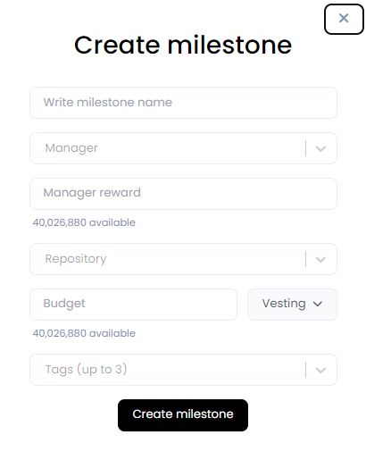

* Write the **Milestone name**.

* Write the username of the **Manager** who will lead the Milestone execution process.

* And specify the **Manager reward** - the amount of tokens he will receive upon completion of the Milestone.

<!--the part of the Milestone budget that he will receive.   The remaining budget will then be distributed among the performers of the respective tasks. -->

!!! info

    The maximum quantity of tokens from the DAO reserve available for distribution is indicated for reference.

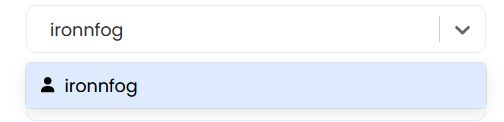

* Select the **Repository** where the pull requests will be created based on the results of work on this Milestone.

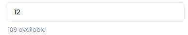

<!-- Then you need to evaluate the Milestone.  -->
* Specify **Budget** - the amount of tokens that will be paid from the DAO reserve to its execution Assigners and Reviewers.

!!! attention

    The total Milestone budget consists of the **Budget** listed here and the **Manager reward**

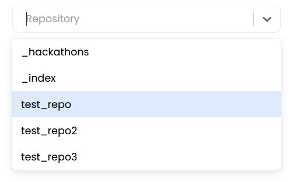

* Select **Vesting** - rules for governing the transfer of tokens at the disposal of the participants in equal portion.

**Lock period (cliff)** - the period after which the reward payments will begin. 
The countdown will start after accepting the proposal about completing the Milestone.  
**Vesting period** - the period during which remuneration will be paid to contractors in equal parts.

For example, lock - 12 months, vesting - 20 months.  

!!! warning
    For the investment scheme to be correct, the Milеstone budget must be a multiple of the number of months of investment.

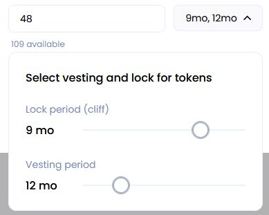

* By using up to 3 relevant keywords separated by spaces as **tags**, you can easily find and filter specific Milestone later on.

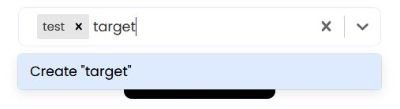

After filling in all the conditions, click **Create milestone**

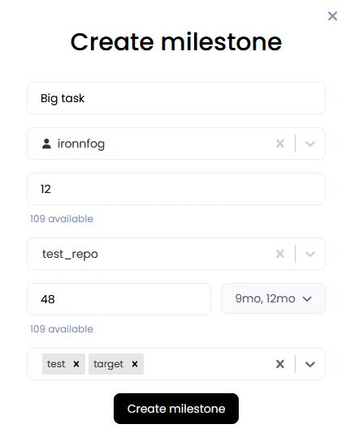

After creating the proposal, you will be redirected to the **DAO** tab on the event page.

Inside the proposal you will be able to see all the conditions of the Milestone.
In the table you can see the period since which month and in what parts the payments will be made to Milestone participants.

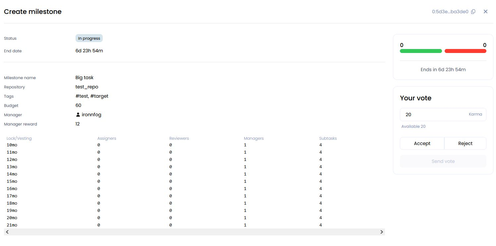

!!! info
    When creating the Milestone the tokens (Budget) from the DAO-reserve are written off and reserved on the Task-contract.

After accepting the proposal, the Milestone will appear in the list on the **Tasks** tab with the status *In progress*.

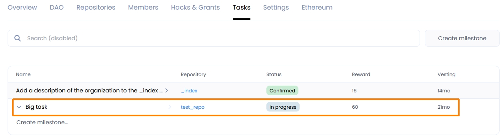

!!! warning "Important!"

    Each participant of the DAO can create a Milestone, but only the Manager assigned to this milestone can add Tasks to it.

Plan out what tasks your Milestone will consist of. Each task is assigned separately.  

To add Tasks to the Milestone, open it by clicking on the one you need in the list. Then click the **Add task...**

To add Tasks to your Milestone, simply open the Milestone by clicking on the one you want in the list.  
Then, click the "Add task..." button.

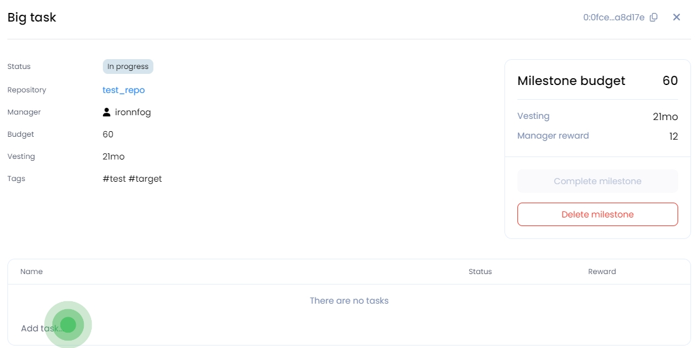

A window will open up where you can enter the task details. Make sure the name of the Milestone and the Repository where materials for the solution are collected are correct.

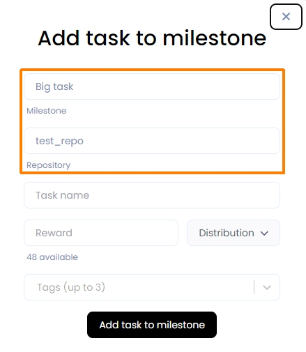

Enter the **Task name**.  
A **Reward** will be given for each Task completed, and **Tags** will be added for quick navigation.

At the same time, you can decide on the number of tokens that the Task executor (**Commit author** for accepted merge), the **reviewer** and the **manager** will receive if they work on the Task.  
To do this, click on the **Distribution**

**Commit author** - the person who executes the Task.  
**Reviewer** - the person who checks the correctness of the Task.  
**Manager** - the person who manages the Task execution process.

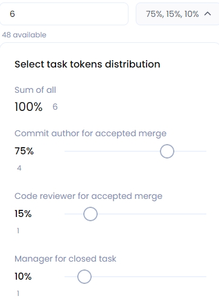

!!! info

    If the shares are not used, they will be returned to the DAO's reserve.

After completing the filling, click **Add task to milestone**

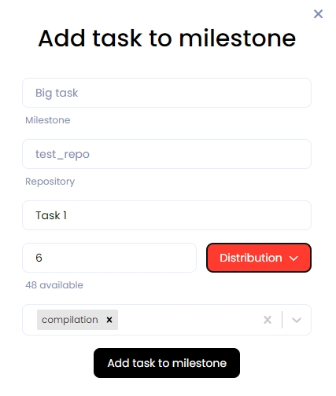

A Milestone with Tasks will look like this:

Inside the Task you will be able to see all the conditions.
In the table you can see the period starting from which month and in which parts the payment will be made to the Task executor.  
Vesting and lock periods as in Milestone.

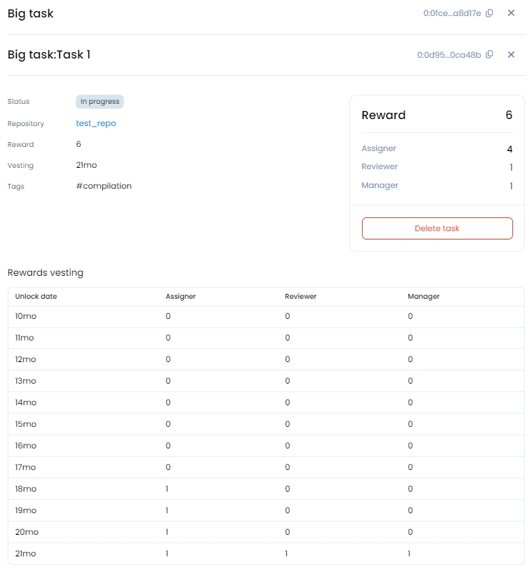

Any member of the Dao can complete the Task and receive a reward. To do this, he needs to [create a Branch](./repository.md#create-branch) in the Repository specified in Milestone, [commit all files](./repository.md#create-file) with the solution and create and merge [pull request](./repository.md#create-pull-request)

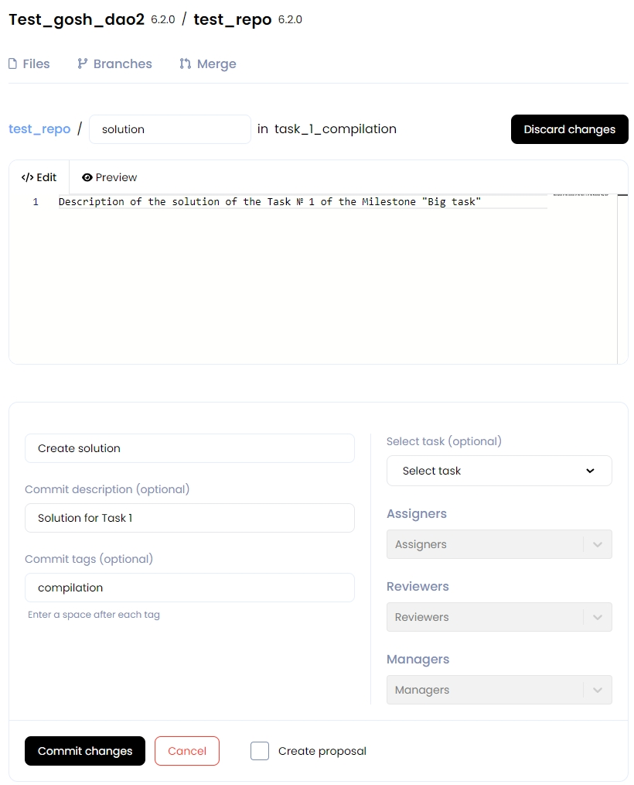

For each file, select the task to which it belongs:

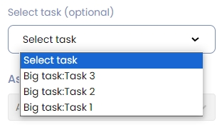

And also enter the names of those who worked on this Task

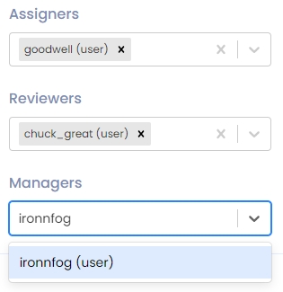

And click **Commit changes**

!!! warning

    If a task has been selected, then a proposal is required.  
    Select the appropriate checkbox.

<!-- If the reviewer was specified during the commit, the event will wait for verification from them. -->
After the file has been created, the extraction request will await the reviewer's evaluation and approval of the proposal:

<!--  -->

<!-- When the proposal is accepted, the status of the Task in Milestone will change to *Confirmed* -->
Then, after the reviewer send the solution, it will be possible to vote for the proposal.  
When the pull request is accepted, the Task status will change to **Confirmed**.

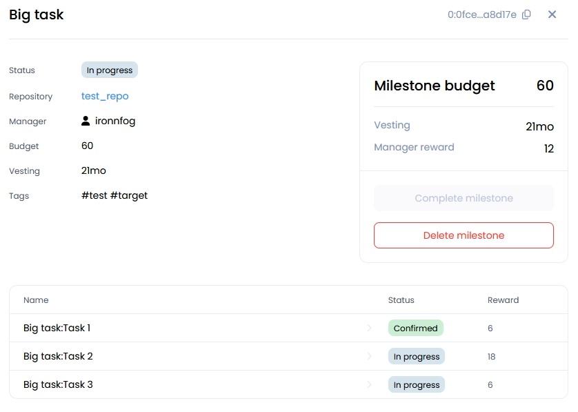

<!-- Assigners  Reviewers	Managers	Subtasks -->

<!-- 
Select the repository for which the Task is being created.

Add the Task name.

You can add 3 tags separated by spaces to quickly find the task.

Then you need to evaluate the Task.

**Task cost** is the number of tokens that will be paid from the DAO reserve for its execution.

!!! info
    The members of the DAO agree between themselves how to evaluate the Tasks.

After attaching a pull request to the Task, the tokens will be distributed between the author, reviewer and manager in the ratio you set.

**Commit author** - the person who executes the Task.  
**Reviewer** - the person who checks the correctness of the Task.  
**Manager** - the person who manages the Task execution process.

!!! info
    The number of authors, areviewers and managers is set at your choice.  

Select vesting and lock periods. 

**Lock (cliff)** - the period after which the reward payments will begin. 
The countdown will start after accepting the proposal about completing the Task.  
**Vesting** - rules for transferring the fixed part of the tokens to the disposal of the contractor.

For example, lock - 12 months, vesting - 2 months.  

!!! warning
    In order for the investment scheme to be correct, the smaller of the number of tokens allocated to the members of the task must be a multiple of the number of months of investment.

Add a comment the token distribution rules and click **Create task and start proposal**

After creating the proposal, you will be taken to the **DAO** tab with events.

Inside the proposal you will be able to see all the conditions of the Task.  
In the table you can see the period since which month and in what parts the payments will be made to the members of the Task. -->

<!--  -->

<!--  -->

<!-- After accepting the proposal, the Task will appear in the list on the **Tasks** tab with the status *Awaiting commits*.

!!! info
    When creating a Task the tokens (Task cost) from the DAO-reserve are written off and reserved on the Task-contract.

 -->

<!-- When the Author has completed the Task, he adds it to the commit.

!!! info
    If you need to make several commits to complete a Task,, create a separate branch.  

And do **Select task** when creating the proposal to the pull request.

Select the Task performed(s), reviewer(s), manager(s) if they worked on the task. The allocated shares of those who were not specified will be returned to the DAO-reserve.

After that a proposal to the pull request will be created.  

Detailed information can be viewed by going to it on the DAO tab with events.

 -->

<!-- If the reviewer was specified during the commit, the event will wait for verification from them.

Then, after the reviewer send the solution, it will be possible to vote for the proposal.  
When the pull request is accepted, the Task status will change to **Confirmed**.

After the lock period ends, the members of the Task can receive a reward.
To do this, go to the **Tasks** tab in the completed Task and click **Claim reward**.

!!! note
    If Lock period (cliff) has been set to zero, then you can click **Claim reward** immediately after accepting the pull request.

Thus the tokens will begin to be transferred to the wallets of the members of the completed Task in accordance with the vesting scheme when the lock period ends. -->

### __Deletе Milestone__

To delete a Milestone, go to it on the **Tasks** tab, open it by clicking on the one you need in the list.
Then click to **Delete milestone**

After creating a proposal about deleting a Task, you will be redirected to the event tab **Dao**.

When the proposal is accepted, the Task will be deleted.  
The tokens allocated for this Task will be returned to the DAO reserve.

