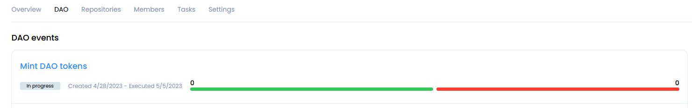
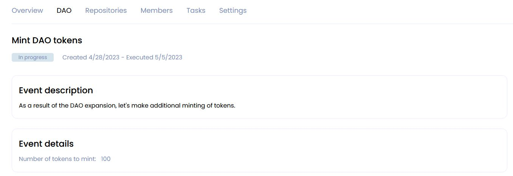
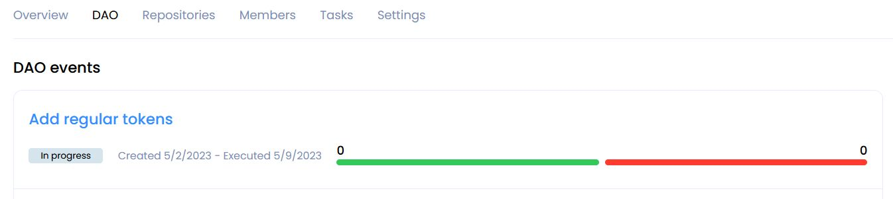
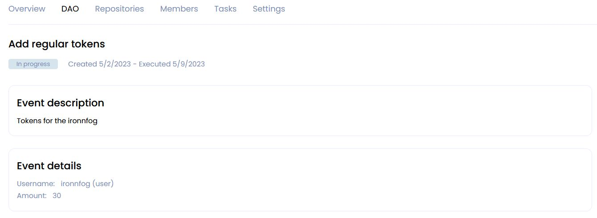

<!-- ### __Working with tokens and Karma__ -->

#### __Additional minting of tokens for DAO__

!!! warning
    The option allowing the minting of DAO tokens must be enabled on the **Settings** tab in the **Token Settings section**.

Click on the **Mint** button on the right on the **Overview** tab in the **DAO Reserve** section.
You will create a proposal to mint additional tokens for this DAO.

In the window that appears, enter the amount of tokens to emission and add a description of the DAO members. Then click **Create proposal to mint tokens**.

After creating the proposal, you will be redirected to the **DAO** tab with events.

Inside the event, you can get details of proposal.

After the proposal is accepted, the changes will take effect.

#### __Additional voting tokens and Karma__

Any member of the DAO can send a request to change Karma.  
To do this, go to the **Members** tab and change the number of Karma and token balance of one or more DAO members, including for yourself.

!!! warning
    To create a proposal, you must have at least 20 tokens on your wallet balance.

!!! Warning
    Be careful when distributing karma among the members of the DAO.  
    Avoid the possibility of a preponderance in the votes of one of the DAO members.  
    To avoid a situation where one participant will be able to transfer the entire balance of the DAO to his wallet.

Then click **Save changes and create proposal**.  
As a result, a Multi proposal will be created, and you will be redirected to the event tab **DAO**.

Inside the event, you can get details of Multi proposal.

After accepting the multi proposal, the user will receive tokens and Karma from DAO reserve. This can be seen on the **Members** tab.

#### __Expert Tags__

You can now [add a **Karma Tags**](../../hacks-and-grants/user-guide.md#expert-tags) to your DAO, which will grant additional Karma Voting Powers to each member possessing such tags for decisions that support Karma Tags.

#### __Transfer of tokens from DAO reserve__

Tokens can be sent from the DAO reserve to

* a member of this DAO;
* any GOSH user, who has visited this DAO at least once.
<!-- * or another DAO. -->

To do this, on the **Overview** tab in the **DAO reserve** section, click **Send**.

In the window that opens, enter the name of the GOSH user or the name of the DAO and the amount of tokens to send.

If you want the recipient's Karma to increase jointly with the token balance, then check this box.  
Also write a description for the token transfer. This will help the DAO members to make a decision when voting.

!!! Warning
    Be careful when distributing karma among the members of the DAO.  
    Avoid the possibility of a preponderance in the votes of one of the DAO members.  
    To avoid a situation where one participant will be able to transfer the entire balance of the DAO to his wallet.

Then click **Create proposal to send tokens**

After creating the offer, you will be redirected to the **DAO** page with events.

Inside the event, you can see detailed information about the proposal.

After the proposal is accepted, the tokens will be transferred to the balance wallet of the GOSH user or DAO.

#### __Transfer of tokens from user's wallet__

Tokens can be sent from the DAO reserve to:

* a member of this DAO;
* any GOSH user, who has visited this DAO at least once.

!!! info
    Only regular tokens are transferred. You will not be able to vote with such tokens.

<!-- To send tokens from your wallet to the DAO, go to the **Overview** or **DAO** tab to the **Your wallet balance** section and click **Send**. -->

To transfer tokens from your DAO wallet, go to the **Overview** or **DAO** tab, then under **Your wallet balance**, click **Send**.

In the window that opens, please enter the name of the DAO member and the number of tokens to be transferred. Then click on the **Send Token** button.

After that, the tokens will be transferred to the recipient's wallet balance.

